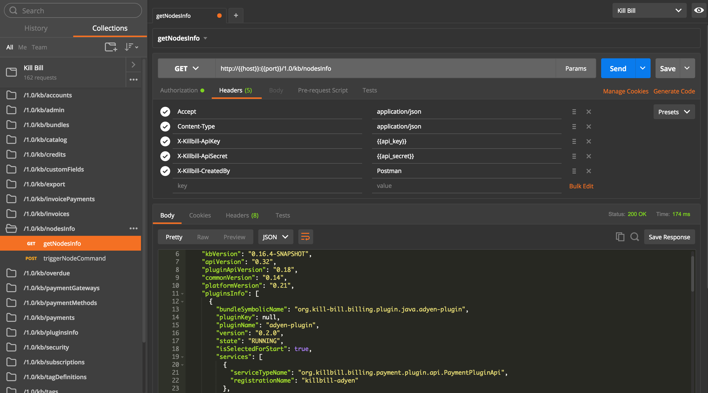

# [Kill Bill](http://killbill.io) collection for Postman

[](https://app.getpostman.com/run-collection/1f8e4deb2319137e8867#?env%5BKill%20Bill%5D=W3sia2V5IjoiaG9zdCIsInZhbHVlIjoiMTI3LjAuMC4xIiwidHlwZSI6InRleHQiLCJlbmFibGVkIjp0cnVlfSx7ImtleSI6InBvcnQiLCJ2YWx1ZSI6IjgwODAiLCJ0eXBlIjoidGV4dCIsImVuYWJsZWQiOnRydWV9LHsia2V5IjoidXNlcm5hbWUiLCJ2YWx1ZSI6ImFkbWluIiwidHlwZSI6InRleHQiLCJlbmFibGVkIjp0cnVlfSx7ImtleSI6InBhc3N3b3JkIiwidmFsdWUiOiJwYXNzd29yZCIsInR5cGUiOiJ0ZXh0IiwiZW5hYmxlZCI6dHJ1ZX0seyJrZXkiOiJhcGlfa2V5IiwidmFsdWUiOiJib2IiLCJ0eXBlIjoidGV4dCIsImVuYWJsZWQiOnRydWV9LHsia2V5IjoiYXBpX3NlY3JldCIsInZhbHVlIjoibGF6YXIiLCJ0eXBlIjoidGV4dCIsImVuYWJsZWQiOnRydWV9XQ==)



## Installation

This repository contains a collection for [Postman](https://www.getpostman.com/). To get started:

1. Install either the [Postman Chrome App](https://chrome.google.com/webstore/detail/postman/fhbjgbiflinjbdggehcddcbncdddomop) or the [Postman Mac App](https://www.getpostman.com/app/postman-osx-beta)
2. Click on the "Run in Postman" button above

Alternatively, to get the latest version of the collection from this repository, you can import it directly:

1. Click Import
2. Select the killbill.json file from this repository
3. Either import it as a new collection or overwrite an existing collection

A few [environment variables](https://www.getpostman.com/docs/environments) are required:

* `host`: Kill Bill host (e.g. 127.0.0.1)
* `port`: Kill Bill port (e.g. 8080)
* `username`: Kill Bill username (e.g. admin)
* `password`: Kill Bill password (e.g. password)
* `api_key`: Tenant api key (e.g. bob)
* `api_secret`: Tenant api secret (e.g. lazar)

If you clicked on the button above, Postman should have created a default environment for you. Alternatively, to import the example environment `killbill.env.json`, go to Manage Environments in Postman and import the file.

## Usage

To execute an API call, simply browse to the API call in the Sidebar and select it. Update the request in the right pane (the Request Builder) as needed (add body, change query parameters, etc.) and click Send.

## Build

To regenerate the [Kill Bill collection](https://www.getpostman.com/docs/collections), make sure the Swagger files are up-to-date then run:

```
ruby generate.rb > killbill.json
```

To [validate](https://www.getpostman.com/docs/validating_json_collections) it:

```
node validate.js
```
