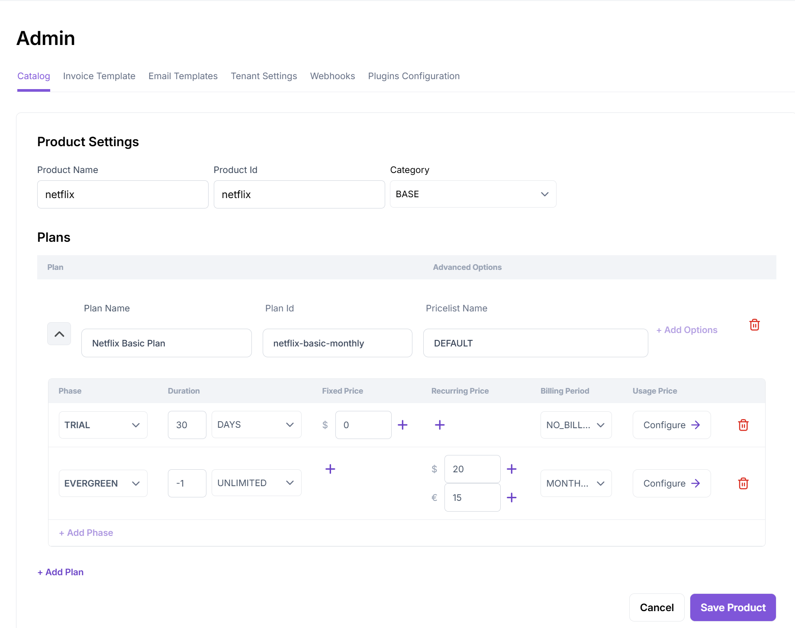
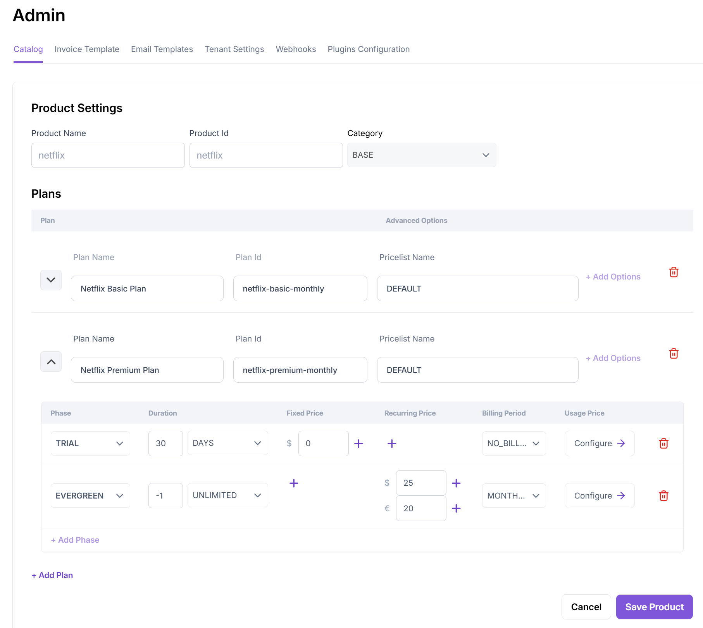
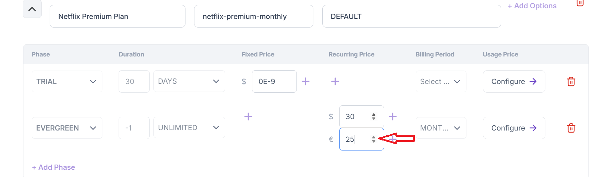
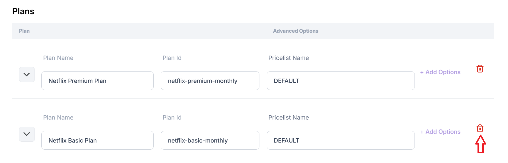
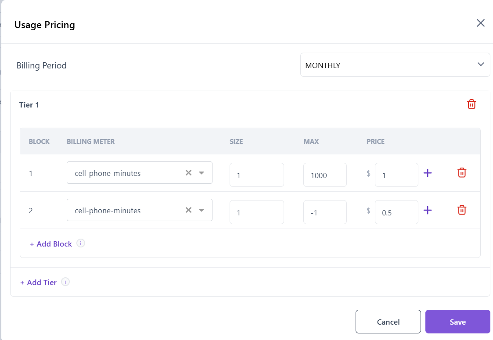

= Aviate Pricing Hub

== Introduction

The Aviate Pricing Hub allows creating products, individual catalog entries such as plans, products, and pricelists. Thus, you can create such entries without the need to manage entire catalog versions.
Internally, it uses the https://apidocs.killbill.io/aviate-catalog[Aviate Catalog APIs].

== Products

The Products screen provides information about the available products. It can be used to create products/plans/pricelists. It can also be used to edit existing plans/products and retire plans/products.

=== Create Product,Plan, Pricelist

The Create Product, Plan, Pricelist screen can be used to create a product, plan, and pricelist.

In order to use this feature, click on the *Add Product* button in the *Pricing Hub*. Enter product details, plan details, phase details, price details and billing period as required and click on *Save Product*:

//TODO: Annotate the screenshot if required

The above screenshot demonstrates creating a new product called `netflix` with a `netflix-basic-monthly` plan that is priced at `$10` per month.

This screen internally uses the https://apidocs.killbill.io/aviate-catalog#create-plan-product-pricelist[Create Plan, Product, Pricelist
 API].

=== Add New Plan

Once a product is created, you can add new plans at any time.

In order to add a new plan, click on the three dots next to the product name and click *Edit*. Click on *Add Plan* and enter details for the new plan as required:

The above screen demonstrates creating a new plan called `netflix-premium-monthly` corresponding to the `netflix` product.

This screen internally uses the https://apidocs.killbill.io/aviate-catalog#create-plan[Create Plan API].

=== Edit Plan

It is possible to modify plan prices after a plan is created. Other attributes like duration of the phases, etc. are not allowed to be changed.

To edit a plan,  click on the three dots next to the product name and click *Edit*. Click the Chevron next to the plan name to view the plan details. Click the arrow next to the price values to increase/decrease the values as required:

The above screen demonstrates editing the prices of the `netflix-premium-monthly` plan.

This screen internally uses the https://apidocs.killbill.io/aviate-catalog#modify-plan[Modify Plan API].

=== Retire Plan

It is possible to retire a plan.

To retire a plan,  click on the three dots next to the product name and click *Edit*. Click the *Delete* icon next to the plan name:

This screen internally uses the https://apidocs.killbill.io/aviate-catalog#retire-plan[Retire Plan API].

=== Creating Usage Prices

The Pricing Hub UI also allows you to create usage plans. So you can define a billing meter (which encapsulates how usages are aggregated), define blocks/tiers in the usage plan, and add usage based prices corresponding to these blocks.

In order to create a usage plan, click the *Configure* button in the *Usage Price* column.Select an existing billing meter or add a new billing meter. Enter size, max and price. Add additional blocks/tiers as required:

