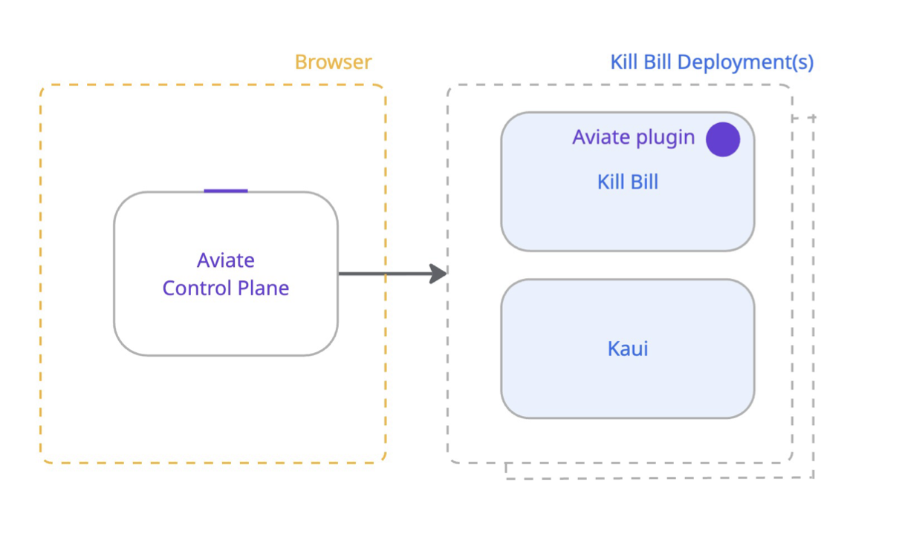

= What Is Aviate?

include::{sourcedir}/aviate/includes/aviate-card.adoc[]

== About Aviate
Aviate is designed to deliver a seamless billing experience that builds upon the core capabilities of Kill Bill. Our goal is to provide users with advanced features that cover the entire quote-to-cash lifecycle, including enhanced system observability, streamlined configurations, and valuable business intelligence.

== Overview

Aviate is composed of two main components that work together to deliver a comprehensive billing management solution:

* *Aviate Control Plane*: A browser-based interface that allows administrators to configure, monitor, and manage one or more Kill Bill deployments from a single, unified dashboard. It communicates with each Kill Bill instance through the Aviate plugin to provide system observability, configuration management, and business intelligence.

* *Aviate Plugin*: A plugin installed on each Kill Bill instance that extends it with additional API endpoints. It acts as the bridge between the control plane and the Kill Bill core, enabling centralized management and real-time monitoring across all your deployments.

The following diagram illustrates the relationship between these components:

== Aviate Plugin

The Aviate plugin extends Kill Bill with additional endpoints. These endpoints are described in the *Aviate section* below. The plugin is available to users who have subscribed to our Flock plan, and it is installed by default on our `sandbox` deployment at https://aviate.killbill.io[aviate.killbill.io].

Please refer to the documentation below to start integrating Aviate into your Kill Bill environment.
