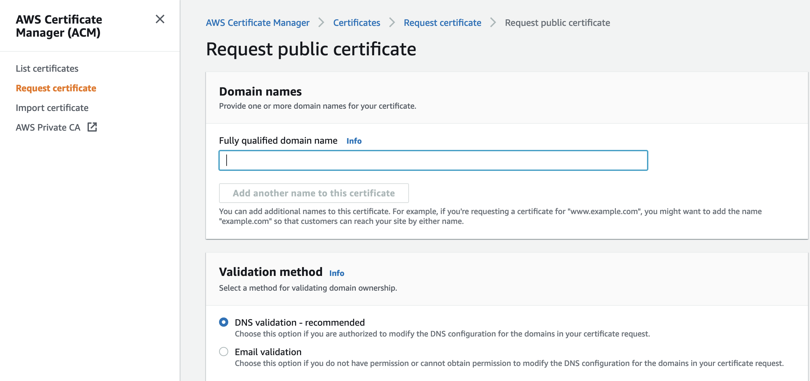
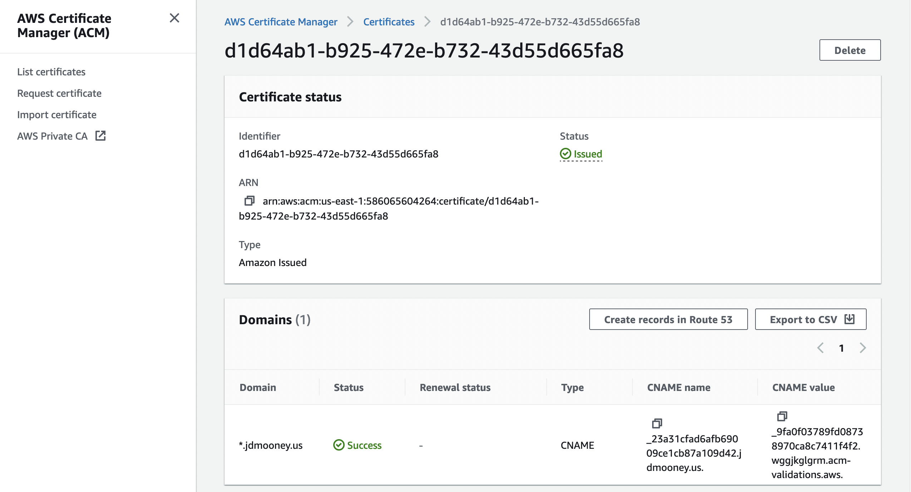

= How To Add a Certificate Using the AWS Certificate Manager

== Overview

This document provides information about setting up HTTPS that applies to the AWS multi-tier and CloudFormation Kill Bill architectures. 
HTTPS is based on the use of a verification document called a *certificate*. For an explanation of certificates see https://docs.killbill.io/latest/explanation-https-and-certificates.html[HTTPS and Certificates]. A certificate must identify a *certificate authority (CA)*, a trusted site that can show that the bearer of the certificate can be trusted. The multi-tier and CloudFormation architectures can be protected by a certificate created by the *AWS Certificate Manager (ACM)*. There is no extra cost for ACM certificates.                                                                                                                                                                                                                                                                                                                                                                                                                                                                                    

If you own a domain, your domain provider can serve as your CA. If you don't have a domain, you can purchase one for very low cost from a domain provider such as https://www.godaddy.com/[Godaddy]. When you obtain a domain you need to prove your identity, so your domain provider can trust you. To demonstrate this trust you will need a CNAME.

The remainder of this document has three parts:

. <<step1, Preliminary Concepts>>
. <<step2, Obtaining a Certificate>>
. <<step3, Testing and Renewal>>

[[step1]]
== Step 1: Preliminary concepts

Before you begin, review the following concepts to be sure you understand them.

=== CNAMEs

A CNAME, or *Canonical Name*, is an identifier for the resources that you are protecting with your certificate. A CNAME record creates an alias for this name. CNAMEs are discussed in https://docs.killbill.io/latest/explanation-https-and-certificates.html[HTTPS and Certificates]. Further instructions for setting up your required CNAME records are given here.

=== Protocol and Port Setup

Your AWS security group by default provides rules giving access to Kaui and Kill Bill using the HTTP protocol and a specified port number. For HTTPS you will need modified rules with the new protocol and a new port number.

=== Validation

When you create a new certificate you will need to validate your certificate. This identifies the trust hierarchy for the certificate. You may need to setup a temporary CNAME record for this purpose, and you may need to provide temporary access via an extra port in your security group.

[[step2]]
== Step 2: Obtaining a Certificate

The AWS Certificate Manager (ACM) offers a straightforward way to provide SSL/TLS protection for AWS resources such as load balancers. This will be explained here. 

=== 2.1. Request a Certificate

If you are setting up a new multi-tier or CloudFormation implementation, choose the HTTPS option for your load balancer. You will come to a page that asks for your certificate. click on *Request a new Certificate from ACM*. 

Otherwise, to add HTTPS security to an existing implementation, select *Security, Identity, and Compliance*, then *Certificate Manager* from the Services menu. In this case you will need to edit your load balancer(s) later on.

In either case you will be taken to the main page of the ACM. Initially this will probably show that you have no certificates. On the left menu, click *Request a Certificate*.

The next page will give you the option to request a public or private certificate. The private option may be grayed out. Click *Request a Public Certificate*. The page that appears will ask you to specify several parameters, including one or more domain names and a validation method.

=== 2.2. Set up CNAME records

To validate your certificate, you must first set up a *validation* CNAME record. The values to use for this record will be seen shortly.  You will then create the CNAME record that you will actually use to access the system.

Enter your domain name, using the wildcard format (e.g., `\*.mydomain.com` ). In the second pane, select **DNS Validation**. Do not change the other settings. Scroll to the bottom of the page, and click **Request**. The main ACM page will again appear.

You should see a new certificate in progress with your (wildcard) domain name. It's status will be *Pending Validation*. Select the Certificate ID. The display will expand to show the values that you must use to create your validation record.

The two strings labeled `Name` and `Value` should be copied to the two required entries for your CNAME record. Copy these long strings carefully. Do not include any trailing periods.

Your second record is simpler. The `Name` entry will be `kaui`. The `Value` entry is the DNS name of your Load Balancer.

==== 2.3. Create and Validate your Certificate

When your CNAME records are set, return to ACM and click *Continue*. The display changes to show that your certificate is *Pending Validation*. The certificate should now appear also on the main ACM page. When (and if) it is validated, the status will change to *Success*. *This may take several hours or more.* A short time later it will change again to *Issued*.

NOTE: Your validation CNAME record will not be used again for normal HTTPS access, but it *will* be needed to revalidate your certificate when it is renewed.

[[step3]]
== Step 3: Testing and Renewal

When your certificate is installed, you should be able to access Kaui from your browser using `\https://kaui.<domain>` where `<domain>` is the name of your domain. The browser should indicate that the site is secure.

The ACM certificates are good for approximately one year. Your certificate will renew automatically, provided that:

1. It is currently associated with an AWS load balancer
2. Your validation CNAME record is still setup in your domain's DNS profile
 
