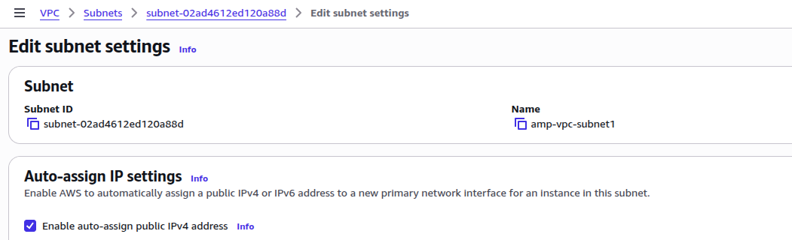
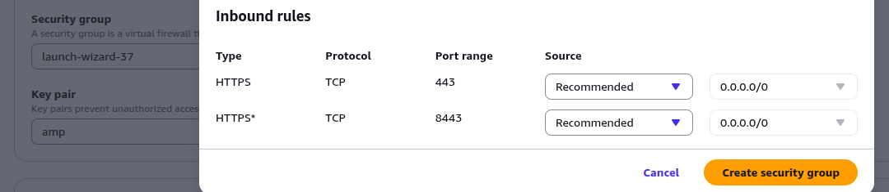

= How to Launch Kill Bill on AWS Using One-Click Launch

:card-badge: Premium
:card-title: AWS Deployment
:card-link: https://aws.amazon.com/marketplace/pp/prodview-jvcsq4phzaclw
:card-description:
include::{sourcedir}/includes/premium-card.adoc[]

== Introduction

This document describes how to deploy Kill Bill on AWS using the *One-Click Launch* option available through AWS Marketplace.

With One-Click Launch, AWS automatically provisions a preconfigured Kill Bill instance, allowing you to get started with minimal configuration.

The setup procedure includes three steps:

. <<step1, Open the AWS Marketplace Listing>>
. <<step2, Configure and Launch the Instance>>
. <<step3, Access Kill Bill>>

[[step1]]
== Step 1: Open the AWS Marketplace Listing

Log in to your AWS account and open the Kill Bill listing in AWS Marketplace.

If you have not already subscribed, complete the subscription process. Then select *Continue to Configuration*.

On the launch page, select *One-click launch from AWS Marketplace*.

[[step2]]
== Step 2: Configure and Launch the Instance

Configure the launch settings as follows:

* Select the AWS *Region* where you want to deploy the instance.

* Select the *VPC* where the instance will be deployed.

* Select a *public subnet*. Ensure that *Auto-assign public IPv4 address* is enabled, as shown below.

* Create a new *Security Group*. The recommended inbound rules are already populated. Provide a name for the security group and ensure that ports *443* and *8443* are open.

* Select an existing EC2 *Key Pair* or create a new one.

After reviewing the configuration, click *Launch*.

AWS provisions the EC2 instance and starts the Kill Bill services automatically. Deployment typically takes a few minutes.

[[step3]]
== Step 3: Access Kill Bill

Once the instance status changes to *Running*, note its public IP address or public DNS name.

You can then access Kill Bill using:

[source]
----
https://<public-ip-or-dns>
----

Login using the following default credentials:

* **Username:** `admin`
* **Password:** `{INSTANCE_ID}`

where `{INSTANCE_ID}` is the EC2 Instance ID (for example, `i-0123456789abcdef0`) of the deployed instance.

After verifying that Kill Bill is accessible, you are ready to create your first tenant and connect your deployment to Aviate.