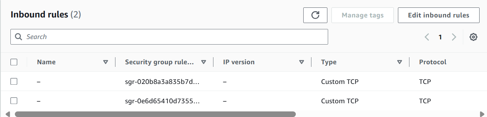
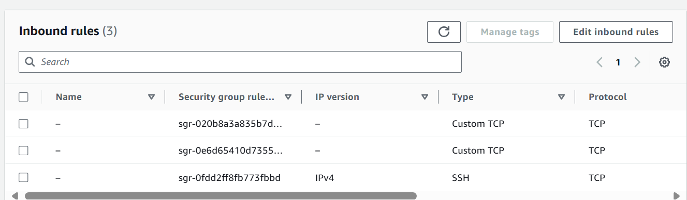
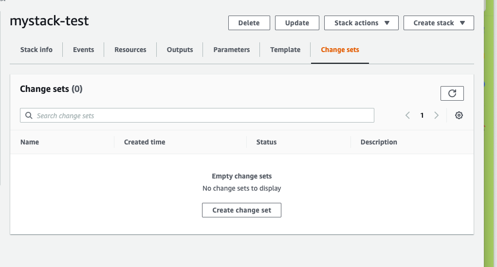
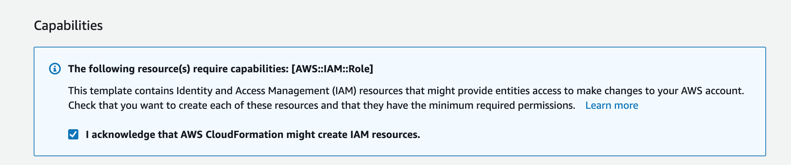
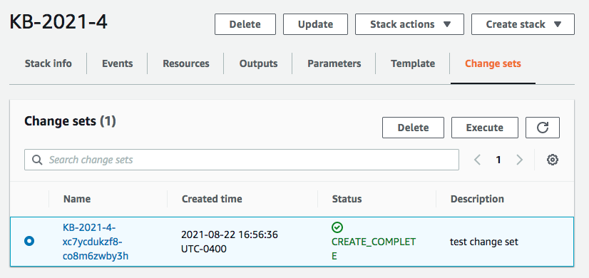

= How to Mantain a CloudFormation System

This guide discusses how to troubleshoot, maintain and upgrade your Kill Bill CloudFormation (CFN) installation.

== Logging in to your EC2s

Many of the steps you may want to take to troubleshoot and maintain your system require login and command line access to one or more of your EC2 instances. To enable this you will need to temporarily modify the corresponding security group.

First, go to the *Instances* screen on your EC2 dashboard and select an instance to log in to. For most tasks you can use any one. Scroll to the right to see the security group associated with this instance. Click on the name of the group. Then select the tab labeled *Inbound Rules*. You should see:

Select *Add Rule* and add a rule with Type SSH, Source 0.0.0.0/0. The Port range will set automatically to 22. You should now see:

To login, use the secure shell command:

`ssh -i PRIVATE_KEY.pem ubuntu@INSTANCE_IP`

Here PRIVATE_KEY is the pathname where you have stored the private key that was downloaded when you generated your key pair, and INSTANCE_IP is the IPV4 address described earlier. The private key will not work unless its access controls are set to readable by the owner only.

On Windows versions before Windows 10, you may need to download a program called PuTTY to enable `ssh`. On Windows 10 and 11, `ssh` is available but may need to be activated through the Settings screen.

The first time you login, you will see a warning message asking if you want to add this host to your list of hosts. You should answer `yes`.

You will now be able to explore your instance and perform various configuration and maintenance tasks. Be careful, because you automatically have root (su) privileges. To exit from your login, type `exit`.

It is a good idea to *remove* the extra security rule when you have no need to login.

== Troubleshooting

In spite of your best efforts, your installation may not succeed. Some components may not be created, or testing may produce errors. This section discusses some things that could go wrong during installation, and provides some suggestions for dealing with them.

=== Stack Creation Problems

There are various possible problems that could arise when creating the CFN stack. In this section
we provide some tips for debugging the issues. The stack will initially have a status of `CREATE_IN_PROGRESS` during the initialization. It will then either transition to `CREATE_COMPLETE` or `CREATE_FAILED`. Keep in mind
that creating the stack will typically take on the order of 15-20 minutes, mostly because of the time it takes to set up the
RDS cluster, so you need to be patient. If the final status is `CREATE_FAILED` you need to find out why.

Check the *Resources* tab on the stack creation page to see which resources failed to create. If you have set the option to prevent rollback, most of the resources will usually have created successfully. If one or more EC2 instances were created, they should now be running, and you can login to one of them (any one) for further checks.

If no instances are running, it is likely there is a problem with your template. Try once more, then contact `support@killbill.io`.

=== System logs

Your system keeps a variety of logs, and some of them are useful even during startup.

CloudFormation logs are found in the `/var/log` directory. First we recommend you check `/var/log/cfn-init.log`, which gives a summary of the startup events.  Next you may look at `/var/log/cfn-init-cmd.log` which breaks down the configuration command in more detail.

Some other CFN logs are listed below. However these are more specialized and may be less helpful:

[source,bash]
----
/var/log/cfn-wire.log
/var/log/cloud-init-output.log
/var/log/awslogs.logs
/var/log/xray/xray.log
----

The Kill Bill/Kaui server logs are located under `/var/lib/tomcat/logs/`. The most interesting of these are:

* `killbill.out`: All Kill Bill server logs, configured as `INFO` by default
* `kaui.out`: All Kaui server logs, configured as `INFO` by default
* `localhost_access_log...`: Access requests to the servers

The configuration of the logging (log rotation, log level, ...) can be found in `/var/lib/killbill/config/logback.xml`

=== AWS Errors

Some errors could occur due to the organization of your AWS system or possible limitations on your account. Typical issues might include:

  * Insufficient IAM Permissions
  * Limit Exceeded
  * Security Group Does Not Exist in VPC
  * RDS Cluster failed to come up
  * ...

Make sure thate you have setup a valid VPC with valid subnets. Fow AWS specific issues, please refer to the https://docs.aws.amazon.com/AWSCloudFormation/latest/UserGuide/troubleshooting.html[AWS troubleshooting documentation].

If you think there is an issue with the CloudFormation template itself, please report any issue to `support@killbill.io`.

If you update any configuration file, you will need to restart the service. To do this, you can run the following commands:

[source,bash]
----
# Restart  killbill server instance
> service killbill restart
# Restart  kaui server instance
> service kaui restart
----

=== Database Problems

From any Kill Bill EC2 instance, it is possible to access the RDS Aurora database. On each node, there is a `mysql` client installed
allowing database access. The database hostname can be obtained from the CFN Resources screen. This information can also be
extracted from the `killbill.properties` file:

[source,bash]
----
> grep 'org.killbill.dao' /var/lib/killbill/config/killbill.properties
org.killbill.dao.password=killbill
org.killbill.dao.url=jdbc:mysql:aurora://mystack-test-rdscluster-1qwiqitatcb9m.cluster-cah16olm8gkg.us-east-1.rds.amazonaws.com:3306/killbill
org.killbill.dao.user=killbill
----

Based on this info, the following command would allow you to get a `mysql` prompt:

[source,bash]
----
> mysql -h mystack-test-rdscluster-1qwiqitatcb9m.cluster-cah16olm8gkg.us-east-1.rds.amazonaws.com -u killbill -pkillbill killbill
> show tables
> ...
----

You should ensure that the database is up and running, and the schemas are properly installed.

== Maintenance

If your installation has been running well but shows signs of slowing down or other problems, there are several commands you can use to assess its overall health. Thee commands can be used when you are logged in to any instance. Some should be run on all instances from time to time.

=== Service Health

Since both the Kill Bill and Kaui servers listen on port 8080, you can check if these services are running by issuing the following command:

[source,bash]
----
telnet 127.0.0.1 8080
Trying 127.0.0.1...
Connected to 127.0.0.1.
Escape character is '^]'.
----

This check may be needed on each of the KB and Kaui instances.

For the Kill Bill servers specifically, some useful commands are:

[source,bash]
----
# Check the status of various memory pools and queues
> curl http://127.0.0.1:8080/1.0/healthcheck | jq
----

Sample output:

[source,bash]
----
  % Total    % Received % Xferd  Average Speed   Time    Time     Time  Current
                                 Dload  Upload   Total   Spent    Left  Speed
100  1164    0  1164    0     0  25866      0 --:--:-- --:--:-- --:--:-- 25866
{
  "main.pool.ConnectivityCheck": {
    "healthy": true
  },
  "org.killbill.billing.server.healthchecks.KillbillHealthcheck": {
    "healthy": true,
    "message": "OK"
  },
  "org.killbill.billing.server.healthchecks.KillbillPluginsHealthcheck": {
    "healthy": true
  },
  "org.killbill.billing.server.healthchecks.KillbillQueuesHealthcheck": {
    "healthy": true,
    "bus": {
      "growing": false
    },
    "overdue-service:overdue-check-queue": {
      "growing": false
    },
    "entitlement-service:entitlement-events": {
      "growing": false
    },
    "invoice-service:next-billing-date-queue": {
      "growing": false
    },
    "notifications-retries:extBusEvent-listener": {
      "growing": false
    },
    "payment-service:janitor": {
      "growing": false
    },
    "externalBus": {
      "growing": false
    },
    "payment-service:retry": {
      "growing": false
    },
    "notifications-retries:next-billing-date-queue": {
      "growing": false
    },
    "subscription-service:subscription-events": {
      "growing": false
    },
    "invoice-service:parent-invoice-commitment-queue": {
      "growing": false
    },
    "server-service:push-notification-queue": {
      "growing": false
    },
    "overdue-service:overdue-async-bus-queue": {
      "growing": false
    },
    "notifications-retries:invoice-listener": {
      "growing": false
    }
  },
  "osgi.pool.ConnectivityCheck": {
    "healthy": true
  },
  "shiro.pool.ConnectivityCheck": {
    "healthy": true
  }
}
----

[source,bash]
----
# Check which Kill Bill & plugin versions are present
> curl -u admin:KBADMINPASSWORD http://127.0.0.1:8080/1.0/kb/nodesInfo | jq
----

Sample output:

[source,bash]
----
[
  {
    "nodeName": "ip-192-168-65-236.ec2.internal",
    "bootTime": "2020-02-02T21:26:44.000Z",
    "lastUpdatedDate": "2020-02-02T21:26:44.000Z",
    "kbVersion": "0.22.1",
    "apiVersion": "0.53.17",
    "pluginApiVersion": "0.26.3",
    "commonVersion": "0.23.7",
    "platformVersion": "0.39.12",
    "pluginsInfo": [
      {
        "bundleSymbolicName": "org.kill-bill.billing.killbill-platform-osgi-bundles-kpm",
        "pluginKey": null,
        "pluginName": "org.kill-bill.billing.killbill-platform-osgi-bundles-kpm",
        "version": null,
        "state": "RUNNING",
        "isSelectedForStart": true,
        "services": []
      },
      {
        "bundleSymbolicName": "org.kill-bill.billing.killbill-platform-osgi-bundles-logger",
        "pluginKey": null,
        "pluginName": "org.kill-bill.billing.killbill-platform-osgi-bundles-logger",
        "version": null,
        "state": "RUNNING",
        "isSelectedForStart": true,
        "services": []
      }
    ]
  }
]
----

=== Diagnostic Command

The `diagnostic` option of the `kpm` command creates an extensive report for a given tenant that may be useful for troubleshooting. To run this command:

[source,bash]
----
# Login as 'tomcat'
> sudo su - tomcat
#
# Details about DB host can be extracted from '/var/lib/killbill/config/killbill.properties'
#
# Run the command with your access credentials:
#
> kpm  diagnostic \
  --killbill-credentials=ADMIN PASSWORD \
  --bundles-dir=/var/lib/killbill/bundles \
  --database-name=killbill \
  --database-credentials=DBUSER DBPASS \
  --killbill-api-credentials=KEY SECRET \
  --killbill-web-path=/var/lib/tomcat/webapps \
  --database-host=DBHOST
----

You will need to edit this command to include:

1. Your KAUI username and password (ADMIN PASSWORD)
2. Your database credentials (DBUSER DBPASS)
3. The key and secret key for your tenant (KEY SECRET)
4. Your database host (see  `/var/lib/killbill/config/killbill.properties` )

The last line of the response should look like:

[source,bash]
----
Diagnostic data exported under /tmp/killbill-diagnostics-20200212-26849-c0rrz3/killbill-diagnostics-02-12-20.zip
----

Note that there is also a `--account-export=<account_id>` flag to export the data associated with a specific Kill Bill `account_id`.

== Upgrading

=== Using Newer AMIs

The Kill Bill core team will provide new AMIs whenever necessary. Here we discuss how to upgrade to these new AMIs without a complete reinstallation.

Because the CloudFormation from AWS Marketplace will always reflect the latest AMI ids, you can simply update the stack with the latest CloudFormation template and the instances in the AutoScaling groups will be updated automatically.
We strongly recommend that you always test the upgrade in a test environment first.

We recommend that you rely on the CloudFormation `ChangeSet` functionality to get a sense of what would be updated if the change was submitted. For more information about the CloudFormation `ChangeSet` functionality see this https://docs.aws.amazon.com/AWSCloudFormation/latest/UserGuide/using-cfn-updating-stacks.html[documentation]. Below is a summary of the steps:

==== 1. Download the new CloudFormation template

Each AMI is defined by a CloudFormation template. To access the template for the latest AMI, go to the Marketplace page as described under *Configure and Launch* above. Check that the page lists the desired version, then scroll down to the *Usage Information* section. Expand the link *View Cloudformation Template*. Below the diagram that appears, click *Download Cloudformation Template*. Save the template file. This will be a long text (JSON) file with a name ending in `template`.

image::../../assets/aws/change-set-usage-information.png[align=center]

==== 2. Create a new ChangeSet

Go to the CloudFormation dashboard and select you current stack. Then select *Stack Details* from the left menu. You should see the following page:

Select *Create Change Set.* On the page that appears, Select *Replace Current Template*, then select *Upload a Template File*. Finally, upload the file you downloaded in Step 1.

You will now revisit several pages that you saw when the stack was created. First, you will see the page *Specify Stack Details*. At this time there should be no changes required. Click *Next*.

The next page will be the *Configure Stack Options*. Again, no changes required.

THe last page is the *Review* page. If everything looks good, scroll to the bottom. You will see the following message, that you will need to acknowledge:

Finally click *Create Change Set*. You can provide an optional description in the popup that appears, then select *Create Change Set* again. Your change set will be created. You will initially see the status `CREATE_PENDING` . Wait until the status message changes to `CREATE_COMPLETE` .

==== 3. Apply the ChangeSet

It is important to remember that at this point your Kill Bill installation has not changed. Your change set is ready and waiting when you do want to use it. When that time comes, return to the cloudformation dashboard, select your stack and select the *change sets* tab. Select your change set, then click *Execute*.

Your new resources will be created and any old ones no longer needed will be deleted. The status of the stack will show as `UPDATE_IN_PROGRESS` . For a short time the stack may be in an unusable state. When the status changes to `UPDATE_COMPLETE` , the stack has been fully updated to the new version.
