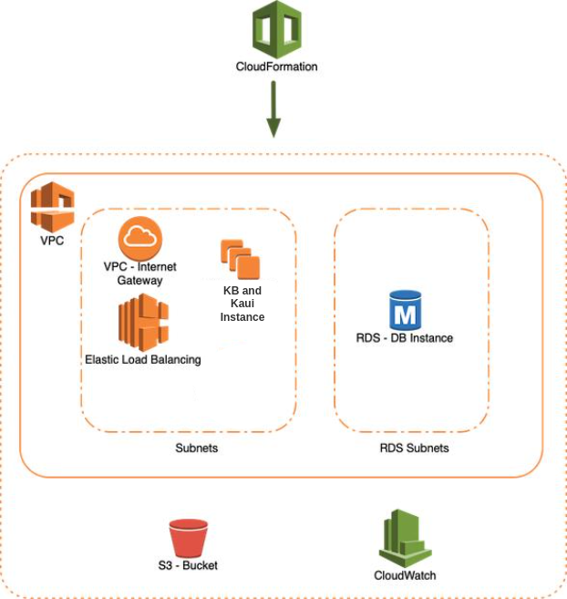
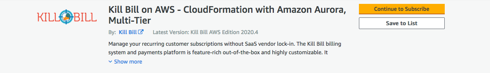
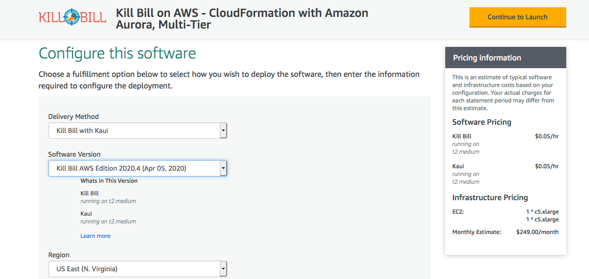
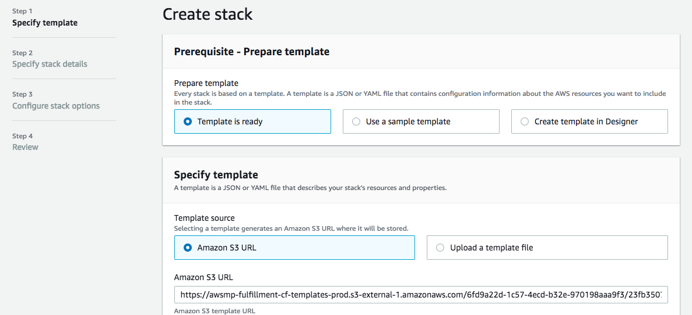
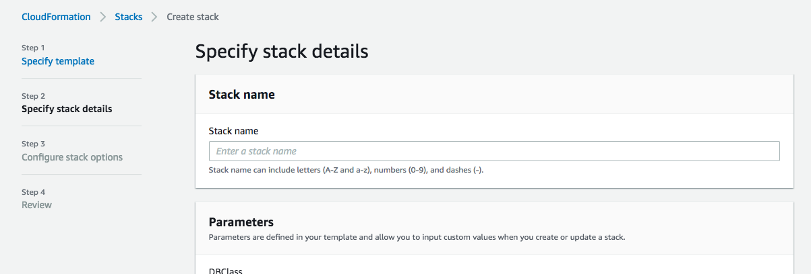
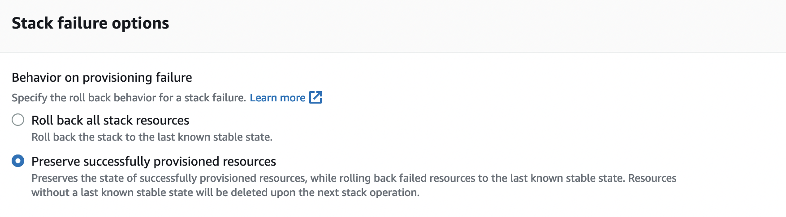
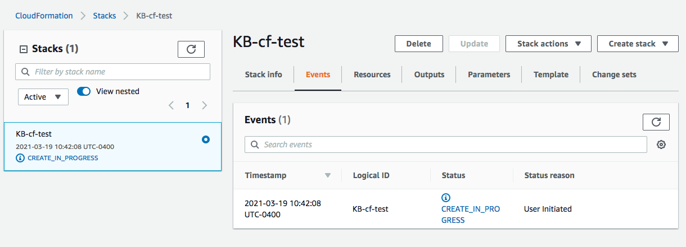
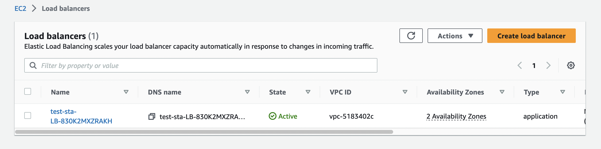
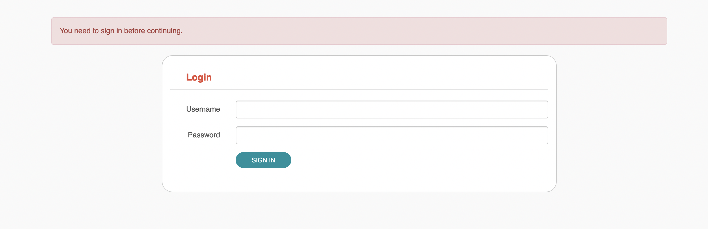

= How to Set up a CloudFormation System

== Overview

This document describes the procedures for setting up Kill Bill under AWS using the CloudFormation option. This is one of two recommended alternatives for production use. The multi-tier option requires more setup than CloudFormation, but provides more control over the deployment. The procedures in this document are based on the options recommended by Kill Bill.

Deployment via CloudFormation leverages the capabilites of the AWS infrastructure to provide a robust *production ready* deployment with a single click. The entire CloudFormation configuration, or stack, is defined by a *CloudFormation Template*.

The features of the CloudFormation system include:

* Both Kill Bill and Kaui instances can be scaled up or down using AWS autoscaling groups
* AWS CloudWatch provides metrics to follow what is happening
* The RDS database based on AWS Aurora comes automatically configured and ready for use

Running Kill Bill on AWS using our CloudFormation Template is the easiest and fastest way to get started with a production cluster. *It is also the only method of installation that is certified by the core developers for a highly available, horizontally scalable and production-ready installation.*

With the click of a button, the template will install and configure:

* Kill Bill and Kaui on a custom AMI optimized for AWS workloads (integrated with CloudWatch, SQS, SES, X-Ray and more)
* Auto Scaling Groups, to automatically scale up and down the number of EC2 instances as needed (such as when batches of invoices are generated)
* A load balancer, integrated with our internal healthchecks to promptly take unhealthy instances out of rotation
* An RDS Aurora Cluster with automatic failover

The following diagram shows the various AWS entities that will be created by CloudFormation:

All resources for this system run within a single AWS *Virtual Private Cloud (VPC)*, providing a dedicated block of IP addresses which must be located in a single *region*. The cloud is partitioned into *availability zones*, which are accessed by *subnets*. The resources must be distributed over at least two availability zones.

Multiple instances of Kaui and the Kill Bill server are deployed in the VPC, each running on its own Ubuntu Linux server. AWS autoscaling is used to increase and decrease the number of instances for each package as needed.

Access to these instances is managed by an AWS *Elastic Load Balancer (ELB)*. The ELB routes each request to the correct package and distributes the requests across the available instances. The ELB accepts traffic securely using HTTPS by default.

The back end of the system is an *Aurora* database manager provided through the AWS *Relational Database System (RDS)*. Aurora is a robust database system developed by AWS, compatible with MySQL and Postgres. There are separate databases maintained for Kill Bill and Kaui.

In addition, the complete CloudFormation system makes use of AWS scalable and reliable *S3* storage technology.

The procedures described here are based on the Kill Bill CloudFormation Template version 2022.10 or later. This system provides the framework for incorporating a variety of analytic tools, including Datadog, New Relic, Rollbar, Sentry, and AWS CloudWatch. In this How-To we will enable CloudWatch, which is easily integrated with our CloudFormation installation. We will *not* make use of the other analytic tools.

The setup procedure includes seven steps:

. <<step1, Login to AWS>>
. <<step2, Setup the VPC and Subnets>>
. <<step3, Create a Certificate>>
. <<step4, Create a Key Pair>>
. <<step5, Configure and Launch>>
. <<step6, Setup a CNAME>>
. <<step7, Test your Stack>>

[[step1]]
== Step 1: Login to AWS

To begin, log in to Amazon Web Services at https://aws.amazon.com. If you are new to AWS, you will be asked to create an account and provide billing information. You will need to sign in as a *Root User*. This should take you to the *AWS Management Console*, which provides links to all available services.

Check the upper right corner of your screen to be sure you are in the appropriate *region*. All resources you create will be placed in this region, and may not be accessible from other regions.

In addition, AWS places all resources within a *Virtual Private Cloud (VPC)*. A default VPC will be created and used automatically in the following steps. However, if you have access to other VPCs, you will need to ensure that all Kill Bill resources are deployed in the same one.

[[step2]]
== Step 2: Setup the VPC and Subnets

All resources for your CloudFormation deployment must be placed within a single VPC. To prepare for CloudFormation deployment you will first need to setup and identify your VPC and subnets.

=== 1. Setup your VPC

From the *Services* menu item at the top of the main AWS page, under *Networking and Content Delivery*, select *VPC*. This will open the *VPC Dashboard*. Then select *Your VPCs* from the left menu.

Normally you will see one VPC, which AWS provides by default. This VPC will automatically be used for all your resources. If you have more than one, you need to select the one you want to use and be sure to set its ID as a parameter for your CloudFormation configuration. If there is no VPC listed, you must create one. The only parameter you need to set is the ipv4 CIDR block, which designates a range of (private) IP addresses. A suggested value is 192.168.0.0/16.

=== 2. Setup your Subnets

From the left menu of the VPC Dashboard select *Subnets*. This shows a list of your subnets. By default AWS creates one subnet for each Availability Zone in your region. You may create your own subnets, as long as you give each a CIDR block representing a unique subset of your VPC, and assign each to a specific availability zone. If you don't know what this means, just accept the defaults.

[[step3]]
== Step3: Create a Certificate

The CloudFormation implementation uses the HTTPS protocol for strong security. This requires the use of an X.509 certificate.

If you do not have a certificate, select *Security, Identity, and Compliance*, then *Certificate Manager* from the Services menu. Then follow the instructions in https://../how-to-add-a-certificate-using-ACM.html[How to Add a Certificate Using ACM].

If you have a certificate created by ACM, you are all set. If you have a certificate not created by ACM, set the bottom left dropdown to **Import** and follow the instructions. Import the certificate to ACM.

Now select your certificate from the ACM list and copy its AWS Resource Name (ARN). Save this value as it will be needed in a later step.

[[step4]]
== Step 4: Create a Key Pair

The Kill Bill CloudFormation stack requires a key pair. The key pair provides the credentials you will need to login to your EC2 instances. If you already have a key pair, you are all set. Otherwise you will need to create one.

To create a key pair, from the EC2 console scroll down to *Networks & Security / Key Pairs*. Select *Create Key Pair* and follow the instructions. Give the key pair a simple, easy to remember name such as `My-Key-Pair`.For details about key pairs, see the https://docs.aws.amazon.com/AWSEC2/latest/UserGuide/ec2-key-pairs.html[AWS documentation]. Important: You *must* save the private key that will be generated in this step. If you lose this key, you will *not* be able to login to your instances.

[[step5]]
== Step 5: Configure and Launch

The setup process starts with the  https://aws.amazon.com/marketplace/pp/prodview-yadytedsiclzu?sr=0-3&ref_=beagle&applicationId=AWSMPContessa[Kill Bill CloudFormation Template at AWS Marketplace]. Go to this page, then click *Continue to Subscribe*.

THe next page gives the AWS Terms and Conditions. You must accept these conditions if asked, then click *Continue to Configuration*. This will take you to the page titled *Configure This Software*:

Make sure your Region is correct. There is nothing else to change on this page. Click *Continue to Launch*. THe next page is titled *Launch this Software*. There is nothing to do here either. Click *Launch*.

The next page is designated *Step 1: Specify Template* and titled *Create stack*:

Once again everything is filled in for you. Click *Next*. This brings up the *Stack Details* page (your complete configuration is called a stack):

*Now* you have some work to do! This page requires that a number of configuration parameters be filled in. All of these are important, and some are critical.

First, you need to provide a name for your stack. Any name will do, as long as it meets the stated rules. Then you will need to carefully set a series of parameters:

* *CloudWatchMetricsLevel:* the amount of metrics that will be collected for CloudWatch. No change needed.
* *DBClass:* the database instance type to use for RDS. This normally should not be changed.
* *DBName:* the database name for Kill Bill. This is preset to *killbill*. Do not change it.
* *DBPassword:* database admin password. The password you choose for the database administrator. This must be at least 8 characters long, and composed entirely of letters and digits.
* *DBUser:* database admin username. The username you choose for the database administrator.
* *DatadogApiKey:* the key needed if using Datadog. Leave blank.
* *ELBListenerSSLCertARN:* the ARN for the certificate you setup in Step 3.
* *EnableCloudWatchMetrics:* whether to enable metrics in CloudWatch. Leave set to true.
* *EnableDatadog:* leave set to false.
* *EnableNewRelic:* leave set to false.
* *EnableRollbar:* leave set to false.
* *EnableSentry:* leave set to false.
* *EnvType:* the purpose of this configuration: test, dev (development), or prod (production). There is no difference in the stack being created but this value will be sent to CloudWatch as a dimension.
* *HTTPLocation:* the IP address range allowed to access the load balancer, in the form of a CIDR block. You can use 0.0.0.0/0 initially and adjust access later on.
* *InstanceType:* the EC2 instance type to use for Kill Bill. This normally should not be changed.
* *KBAdminPassword:* the password to be used for the default `root` user which has all permissions. By default this is set to `password`. Please change it! There are currently no restrictions on format. This is also the password you will use to login to Kaui.
* *KauiDBName:* database name for Kaui. This is preset to *kaui*. Do not change it.
* *KauiServerCapacity:* the initial number of Kaui instances in the Auto Scaling group. We recommend using the default value, `2`.
* *KeyName:* name of your existing EC2 KeyPair to enable SSH access to the instances. You created this in Step 4.
* *KillBillServerCapacity:* the initial number of Kill Bill instances in the Auto Scaling group. Again we recommend the default value of `2`.
* *NewRelicApiKey:* key needed if New Relic is used. Leave blank.
* *RDSSubnets:* the subnets to use for the RDS instance. Select two or more from your subnets, which must be in two or more availability zones. There is no harm in using more.
* *RollbarAccessToken:* key needed for Rollbar. Leave blank.
* *SentryDsn:* key needed for Sentry. Leave blank.
* *SsmStorePath:* SSM parameter store that can be used for key pairs. Leave this blank.
* *Subnets:* the subnets to use for the KB and Kaui instances. Also two or more from your subnets in two or more availability zones. These may or may not be the same as the RDS subnets.
* *VpcId:* the Id of the VPC to use for the installation, which you identified earlier.

When all of these are set, click *Next* to go to *Configure Stack Options*. There is only one thing to do here. Scroll down to the panel labeled *Stack Failure Options*, and select the option *Preserve Successfully Provisioned Resources.* This ensures that if your stack creation fails, you can use the resources that were successfully created to help troubleshoot the problem. Then click *Next*.

The final page gives you a chance to review. If everything seems OK, read and check any warnings at the bottom, then click *Submit*. you are off!

If there are any errors, you will see a message and the Create will not begin. You will need to go back and fix the errors. Common errors may include using an invalid password form (which may give a misleading message), or not choosing subnets in at least two availability zones.

Otherwise, you will see that your stack is being created, and its status (shown in blue) will be `CREATE_IN_PROGRESS`. You may also check the *Resources* tab to see the many resources that are being created to make up the complete stack.

If the create succeeds, the status will eventually change to `CREATE_COMPLETE` (shown in green). This may take a fairly long time.

[[step6]]
== Step 6: Setup a CNAME

A critical resource included in your CloudFormation implementation is the ELB Load Balancer. To complete the protection of this resource by your certificate, as explained in https://add-a-certificate-using-ACM.html[How to Add a Certificate Using ACM], you need to create a CNAME for your domain with the name "kaui" and a value that points to this load balancer.

First, find the load balancer in the EC2 console:

Select the load balancer and copy its DNS name as the value for the CNAME you are creating.

[[step7]]
== Step 7: Test your Stack

You should now be able to login to Kaui from your browser using the URL `\https://kaui.<DOMAIN>:9090`, where <DOMAIN> is *your* domain that you have used for your certificate. The Kaui login screen should appear:

For an introduction to Kaui, see our https://docs.killbill.io/latest/quick_start_with_kaui.html[Quick Start with Kaui] guide. The default credentials are: `admin` / `<KBA_PASSWORD>`, where <KBA_PASSWORD> is the parameter *KBAdminPassword* that you set earlier.

Similarly, you should be able to login directly to the Kill Bill server using the URL `\https://kaui.<DOMAIN>`.
This provides access to certain detailed resources that may be needed for maintenance, including metrics and the Swagger API pages.

Congratulations! Your CloudFormation installation is ready to go!

For information on troubleshooting, maintaining and upgrading your installation see https://../how-to-maintain-a-cloudformation-system.adoc[How to Maintain a CloudFormation System].

