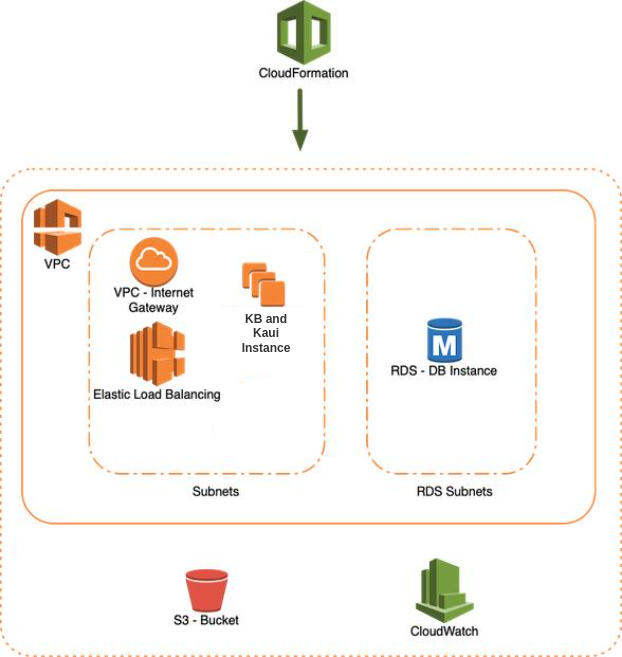
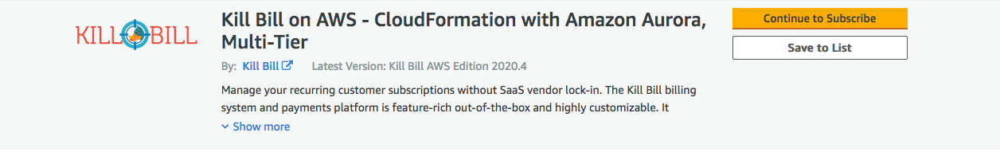
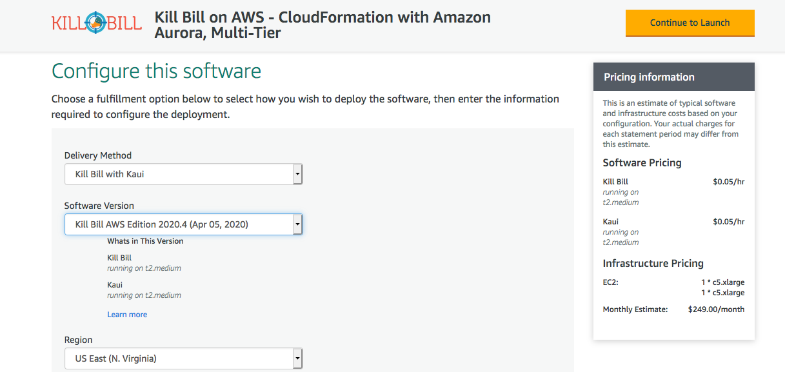
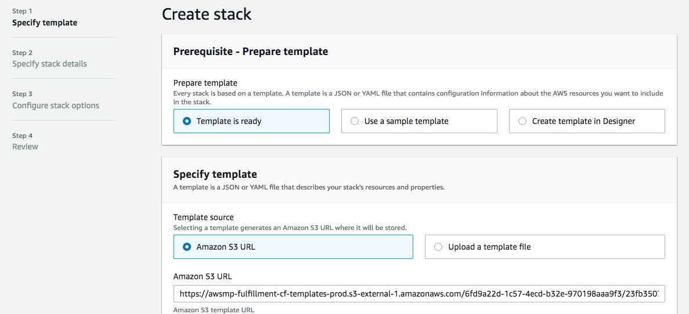
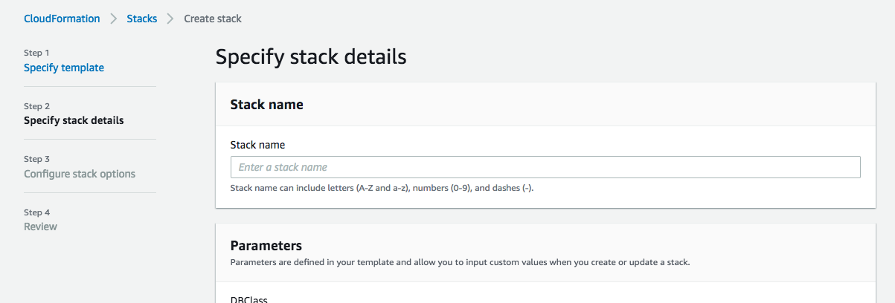
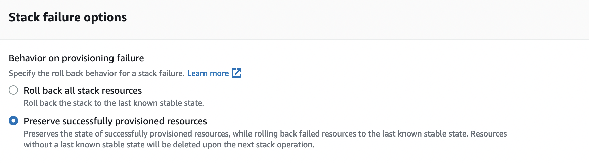
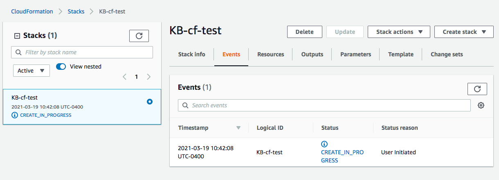
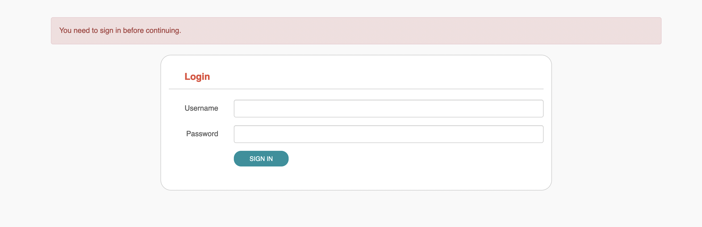
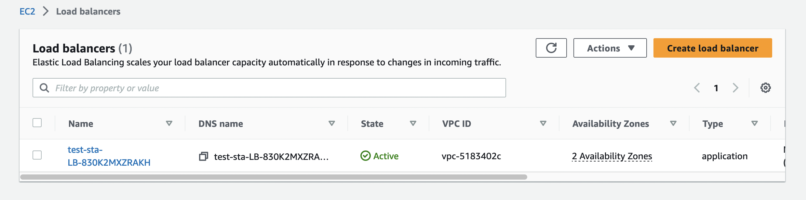

= How to Set up a CloudFormation System

:card-badge: Premium
:card-title: AWS Deployment
:card-link: https://aws.amazon.com/marketplace/pp/prodview-aicuarzg3e4t6
:card-description:
include::{sourcedir}/includes/premium-card.adoc[]

== Overview

Deploying Kill Bill via AWS CloudFormation is the fastest path to a production-grade installation. A single template creates and wires together all required AWS infrastructure automatically.

The stack provisions:

* Kill Bill and Kaui on a custom AMI pre-configured for AWS (CloudWatch, SQS, SES, X-Ray)
* An Auto Scaling Group that scales EC2 instances up or down based on demand
* An Application Load Balancer with HTTPS on port 443 (Kaui) and port 8443 (Kill Bill API)
* An Aurora MySQL cluster across two availability zones with automatic failover

*This is the only installation method certified by the Kill Bill core team for high availability, horizontal scalability, and production readiness.*

=== What You Will Need

Collect the following before starting. Each item is covered in the <<prerequisites,Prerequisites>> section.

[cols="2,3,2", options="header"]
|===
|Item |Purpose |Where to get it
|AWS account |All resources run in your account |https://aws.amazon.com
|VPC + 2 public subnets (min) |Load balancer and EC2 instances |AWS VPC Console
|2 private subnets (recommended) |Aurora RDS cluster, isolated from internet |AWS VPC Console
|TLS certificate ARN |HTTPS on the load balancer — *required before launch* |AWS Certificate Manager
|EC2 Key Pair |SSH access to EC2 instances |AWS EC2 Console
|===

Estimated time: 30–45 minutes, most of which is unattended stack creation.

[[prerequisites]]
== Prerequisites

Complete each prerequisite once. They persist across stack re-creations and upgrades.

[[prereq-account]]
=== 1. AWS Account and Region

Log in to https://aws.amazon.com. Check the *region selector* in the upper-right corner of the console — all resources in the stack must be in the same region. Confirm you are in the correct region before proceeding.

[[prereq-vpc]]
=== 2. VPC and Subnets

The stack needs two sets of subnets within a single VPC:

* *EC2 and Load Balancer Subnets* (`Subnets` parameter): at least two *public* subnets, one per availability zone. The load balancer must be reachable from the internet.
* *RDS Database Subnets* (`RDSSubnets` parameter): at least two subnets for the Aurora cluster. For production, use *private* subnets (no route to the internet gateway) to isolate the database.

To view or create subnets: *Services → Networking & Content Delivery → VPC → Subnets*.

AWS creates a default public subnet per availability zone automatically. For a quick test deployment you can use the same public subnets for both parameters. For production, create two dedicated private subnets for `RDSSubnets`.

You will need:

* Your VPC ID (`vpc-xxxxxxxx`)
* At least two subnet IDs for EC2/LB (`subnet-xxxxxxxx`)
* At least two subnet IDs for RDS (`subnet-xxxxxxxx`)

[[prereq-cert]]
=== 3. TLS Certificate

[IMPORTANT]
====
The stack will fail immediately if `ELBListenerSSLCertARN` is empty or invalid. Create and copy the certificate ARN *before* launching the stack.
====

The load balancer requires an HTTPS certificate stored in *AWS Certificate Manager (ACM)*. Two options:

*Option A — ACM-issued certificate (production):* requires a domain name you control. AWS validates ownership via DNS CNAME, then issues the certificate automatically. Follow https://docs.killbill.io/latest/how-to-add-a-certificate-using-ACM.html[How to Add a Certificate Using ACM].

*Option B — Imported self-signed certificate (testing):* avoids the need for a domain name. Browsers will show an untrusted certificate warning, which you can click through.

To generate a self-signed certificate:

[source,bash]
----
openssl req -x509 -newkey rsa:2048 -keyout key.pem -out cert.pem \
  -days 365 -nodes \
  -subj "/CN=killbill.test.internal" \
  -addext "subjectAltName=DNS:killbill.test.internal"
----

[IMPORTANT]
====
The CN value must be a *fully-qualified domain name* — it must contain at least one dot. A value like `killbill-test` (no dot) will cause the load balancer listener to fail during stack creation with the error: _"The certificate must have a fully-qualified domain name."_
====

Then import the certificate to ACM: *Services → Security, Identity & Compliance → Certificate Manager → Import*.

After importing or creating the certificate, copy its ARN — it looks like:

----
arn:aws:acm:us-east-1:123456789012:certificate/xxxxxxxx-xxxx-xxxx-xxxx-xxxxxxxxxxxx
----

For background on how HTTPS, certificates, and the load balancer interact in this stack, see https://docs.killbill.io/latest/explanation-https-and-certificates.html[Explanation: HTTPS and Certificates].

[[prereq-keypair]]
=== 4. EC2 Key Pair

A key pair is required to SSH into EC2 instances. To create one: *EC2 Console → Network & Security → Key Pairs → Create Key Pair*.

[IMPORTANT]
====
Download and save the private key file immediately. AWS will not let you download it again. If you lose it, you must create a new key pair and re-launch the stack.
====

== Step 1: Subscribe on AWS Marketplace

Go to the https://aws.amazon.com/marketplace/pp/prodview-aicuarzg3e4t6[Kill Bill CloudFormation Template on AWS Marketplace] and click *Continue to Subscribe*.

Accept the AWS terms and conditions when prompted, then click *Continue to Configuration*.

On the *Configure This Software* page, verify your region is correct. Click *Continue to Launch*, then *Launch* on the next page. This opens the CloudFormation console.

NOTE: The subscription and terms acceptance is a *one-time action per AWS account*. On subsequent deployments you go directly to the CloudFormation launch page.

== Step 2: Launch the CloudFormation Stack

The CloudFormation console opens at *Step 1: Specify Template*, with the template URL pre-filled. Click *Next*.

On the *Specify stack details* page, enter a name for the stack (e.g. `killbill-prod`), then fill in the parameters below. Parameters are presented in four groups matching the form layout.

[[params-network]]
=== Required: Network Configuration

[cols="2,4", options="header"]
|===
|Parameter |What to enter
|*VPC ID* |Your VPC ID from <<prereq-vpc,Prerequisite 2>> (e.g. `vpc-0abc12345`)
|*EC2 and Load Balancer Subnets* |Select at least 2 public subnets across 2 AZs
|*RDS Database Subnets* |Select at least 2 subnets across 2 AZs (private subnets recommended for production)
|===

[[params-security]]
=== Required: Security

[cols="2,4", options="header"]
|===
|Parameter |What to enter
|*TLS Certificate ARN* |The ARN copied from ACM in <<prereq-cert,Prerequisite 3>>. Must start with `arn:aws:acm:`.
|*Allowed IP Range for Load Balancer* |CIDR controlling who can reach the load balancer. Use `0.0.0.0/0` initially; restrict to your IP range for production.
|*Kill Bill / Kaui Admin Password* |Password for the `admin` user. Minimum 8 characters. You will use this to log in to Kaui after deployment.
|*Database Username* |Admin username for Aurora. Letters and digits only; must start with a letter.
|*Database Password* |Admin password for Aurora. Minimum 8 characters, letters and digits only.
|*EC2 Key Pair Name* |Name of the key pair from <<prereq-keypair,Prerequisite 4>>.
|===

[[params-capacity]]
=== Optional: Capacity and Environment

These have sensible defaults. Change only if you have a specific reason.

[cols="2,3,1,2", options="header"]
|===
|Parameter |Description |Default |Guidance
|*Environment Type* |Labels CloudWatch metrics as prod/test/dev |`test` |Set to `prod` for production deployments
|*EC2 Instance Type* |Compute size for Kill Bill instances |`t2.medium` |Increase for sustained high traffic
|*Initial Number of EC2 Instances* |Starting capacity in the Auto Scaling Group |`2` |`1` is sufficient for testing
|*RDS Instance Class* |Database compute size |`db.t3.medium` |Increase for high write/read load
|===

[[params-monitoring]]
=== Optional: Monitoring and Observability

CloudWatch is enabled by default. Third-party integrations are opt-in.

[cols="2,3,1", options="header"]
|===
|Parameter |Description |Default
|*Enable CloudWatch Metrics* |Sends metrics to AWS CloudWatch |`true`
|*CloudWatch Metrics Detail Level* |Amount of data: NONE / MINIMAL / LARGE / ALL |`MINIMAL`
|*Enable New Relic / Datadog / Sentry / Rollbar* |Third-party observability integrations |`false`
|*API keys for each tool* |Required only if the corresponding tool is enabled |blank
|===

=== Advanced Settings

*Do not change these parameters unless explicitly instructed.*

[cols="2,3", options="header"]
|===
|Parameter |Description
|*Kill Bill Database Name* |Preset to `killbill` — changing this breaks the schema setup
|*Kaui Database Name* |Preset to `kaui` — changing this breaks the schema setup
|*Kill Bill AMI ID* |Pre-set to the current certified AMI — changing this will break the deployment
|*SSM Parameter Store Path* |For config stored in SSM. Leave blank.
|*Custom Environment Variables* |Comma-delimited list of env vars. Leave blank unless instructed.
|===

=== Configure Stack Options and Submit

Click *Next* to reach *Configure stack options*. Scroll to *Stack failure options* and select *Preserve Successfully Provisioned Resources*. This allows you to inspect partial deployments for troubleshooting.

Click *Next*, review the summary, check any capability acknowledgement boxes at the bottom, and click *Submit*.

Stack creation takes 15–25 minutes. The status shows `CREATE_IN_PROGRESS` (blue) while running and `CREATE_COMPLETE` (green) when done. Watch individual resources on the *Events* and *Resources* tabs.

If the status changes to `CREATE_FAILED`, see <<troubleshooting,Troubleshooting>> below.

== Step 3: Verify Your Deployment

Once the stack status is `CREATE_COMPLETE`, open the *Outputs* tab and copy the *WebsiteURL* value — this is the ALB DNS name.

Open the Kaui login page in your browser:

----
https://<ALB-DNS-NAME>/users/sign_in
----

If you imported a self-signed certificate, your browser will display a security warning. Click through it to proceed.

Log in with:

* *Username:* `admin`
* *Password:* the *Kill Bill / Kaui Admin Password* you set in the stack parameters

For a guided introduction to Kaui, see the https://docs.killbill.io/latest/quick_start_with_kaui.html[Quick Start with Kaui].

To access the Kill Bill API and Swagger documentation directly:

----
https://<ALB-DNS-NAME>:8443
----

== Step 4: (Optional) Configure DNS

If you used an ACM-issued certificate for a domain you own, create a DNS CNAME at your domain registrar pointing your subdomain to the ALB DNS name:

----
kaui.mycompany.com  →  <ALB-DNS-NAME>.us-east-1.elb.amazonaws.com
----

To find the ALB DNS name: *EC2 Console → Load Balancers*, select your load balancer, and copy the *DNS name* field.

NOTE: This routing CNAME is *separate* from the ACM certificate validation CNAME. The validation CNAME proves domain ownership to AWS during certificate issuance. The routing CNAME directs traffic to your stack. They have different names and serve different purposes — you need both if you used an ACM-issued certificate.

Once the CNAME propagates (typically a few minutes to an hour depending on your DNS TTL), access Kaui at `\https://kaui.mycompany.com`.

[[troubleshooting]]
== Troubleshooting

=== `KBLBListener` or `KauiLBListener` fails: "Certificate ARN is not valid"

The `ELBListenerSSLCertARN` parameter was empty or malformed. The load balancer requires a valid certificate ARN at creation time.

*Fix:* Delete the failed stack. Complete <<prereq-cert,Prerequisite 3>> to create and import a certificate in ACM, then re-launch with the ARN filled in.

=== `KauiLBListener` fails: "certificate must have a fully-qualified domain name"

The imported certificate's Common Name (CN) does not contain a dot (e.g. `killbill-test` instead of `killbill.test.internal`). The ALB rejects certificates without a proper FQDN.

*Fix:* Regenerate the certificate with an FQDN CN:

[source,bash]
----
openssl req -x509 -newkey rsa:2048 -keyout key.pem -out cert.pem \
  -days 365 -nodes \
  -subj "/CN=killbill.test.internal" \
  -addext "subjectAltName=DNS:killbill.test.internal"
----

Delete the old certificate from ACM, import the new one, delete the failed stack, and re-launch.

=== Login fails via the load balancer URL but works via EC2 IP directly

Logging in to Kaui returns to the sign-in page repeatedly, but accessing the EC2 instance directly by IP works. This is a Rails trusted proxy configuration issue: when traffic arrives through the ALB, Rails does not recognize the ALB as a trusted proxy and refuses to set the secure session cookie.

See https://docs.killbill.io/latest/how-to-maintain-a-cloud-formation-system[How to Maintain a CloudFormation System] for the fix.

=== Stack creation times out at `KBAutoScalingGroup`

The EC2 instances failed to signal CloudFormation within the 15-minute window. This usually means the instance initialization script encountered an error.

To diagnose:

. Go to *EC2 Console → Instances*, find the Kill Bill instance
. Choose *Actions → Monitor and Troubleshoot → Get System Log* to see the boot output
. Check the *Events* tab on the CloudFormation stack for the specific failing step

Common causes: the RDS cluster was not reachable from the EC2 instances (check security groups and subnet routing), or an invalid parameter value was passed to the install script.

---

For maintenance, scaling, upgrades, and ongoing operations, see https://docs.killbill.io/latest/how-to-maintain-a-cloud-formation-system[How to Maintain a CloudFormation System].
