= How to Set up a Multi-Tier System

:card-badge: Premium
:card-title: AWS Deployment
:card-link: https://aws.amazon.com/marketplace/pp/prodview-jvcsq4phzaclw
:card-description:
include::{sourcedir}/includes/premium-card.adoc[]

== Overview

This document describes the procedures for setting up Kill Bill under AWS using the multi-tier option. This is one of two recommended alternatives for production use. The multi-tier option requires more setup than CloudFormation, but provides more control over the deployment. The procedures in this document are based on the options recommended by Kill Bill.

This configuration uses two or more EC2 instances and a separate database provided by the AWS *Relational Database Service (RDS)*. It also includes an AWS *Elastic Load Balancer (ELB)* to correctly spread the traffic among the various nodes, and to route traffic to either the Kill Bill Server or Kaui based on the incoming port.

The diagram below shows the principal components of the multi-tier system: The ELB, the RDS, and two or more EC2 instances. Each EC2 is an instance of Ubuntu Linux, running both Kill Bill and Kaui within a `tomcat` server. Clients interact only with the ELB, which routes requests to the rest of the system.

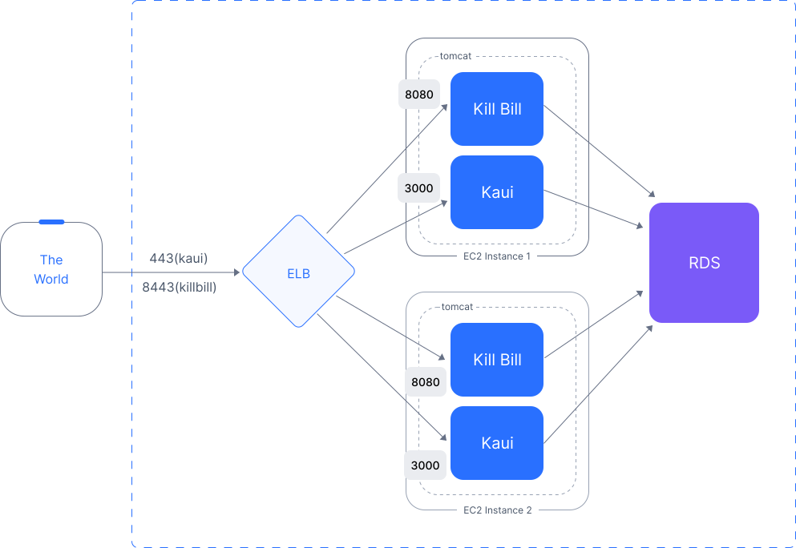

These components will be installed in reverse order. First we set up the RDS instance. Next the EC2 instances are launched, and the Kill Bill and Kaui databases are created on them. Finally, the ELB load balancer is installed to tie everything together.

=== What You Will Need

Before you begin, it helps to have the following ready:

[cols="2,3,2", options="header"]
|===
|Item |Purpose |Where to get it
|AWS account |All resources run in your account |https://aws.amazon.com
|VPC + public subnet |EC2 instances and the load balancer need internet access |AWS VPC Console
|EC2 Key Pair |SSH access to EC2 instances |AWS EC2 Console (see Step 4)
|RDS database instance (MySQL/MariaDB/Aurora compatible) |Shared database for Kill Bill and Kaui |AWS RDS Console (see Step 2)
|TLS certificate |HTTPS on the load balancer |AWS Certificate Manager (see Step 7)
|===

The setup procedure includes eight steps:

. <<step1, Login to AWS>>
. <<step2, Set Up the RDS Instance>>
. <<step3, Edit the Configuration Script>>
. <<step4, Launch EC2 Instances>>
. <<step5, Create the Kill Bill and Kaui Databases>>
. <<step6, Perform Initial Testing>>
. <<step7, Add the ELB>>
. <<step8, Perform Final Testing>>

NOTE: AWS user interfaces change frequently. You may see screens slightly different from those shown below.

[[step1]]
== Step 1: Login to AWS

To begin, log in to Amazon Web Services at https://aws.amazon.com. If you are new to AWS, you will be asked to create an account and provide billing information. You will need to sign in as a *Root User*. This should take you to the *AWS Management Console*, which provides links to all available services.

Check the upper right corner of your screen to be sure you are in the appropriate *region*. All resources you create will be placed in this region, and may not be accessible from other regions.

In addition, AWS places all resources within a *Virtual Private Cloud (VPC)*. A default VPC will be created and used automatically in the following steps. However, if you have access to other VPCs, you will need to ensure that all Kill Bill resources are deployed in the same one.

[[step2]]
== Step 2: Set Up the RDS Instance

Once you are logged in, the first step is to set up the Relational Database System. This process begins with the RDS dashboard, which should be available from the Services menu. When the dashboard appears, select *Databases* from the left menu, and click the red button at the top right that reads *Create Database*:

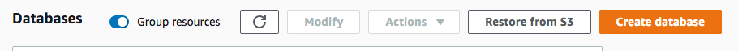

=== 2.1. Set the Configuration

You will be taken to the *Create Database* page. The first choice you will have is between *Standard Create*, which allows you to set a full range of configuration parameters, or *Easy Create*, which sets most of these parameters to defaults. Select *Easy Create*.

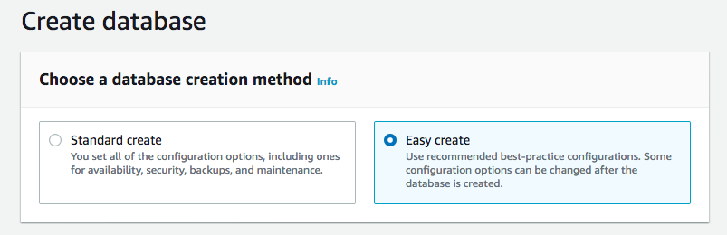

The next section offers you a choice of several database types. Kill Bill can work with any database type that is `mysql` or `postgres` compatible. For robust production use, Amazon Aurora is probably a good choice. Here we will illustrate the simpler steps setting up a MariaDB database.

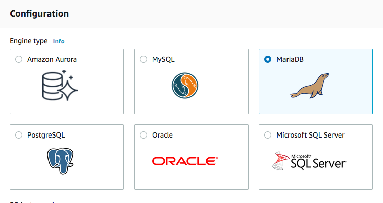

The next choice determines the instance size. We suggest the *Production* option as this will provide the most robust configuration.

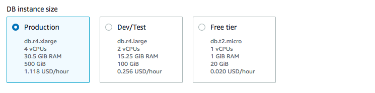

The last section asks you to:

1. Specify a name for your database
2. Give a username for the administrative account (we suggest that you do *not* use the default name)
3. Provide a password for the administrative acount (we suggest you let AWS generate one for you)

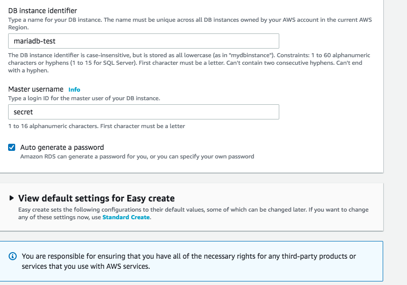

=== 2.2. Create the RDS Instance

When the password is setup and confirmed, click *Create Database* in the lower right corner. You will return to the main Databases screen, which should now look like this:

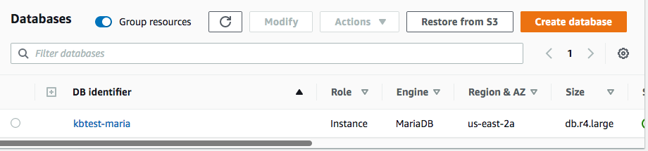

This display shows that your database instance is starting. After a few minutes, the status will change to *Available* (You may need to reload the page to see this). You will also have a chance to see the password, in case it was autogenerated. Save this password, as you will need it later.

At this time you can click on the database name to get more information. You should see a panel named *Connectivity and Security*. The left side of this panel shows the full name of the endpoint, which you will need shortly, and the port number, which is normally 3306.

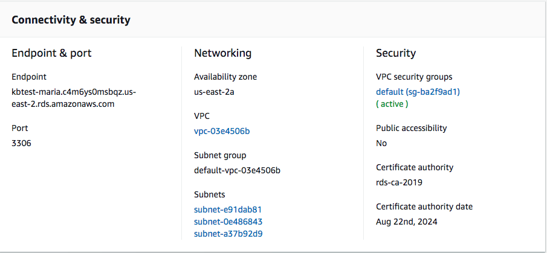

=== 2.3. Set Up the Security Rules

Lastly, on the *Connectivity and Security* panel, locate and click on the link for the default VPC security group. You will need to add an inbound security rule because the database by default does not allow external access. In the panel for this group, click on *Inbound Rules* and select *Edit Inbound Rules*. Next, click on *Add rule*. In the *Type* column select `MYSQL/Aurora`. The port will be set to 3306 automatically. In the *Source* column, click on the search icon and select `0.0.0.0/0`. Finally, click on *Save Rules* in the bottom right. Your database is ready to go.

[NOTE]
====
The current security configuration allows open access to the database from any IP address, which can pose significant security risks. Exposing a database to the public internet without proper restrictions is generally not recommended as it may lead to potential vulnerabilities and make your data susceptible to attacks.

To ensure robust protection, it is essential to promptly update the database security settings after completing the Multi-Tier setup. We recommend restricting access so that only EC2 instances running Kill Bill and Kaui are permitted to connect to the database.
====

[[step3]]
== Step 3: Edit the Configuration Script

To configure the EC2 instances and establish their connection to the databases, you'll need to provide essential information. Fortunately, Kill Bill and Kaui are equipped to read environment variables, making the setup more straightforward. For your convenience, we have a concise configuration script available to streamline this process. Below is the template for the script:

[source,bash]
----
#!/bin/bash
set -euo pipefail

db_host="<DB endpoint writer instance>"
db_port="<DB port>"
db_user="<DB username>"
db_password="<DB passwordd>"
kb_admin_password="<Kaui admin login password>"

KB_PLUGINS_TEMP_DIR="/var/lib/killbill/bundles/temp"

cat << EOF >> /etc/environment
KB_org_killbill_dao_url=jdbc:mysql://$db_host:$db_port/killbill
KB_org_killbill_dao_user=$db_user
KB_org_killbill_dao_password=$db_password

KB_org_killbill_billing_osgi_dao_url=jdbc:mysql://$db_host:$db_port/killbill
KB_org_killbill_billing_osgi_dao_user=$db_user
KB_org_killbill_billing_osgi_dao_password=$db_password

KB_ADMIN_PASSWORD=$kb_admin_password

KAUI_DB_ADAPTER=mysql2
KAUI_DB_URL=jdbc:mysql://$db_host:$db_port/kaui
KAUI_DB_USERNAME=$db_user
KAUI_DB_PASSWORD=$db_password
KAUI_KILLBILL_URL=http://127.0.0.1:8080
EOF

echo "Waiting for plugin SQL files..."

for i in {1..60}; do
  if ls ${KB_PLUGINS_TEMP_DIR}/*/*.sql >/dev/null 2>&1; then
    break
  fi

  sleep 10
done

echo "Installing plugin DDLs..."

find "${KB_PLUGINS_TEMP_DIR}" \
  -mindepth 2 \
  -maxdepth 2 \
  -name "*.sql" \
  | sort \
  | while read -r ddl_file; do

    plugin_name=$(basename "$(dirname "$ddl_file")")

    echo "Installing DDL for plugin: ${plugin_name}"
    echo "Executing file: ${ddl_file}"

    mysql \
      --host="${db_host}" \
      --port="${db_port}" \
      --user="${db_user}" \
      --password="${db_password}" \
      killbill < "${ddl_file}"

    echo "Completed plugin: ${plugin_name}"
done

echo "All plugin DDLs installed successfully"
----

In the above script, replace the value of `db_host` with the full name of the DB writer endpoint obtained from the Connectivity and Security panel, as indicated earlier. Be sure to specify the appropriate database port number (`3306` for MySQL or `5432` for PostgreSQL) by setting `db_port`. The `kb_admin_password` value will be utilized as the admin password for Kaui login.

Optionally, you may choose to customize other Kill Bill properties based on your specific needs. For more detailed information on available configuration options, please refer to the documentation provided at: https://docs.killbill.io/latest/userguide_configuration.html.

[NOTE]
====
The Kaui properties present in the provided template are required for proper functioning. Missing any of these properties may prevent the Kill Bill service from starting successfully. Ensure to set all the necessary properties correctly to ensure a smooth setup process.
====

Save this script to a file as it will be necessary during the launch of EC2 instances.

[[step4]]
== Step 4: Launch EC2 Instances

The next step is to launch the number of EC2 instances you want, all based on the Kill Bill single AMI.

=== 4.1. Subscribe to the AMI

To start the installation process, point your browser to the
+++
<a href="https://aws.amazon.com/marketplace/pp/B083LYVG9H?ref=_ptnr_doc_"
onclick="getOutboundLink('https://aws.amazon.com/marketplace/pp/B083LYVG9H?ref=_ptnr_doc_');
return false;">
Kill Bill AMI at AWS Marketplace
</a>
+++.

You should see the following image at the top of your screen:

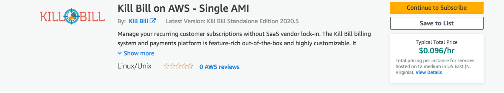

Click *Continue to Subscribe*. The next page will give the AWS Terms and Conditions:

Accept the terms if asked. You will then see a new message confirming that you have subscribed. Next, click *Continue to Configuration*.

=== 4.2. Configure the Instances

The next page will give several configuration options:

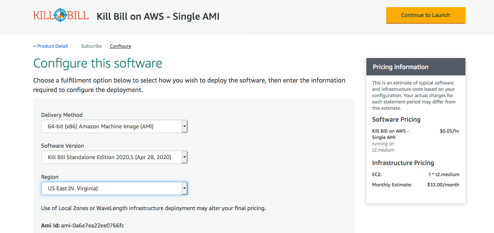

Be sure to select the region you plan to operate in. Accept the other defaults. Then click *Continue to Launch*.

The next page will give you several options for the launch method. Choose *Launch through EC2*.

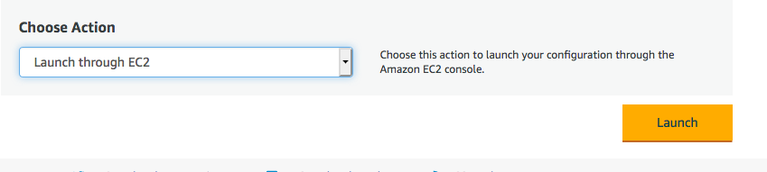

All other options will disappear. Click *Launch*.

The next page is headed *Launch an Instance*. There are several things you will need to do here.

First, at the top right, select the number of instances you will use. We recommend 2. You can add more later.

Next, scroll down to the middle of this page, to the box titled *Key Pair (login)* Here you are asked to choose or create a *key pair*.

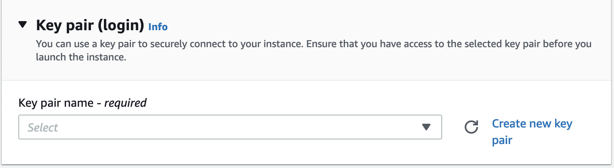

The key pair provides the credentials you will need to login to your EC2 instance. For details about key pairs, see the https://docs.aws.amazon.com/AWSEC2/latest/UserGuide/ec2-key-pairs.html[AWS documentation]. We recommend that you create a new key pair. Click *Create Key Pair* to display a pane to be used for the creation. Give the key pair a simple, easy to remember name such as `My-Key-Pair`. Do not change the other options on this pane. Then click *Download Key Pair*. Important: You *must* save the private key that will be generated in this step. If you lose this key, you will *not* be able to login to your instance.

=== 4.3. Set Up Security Rules

The next step is to scroll down in the menu on the left side to select *Security Groups*. You should see a list of two or more groups. Select the group whose name begins with `Kill Bill on AWS`, then scroll to the bottom and select the tab for *Inbound Rules*. You should see:

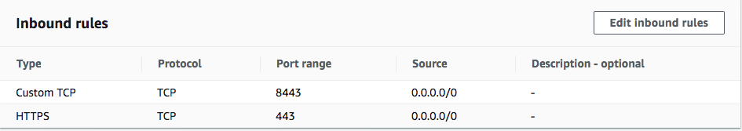

These rules enable the ports that must be open to access Kaui and Kill Bill from a browser. However, for access through the ELB these ports will be different. In addition, to enable direct login to your instance using SSH, which you will need in <<step5, Step 5>> to create the databases, you need to add one more port.

Click on *Edit Inbound Rules*. then do the following:

1. For the rule that specifies Type: HTTPS, Port Range: 443, change the type to CUSTOM TCP and the Port Range to 3000.
2. For the rule that specifies Type: CUSTOM TCP, Port Range: 8443, change the Port Range to 8080.
3. Finally, add a rule with the following elements: Type: SSH, Protocol: TCP, Port Range: 22, Source: 0.0.0.0/0.

Your Inbound Rules should now look like this:

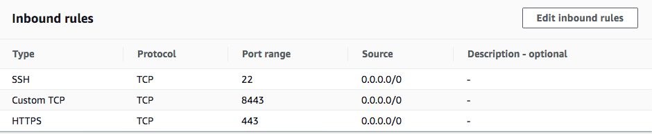

=== 4.4. Configure Network Settings

Before launching the instance, configure the network settings section:

* Select the *VPC* where you want to deploy the EC2 instance. Every AWS account starts with a *default VPC*, and that default VPC already ships with a *public subnet* in every availability zone, so in most cases there is nothing to create here. A subnet is *public* when its route table has a route for destination `0.0.0.0/0` pointing to an *Internet Gateway* (target `igw-xxxxxxxx`), rather than to a NAT Gateway or no route at all.
* Ensure *Auto-assign public IP* is *enabled*. *This defaults to Disable* — without a public IP, you will not be able to reach the instance from the internet, nor log in to it over SSH.

=== 4.5. Add the User Data Script

Finally, scroll to the bottom and open the section labeled *Advanced Details*. You will see a long list of settings. At the very bottom of this list is a box headed *User data*. Paste the script created in Step 3 here.

=== 4.6. Launch Your Instances

When the key pair is generated, click *Launch Instances*. You should see the screen below:

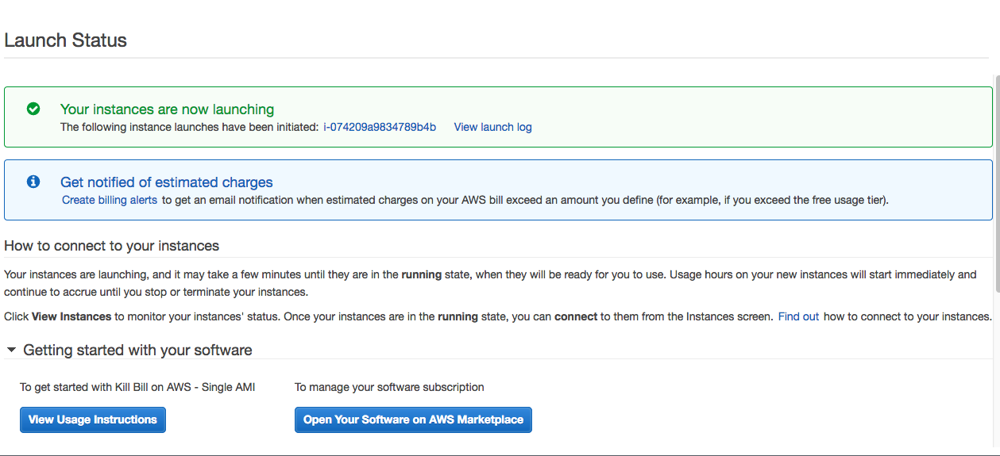

Your instances are finally launching! To follow what is happening on the EC2 Dashboard, scroll all the way down to the bottom, and click *View all instances* at the bottom right. This will take you to the *Instances* screen which is part of the EC2 Dashboard.

image::../assets/aws/multitier-instances.png[align=center]

In a short time, the *Instance State* for each instance should indicate *Running*. You will need to scroll to the right to see all of the information available about your instances. In particular, make a note of the *Availability Zone* (such as `us-east-1a`) assigned to each instance. You will need this information later.

=== 4.7. Login to an Instance

You will need to log in to one of your instances shortly, to create the Kill Bill and Kaui databases in <<step5, Step 5>>. Logging in requires the SSH rule you added in section 4.3 above, and the same procedure applies across all of our AWS deployments, so it is described in a separate document: see https://docs.killbill.io/latest/how-to-login-to-your-ec2-instance.html[How to Log In to Your EC2 Instance via SSH].

NOTE: We recommend that you *remove* the SSH rule from your security group when you are *not* doing configuration or maintenance.

[[step5]]
== Step 5: Create the Kill Bill and Kaui Databases

Kill Bill requires two databases, with the names `killbill` and `kaui`. We provide predefined schemas for these databases.

To create the databases, log in to one of your instances as described in <<step4, section 4.7>> above. Once you are logged in, you can use the `mysql` command to create the two databases `killbill` and `kaui`. The credentials required for this command are the same ones you set up for the database in step 2.1 above.

Note that the host <DB-Endpoint-Writer-Instance> should *not* include the port number and there is no space after `-h` and `-u` options.

The password will not be echoed when it is typed.

[source,bash]
----
> mysql -h<DB-Endpoint-Writer-Instance> -u<DB-Username> -p
Enter Password:
mysql> create database killbill;
mysql> create database kaui;
mysql> exit
----
The next step is to install the schemas. These can be found at:

* killbill schema: `https://docs.killbill.io/latest/ddl.sql`
* kaui schema: `https://github.com/killbill/killbill-admin-ui/blob/master/db/ddl.sql`

One easy way to do this is to return to your local computer (type `exit`) and download the schemas (give them distinct names), then use the `sftp` command to upload them to your EC2 instance home directory with the commands:

[source,bash]
----
sftp -i PRIVATE_KEY.pem ubuntu@INSTANCE_IP
put killbill.ddl
put kaui.ddl
exit
----

Once the files are successfully uploaded, login again to your instance using the `ssh` command. You can now install the schemas:

[source,bash]
----
> mysql -h<DB-Endpoint-Writer-Instance> -u<DB-Username> -p<DB-Password> < killbill.ddl

> mysql -h<DB-Endpoint-Writer-Instance> -u<DB-Username> -p<DB-Password> < kaui.ddl
----
To ensure that the databases are setup correctly, login to `mysql` again, then try the SHOW TABLES command:

[source,bash]
----
> mysql -h<DB-Endpoint-Writer-Instance> -u<DB-Username> -p<DB-Password>

use killbill;
show tables;
use kaui;
show tables;
exit
----

[[step6]]
== Step 6: Perform Initial Testing

You can now login to Kaui from your browser using the URL `\http://<INSTANCE_IP>:3000`, where `<INSTANCE_IP>` is the IPV4 address for one of your instances, given on your dashboard as *Public IPV4 Address*. This should display the Kaui login screen. For an introduction to Kaui, see our https://docs.killbill.io/latest/quick_start_with_kaui.html[Quick Start with Kaui] guide. The default credentials are: `admin` / `<INSTANCE_ID>`, where <INSTANCE_ID> is the AWS ID for the same instance you selected for login.

In addition, you can login to the Kill Bill server using the URL `\http://<INSTANCE_IP>:8080`. This provides access to certain detailed reports that may be needed for maintenance, including metrics, event logs, and the Swagger API pages.

Repeat the tests for your other instance(s). You should also ensure that actions taken in Kaui from one instance are visible from another. If these logins and tests succeed, your EC2 instances and your RDS databases are setup properly.

[[step7]]
== Step 7: Add the ELB

The last major task is to setup the Elastic Load Balancer in front of the EC2 instances.

=== 7.1. Select the ELB Type

To begin, from the EC2 dashboard scroll down the left-hand menu and select *Load Balancing / Load Balancers*. Then click the  *Create Load Balancer* button at the upper left.

You will be given a choice of several load balancer types. The type we will use is *Application Load Balancer*. Click on the *Create* button in the Application Load Balancer box. This will bring up the page titled *Create Application Load Balancer*. This is your master page for the load balancer creation.

=== 7.2. Set Basic Configuration

In the section headed *Basic Configuration*, give your load balancer a name. Do not change the other settings.

In the *Network Mappings* section, select *at least two* availability zones. These *must* include the availability zones assigned to each of your EC2 instances (which you took note of earlier).

=== 7.3. Set Up a Security Group

The next section is headed *Security Groups*. Click on *create new security group*. This will open a page headed *Create security group*.

We will use the secure protocol `HTTPS` (based on TLS) for users to access your system. This will require you to provide or create a certificate in a later step.

Enter a name and a brief description for your security group. The description cannot be empty. Then setup the Inboud Rules as follows:

When your security group is set, return to the master page and select this group from the dropdown list. You may need to use the refresh icon to make your new group appear in the list. Delete any other group that remains selected.

=== 7.4. Create Listeners

The next section is titled *Listeners and Routing*. This is the last section you will have to deal with, but it is very important. This is where you will setup the Listeners that will receive requests for Kaui or Kill Bill and pass them on to the appropriate modules in your EC2 instances.

Initially you will see one listener, set with protocol HTTP and Port 80. Change the protocol to HTTPS and the port to 443. A new section will open up, headed *Secure listener settings*:

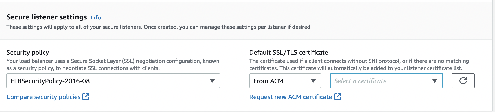

Here you will be required to create or provide an X.509 SSL Certificate. If you already have a certificate you can identify it or upload it here. Otherwise click on *Request a New Certificate from ACM.* This will enable you to create a certificate using the *Amazon Certificate Manager*. Follow the steps described for the ACM in https://docs.killbill.io/latest/how-to-add-a-certificate-using-ACM.html[Add a Certificate Using the Amazon Certificate Manager], then return to this page. Select your new certificate from the dropdown list. You can now proceed to the next step.

Next you will need to click on *Add Listener* to create a second Listener. Just as with the first one, change its protocol to *HTTPS* and its port to `8443`, and select the same certificate from the dropdown list in the *Secure listener settings* section that opens up.

=== 7.5. Set Up Target Groups

The next step is to identify the *target* instances for your load balancer, which are collected into a *target group*. Each listener will have a separate target group. Note that the display for each listener contains a link labeled *Create target group*. Click on this link for the first listener.  This will setup the routing for messages directed to Kaui.

Your group will consist of all of the instances you have launched. First, create the group, give it a simple name, and set the port to 3000:

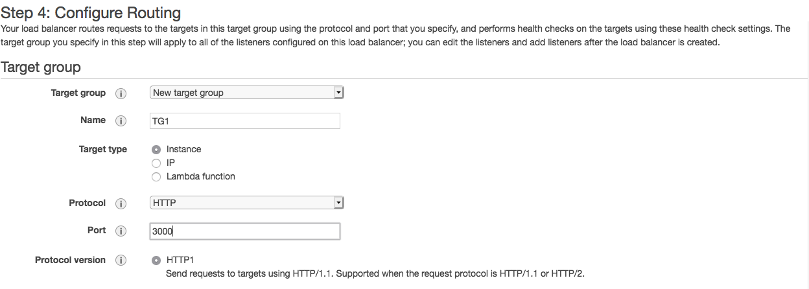

Now click on *Next*, to open a page titled *Register Targets*. The purpose of this step is to identify the target instances that will be part of your target group. Initially, all your instances will be listed at the top. To register them, select them all and click *Include as pending below*. The instances will now be listed in the bottom section. Proceed to *Next: Review*. If all looks well, click on *Create Target Group*. This will bring you to the *Target groups* page, and your new group should appear.

Now return to the master page where you created the listeners. Click on the refresh icon for the first listener, then select your new target group from the dropdown list.

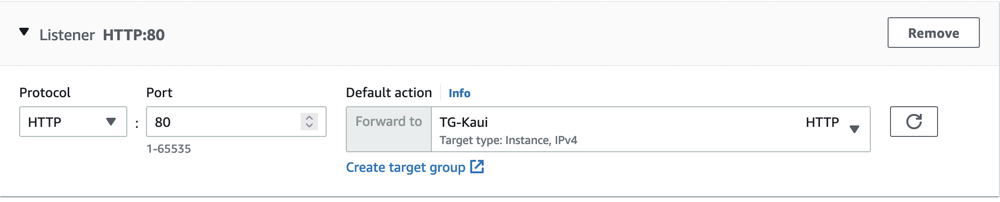

Next, you need to perform the same steps for the second listener. This listener will handle messages directed to the Kill Bill server. Click the link on the second listener labeled *Create target group*. Follow the same steps, setting the port this time to 8080.

When both target groups are setup, you will have a chance to review your settings, then proceed to the next section.

=== 7.6. Create the Load Balancer

Check all settings, then click *Create*. Your load balancer will be created. Close the final page to see the Load Balancer list. The initial status for your new ELB will be *provisioning*. After a few minutes this will change to *active*.

[[step8]]
== Step 8: Perform Final Testing

When your ELB is complete you can proceed to testing. You should now be able to login to Kaui from your browser using the URL `\https://kaui.<DOMAIN>`, where <DOMAIN> is *your* domain that you have used for your certificate. The Kaui login screen should appear, as in Step 6. Similarly, you should be able to login directly to the Kill Bill server using the URL `\https://kaui.<DOMAIN>:8443`.

If these logins do not work correctly, review your setup steps carefully, then proceed to the https://docs.killbill.io/latest/how-to-maintain-a-multi-tier-system.html[Multi-Tier Maintenance Guide].

Congratulations! Your multi-tier installation is ready to go!
