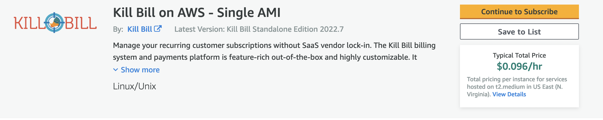
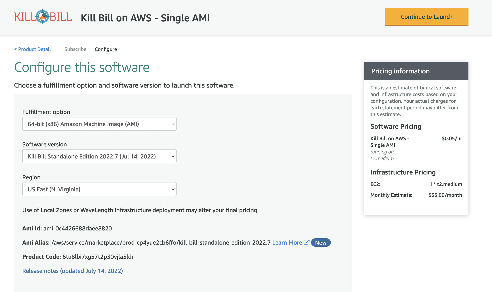
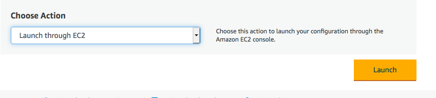
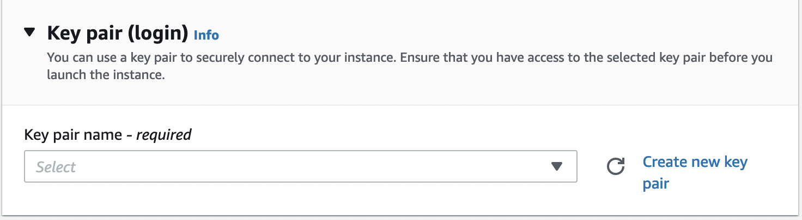
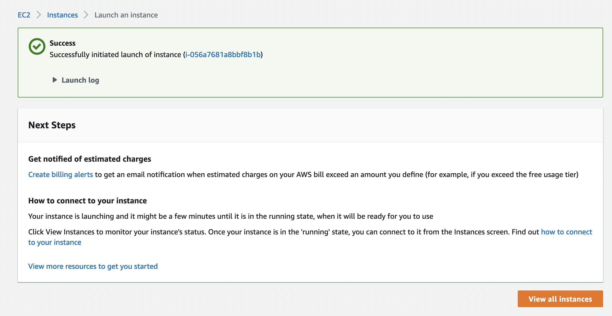
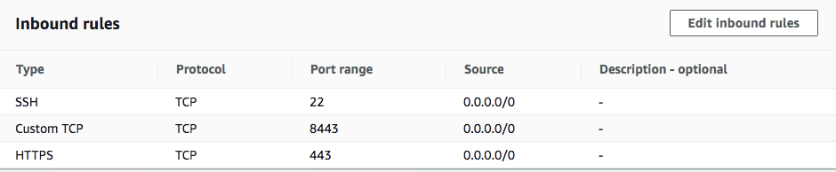

= How to Set up a Single-Tier System

== Introduction

This document describes the procedures for setting up Kill Bill under AWS using the *single-tier* option. This option has limited capabilities but is very easy to setup. It uses a minimum of resources and may be suitable for very simple use cases. Everything you need for this option is bundled in the Kill Bill Amazon Machine Image (AMI) and will be launched on a single virtual Linux system, which AWS calls an *EC2 instance*.

The components of this system include Kill Bill, Kaui, a database manager (DBM), and a load balancer. The EC2 instance runs Ubuntu Linux. The DBM is an instance of https://mariadb.org[MariaDB], an open source version of MySQL. The load balancer is the open source package https://www.nginx.com[Nginx]. This package serves as a front end or reverse proxy, distributing the incoming traffic to either Kill Bill or Kaui based on the incoming port.

The organization of the single-tier system looks like this:

image::../assets/aws/single-tier-ami_deployment.svg[width=750,align=center]

In this configuration, Kill Bill and Kaui are deployed within the `tomcat` application server. Requests are handled by `nginx`. Requests received on port 443 are delivered to Kaui, and those received on port 8443 are delivered to Kill Bill. Both Kill Bill and Kaui communicate as needed with the `mysql` databases.

The setup procedure includes nine steps:

. <<step1, Login to AWS>>
. <<step2, Subscribe to the Kill Bill AMI>>
. <<step3, Set up EC2 Configuration>>
. <<step4, Create a Key Pair>>
. <<step5, Launch your Instance>>
. <<step6, Set up Security Group>>
. <<step7, Login to Your Instance>>
. <<step8, Test Your Installation>>
. <<step9, Add a Certificate>>

[[step1]]
== Step 1: Login to AWS

To begin, log in to Amazon Web Services at https://aws.amazon.com. If you are new to AWS, you will be asked to create an account and provide billing information. You will need to sign in as a *Root User*. This should take you to the *AWS Management Console*, which provides links to all available services.

Check the upper right corner of your screen to be sure you are in the appropriate *region*. Your EC2 instance will be placed in this region, and may not be accessible from other regions.

[[step2]]
== Step 2: Subscribe to the Kill Bill AMI

To start the installation process, point your browser to the Kill Bill AMI at
+++
<a href="https://aws.amazon.com/marketplace/pp/B083LYVG9H?ref=_ptnr_doc_">
AWS Marketplace
</a>
+++.

You should see the following image at the top of your screen:

Click *Continue to Subscribe*. The next page will give the AWS Terms and Conditions. Accept the terms if asked. You will then see a new message confirming that you have subscribed. Next, click *Continue to Configuration*.

[[step3]]
== Step 3: Set Up EC2 Configuration

The next page will give several configuration options.

Be sure to select the correct region for your account. Also be sure that your software version is 2023.3 or later. Accept the other defaults, and click *Continue to Launch*.

The next page will give you several options for the launch method. Choose *Launch through EC2*.

All other options will disappear. Click *Launch*.

[[step4]]
== Step 4: Create a Key Pair

The next page is headed *Launch an Instance*. Scroll down to the middle of this page, to the box titled *Key Pair (login)* Here you are asked to choose or create a *key pair*.

We will create a new key pair. Click *Create Key Pair* to display a pane to be used for the creation. Give the key pair a simple, easy to remember name such as `My-Key-Pair`. Do not change the other options on this pane. Then click *Download Key Pair*. *Important:* You *must* save the private key that will be generated in this step. If you lose this key, you will *not* be able to login to your instance. In addition, you must set the protection for this file so it is readable by the owner only.

[[step5]]
== Step 5: Launch Your Instance

When the key pair is generated, click *Launch Instances*. You should see the screen below:

Your instance is finally launching! To follow what is happening on the EC2 Dashboard, scroll all the way down to the bottom, and click *View all instances* at the bottom right. This will take you to the *Instances* screen which is part of the EC2 Dashboard.

image::../assets/aws/single-ami-instances.png[align=center]

In a short time, the *Instance State* for your instance should indicate *Running*. Select the checkbox to the left of your instance ID. An information pane should open below with details about your instance.

[[step6]]
== Step 6: Set up Security Group

You are almost set, but there is one more thing you should do, and that is to scroll down in the menu on the left side to select *Security Groups*. You should see a list of two or more groups. Select the group whose name begins with `Kill Bill on AWS`, then scroll to the bottom and select the tab for *Inbound Rules*. You should see:

image::../assets/aws/single-ami-inbound.png[align=center]

These rules enable the ports that must be open to access Kaui and Kill Bill from a browser. To enable direct login to your instance using SSH, you need to add one more port. Click on *Edit Inbound Rules*. Then add a rule with the following elements: Type: SSH, Protocol: TCP, Port Range: 22, Source: 0.0.0.0/0. Your Inbound Rules should now look like this:

Your Kill Bill installation is ready to go!

[[step7]]
== Step 7: Login to Your Instance

You have setup access to port 22 in your security group. This will allow you to login directly to your instance from a terminal or command window. You may need to do this to perform some configuration and maintenance tasks that will be described below.

To login, use the secure shell command:

`ssh -i PRIVATE_KEY.pem ubuntu@INSTANCE_IP`

Here PRIVATE_KEY is the pathname where you have stored the private key that was downloaded when you generated your key pair, and INSTANCE_IP is the IPV4 address described earlier. The private key will not work unless its access controls are set to readable by the owner only.

On Windows versions before Windows 10, you may need to download a program called PuTTY to enable `ssh`. On Windows 10 and 11, `ssh` is available but may need to be activated through the Settings screen.

The first time you login, you will see a warning message asking if you want to add this host to your list of hosts. You should answer `yes`.

You will now be able to explore your instance and perform various configuration and maintenance tasks. To exit from your login, type `exit`.

[[step8]]
== Step 8: Test your Installation

Congratulations! Your single-tier installation is ready to go!

You can now try to login to Kaui from your browser using the URL `\https://INSTANCE_IP:443`, where INSTANCE_IP is the IPV4 address for your instance, given on your dashboard as *Public IPV4 Address*. If all goes well, this should display the Kaui login screen. The browser may complain that your connection is not secure, but it should offer you a way to bypass the problem.

For an introduction to Kaui, see our https://docs.killbill.io/latest/userguide_kaui.html[Kaui Guide]. The default credentials are: `admin` / `INSTANCE_ID`, where INSTANCE_ID is the Instance ID for your EC2 instance (*not* the IP!). The first few requests might be a bit slow as Kill Bill initializes itself.

In addition, you can visit the Kill Bill server using the URL `\https://INSTANCE_IP:8443`. This provides access to certain detailed reports that may be needed for maintenance, including metrics, event logs, and the Swagger API pages.

If these logins do not work correctly, review your setup steps carefully, then proceed to the https://docs.killbill.io/latest/how-to-maintain-a-single-tier-system.html[Single-Tier Maintenance Guide].

[[step9]]
== Step 9: Add a Certificate

In order to make your site secure, you will need to add a valid X.509 SSL/TLS certificate. The easiest way to add this certificate is to make use of the tool `certbot`, which relies on the free Certificate Authority (CA) `Let’s Encrypt`. This method provides a simple way to obtain and install free certificates. For instructions on creating a certificate using `certbot`, see https://docs.killbill.io/latest/how-to-add-a-certificate-using-certbot.html[How to Add a Certificate Using Certbot]. Once your certificate is setup, you can login securely to Kaui using your CNAME as the URL (e.g., `\https://kaui.mydomain.com`).

