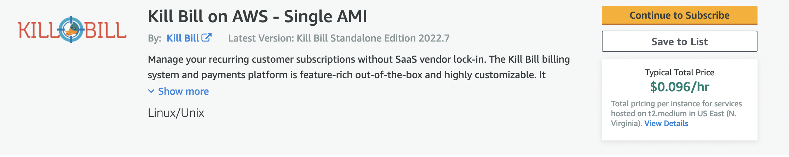
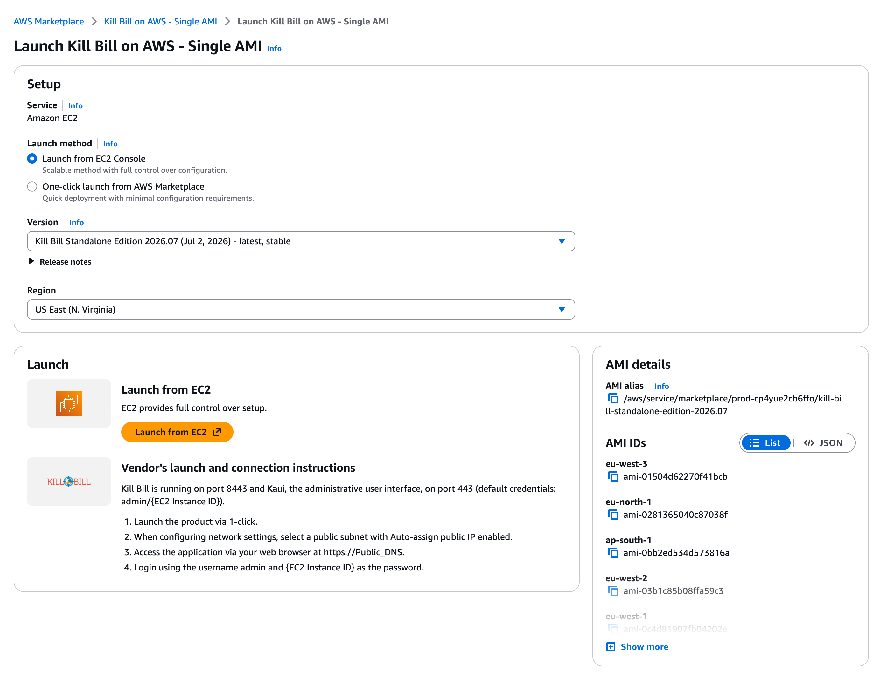
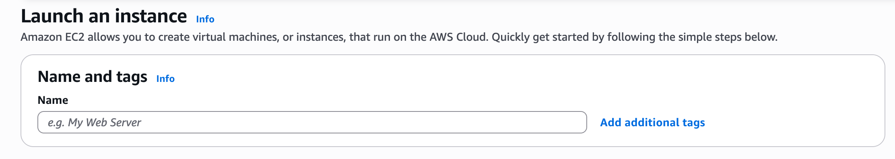
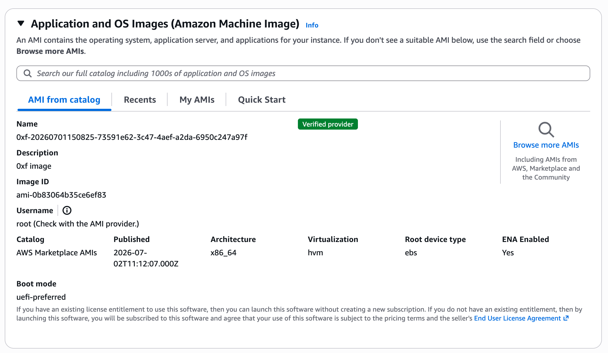
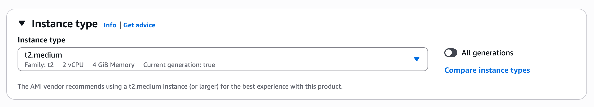
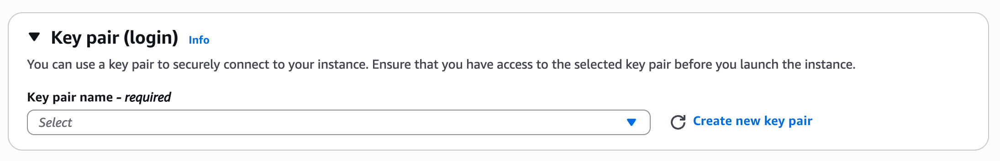
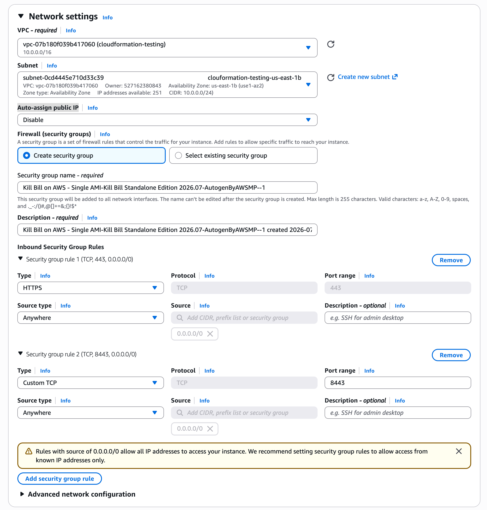
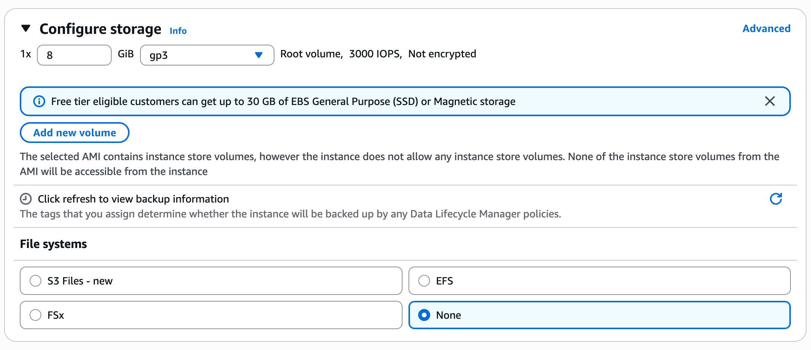
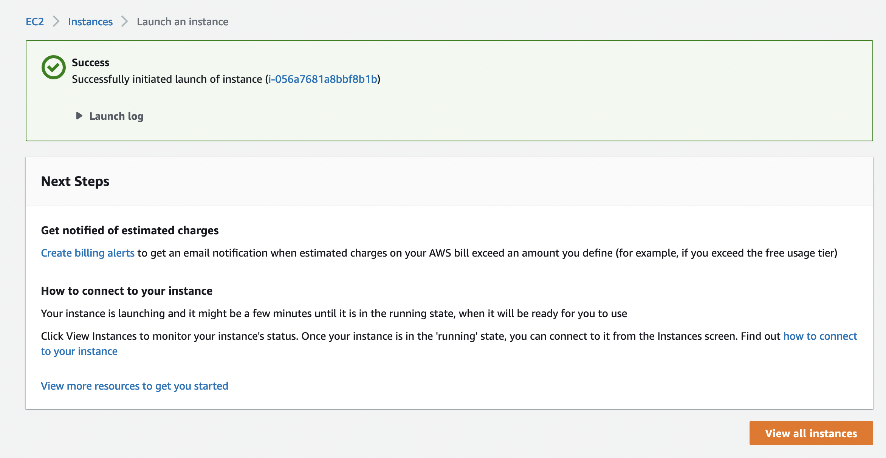
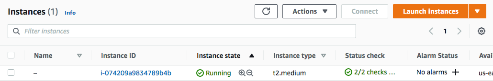

= How to Set up a Single-Tier System

:card-badge: Premium
:card-title: AWS Deployment
:card-link: https://aws.amazon.com/marketplace/pp/prodview-jvcsq4phzaclw
:card-description:
include::{sourcedir}/includes/premium-card.adoc[]

== Introduction

This document describes the procedures for setting up Kill Bill under AWS using the *single-tier* option. This option has limited capabilities but is very easy to setup. It uses a minimum of resources and may be suitable for very simple use cases. Everything you need for this option is bundled in the Kill Bill Amazon Machine Image (AMI) and will be launched on a single virtual Linux system, which AWS calls an *EC2 instance*.

Kill Bill, Kaui, and the database all run on this single EC2 instance. The instance runs Ubuntu Linux, and the database is an instance of https://mariadb.org[MariaDB], an open source version of MySQL. Kaui, the administrative user interface, listens on port `3000`, and the Kill Bill server listens on port `8000`.

The setup procedure includes the following steps:

. <<step1, Login to AWS>>
. <<step2, Subscribe to the Kill Bill AMI>>
. <<step3, Launch the Instance>>
. <<step4, Create a Key Pair>>
. <<step5, Configure Network Settings>>
. <<step6, Configure Storage>>
. <<step7, Launch Your Instance>>
. <<step8, Login to Your Instance>>
. <<step9, Test Your Installation>>
. <<step10, Add a Certificate>>

[[step1]]
== Step 1: Login to AWS

To begin, log in to Amazon Web Services at https://aws.amazon.com. If you are new to AWS, you will be asked to create an account and provide billing information. You will need to sign in as a *Root User*. This should take you to the *AWS Management Console*, which provides links to all available services.

Check the upper right corner of your screen to be sure you are in the appropriate *region*. Your EC2 instance will be placed in this region, and may not be accessible from other regions.

[[step2]]
== Step 2: Subscribe to the Kill Bill AMI

To start the installation process, point your browser to the Kill Bill AMI at
+++
<a href="https://aws.amazon.com/marketplace/pp/B083LYVG9H?ref=_ptnr_doc_">
AWS Marketplace
</a>
+++.

You should see the following image at the top of your screen:

Click *Continue to Subscribe*. The next page will give the AWS Terms and Conditions. Accept the terms if asked. You will then see a new message confirming that you have subscribed. Next, click *Continue to Configuration*, and select *Launch through EC2* as the launch method.

You should then see the following page, which lets you pick the software version and region and start the launch:

Accept the defaults (the version dropdown always points at the latest stable release), confirm the *Region* matches the one you selected in Step 1, and click *Launch from EC2*.

[[step3]]
== Step 3: Launch the Instance

This takes you to the *Launch an Instance* page in the EC2 console. This page is organized into several sections that you will fill in one at a time. The first three sections normally need no changes:

*Name and tags* — Optionally give your instance a name, such as `kill-bill-single-tier`. This is only a label for your own reference in the EC2 dashboard and has no effect on the installation.

*Application and OS Images (Amazon Machine Image)* — Because you arrived here from the AWS Marketplace subscription, the Kill Bill AMI is already selected for you. There is nothing to change here; just confirm it shows the Kill Bill AMI as a *Verified provider*.

*Instance type* — Defaults to `t2.medium`, which is the minimum instance type recommended for Kill Bill. You can select a larger instance type if you expect heavier load, but `t2.medium` is fine to get started.

[[step4]]
== Step 4: Create a Key Pair

Scroll down to the *Key Pair (login)* section. Here you are asked to choose or create a *key pair*.

We will create a new key pair. Click *Create new key pair* to display a pane to be used for the creation. Give the key pair a simple, easy to remember name such as `My-Key-Pair`. Do not change the other options on this pane. Then click *Download Key Pair*. *Important:* You *must* save the private key that will be generated in this step. If you lose this key, you will *not* be able to login to your instance. In addition, you must set the protection for this file so it is readable by the owner only.

[[step5]]
== Step 5: Configure Network Settings

Scroll down to the *Network settings* section:

=== 5.1. VPC and subnet

Select the *VPC* where you want to deploy the EC2 instance. Every AWS account starts with a *default VPC*, and that default VPC already ships with a *public subnet* in every availability zone, so in most cases there is nothing to create here.

A subnet is *public* when the route table associated with it has a route for destination `0.0.0.0/0` pointing to an *Internet Gateway* (target `igw-xxxxxxxx`) attached to the VPC, rather than to a NAT Gateway or no route at all. If you are using a custom VPC instead of the default one, use the *Subnet* dropdown to check the details shown for each subnet (availability zone, CIDR), or click *Create new subnet* if you need one. Then, in the VPC console, confirm its route table has a `0.0.0.0/0 -> igw-xxxxxxxx` route before continuing.

=== 5.2. Auto-assign public IP

*This defaults to Disable — you must change it to Enable.* Without a public IP, you will not be able to reach the instance from the internet in Step 9, nor log in to it in Step 8.

=== 5.3. Firewall (security group)

Leave *Create security group* selected. AWS pre-fills two inbound rules for you, for ports `443` and `8443`. *These are incorrect for this AMI* and must be changed to match the ports Kaui and Kill Bill actually listen on:

* Edit rule 1: Type *Custom TCP*, Port range `3000`, Source `Anywhere (0.0.0.0/0)` — for Kaui.
* Edit rule 2: Type *Custom TCP*, Port range `8000`, Source `Anywhere (0.0.0.0/0)` — for Kill Bill.

While you are here, also click *Add security group rule* to add SSH access, which you will need in Step 8:

* Type *SSH*, Protocol `TCP`, Port range `22`, Source `Anywhere (0.0.0.0/0)`.

Your security group should now have three inbound rules: `3000`, `8000`, and `22`, all open to `0.0.0.0/0`.

[[step6]]
== Step 6: Configure Storage

Scroll down to the *Configure storage* section:

The default of a single 8 GiB `gp3` root volume is sufficient to get started, and no additional file systems (S3, EFS, FSx) are required. Leave *None* selected and leave the rest of this section at its defaults.

[[step7]]
== Step 7: Launch Your Instance

Review the summary panel on the right, then click *Launch Instance*. You should see the screen below:

Your instance is finally launching! To follow what is happening on the EC2 Dashboard, scroll all the way down to the bottom, and click *View all instances* at the bottom right. This will take you to the *Instances* screen which is part of the EC2 Dashboard.

In a short time, the *Instance State* for your instance should indicate *Running*. Select the checkbox to the left of your instance ID. An information pane should open below with details about your instance.

[[step8]]
== Step 8: Login to Your Instance

You configured access to port 22 in your security group in Step 5. This will allow you to login directly to your instance from a terminal or command window. You may need to do this to perform some configuration and maintenance tasks that will be described below.

To login, use the secure shell command:

`ssh -i PRIVATE_KEY.pem ubuntu@INSTANCE_IP`

Here PRIVATE_KEY is the pathname where you have stored the private key that was downloaded when you generated your key pair, and INSTANCE_IP is the IPV4 address described earlier. The private key will not work unless its access controls are set to readable by the owner only.

On Windows versions before Windows 10, you may need to download a program called PuTTY to enable `ssh`. On Windows 10 and 11, `ssh` is available but may need to be activated through the Settings screen.

The first time you login, you will see a warning message asking if you want to add this host to your list of hosts. You should answer `yes`.

You will now be able to explore your instance and perform various configuration and maintenance tasks. To exit from your login, type `exit`.

[[step9]]
== Step 9: Test your Installation

Congratulations! Your single-tier installation is ready to go!

You can now try to login to Kaui from your browser using the URL `\https://INSTANCE_IP:3000`, where INSTANCE_IP is the IPV4 address for your instance, given on your dashboard as *Public IPV4 Address*. If all goes well, this should display the Kaui login screen. The browser may complain that your connection is not secure, but it should offer you a way to bypass the problem.

For an introduction to Kaui, see our https://docs.killbill.io/latest/userguide_kaui.html[Kaui Guide]. The default credentials are: `admin` / `INSTANCE_ID`, where INSTANCE_ID is the Instance ID for your EC2 instance (*not* the IP!). The first few requests might be a bit slow as Kill Bill initializes itself.

In addition, you can visit the Kill Bill server using the URL `\https://INSTANCE_IP:8000`. This provides access to certain detailed reports that may be needed for maintenance, including metrics, event logs, and the Swagger API pages.

If these logins do not work correctly, review your setup steps carefully, then proceed to the https://docs.killbill.io/latest/how-to-maintain-a-single-tier-system.html[Single-Tier Maintenance Guide].

[[step10]]
== Step 10: Add a Certificate

In order to make your site secure, you will need to add a valid X.509 SSL/TLS certificate. The easiest way to add this certificate is to make use of the tool `certbot`, which relies on the free Certificate Authority (CA) `Let’s Encrypt`. This method provides a simple way to obtain and install free certificates. For instructions on creating a certificate using `certbot`, see https://docs.killbill.io/latest/how-to-add-a-certificate-using-certbot.html[How to Add a Certificate Using Certbot]. Once your certificate is setup, you can login securely to Kaui using your CNAME as the URL (e.g., `\https://kaui.mydomain.com`).

