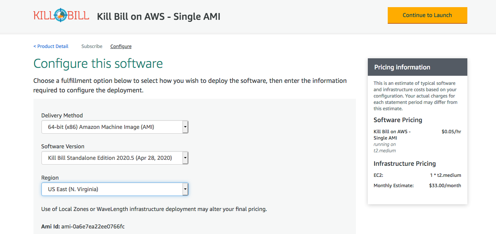

= Tutorial: Single-Tier Option

== Introduction

In this tutorial you will set up a working environment on AWS with Kill Bill and Kaui using the *single-tier* option. Everything you need for this option is bundled in the Kill Bill Amazon Machine Image (AMI) and can be launched on a single virtual Linux system, which AWS calls an EC2 instance.

First, you will need to create an AWS account, if you do not already have one, and login to your account. Then proceed with the steps below.

== Step 1: Subscribe to the Kill Bill AMI

To start the installation process, point your browser to the Kill Bill AMI at
+++
<a href="https://aws.amazon.com/marketplace/pp/B083LYVG9H?ref=_ptnr_doc_">
AWS Marketplace
</a>
+++.

You should see the following image at the top of your screen:

image::../../assets/aws/single-ami-subscribe.png[align=center]

Click *Continue to Subscribe*. The next page will give the AWS Terms and Conditions. Accept the terms if asked. You will then see a new message confirming that you have subscribed. Next, click *Continue to Configuration*.

== Step 2: Set Up EC2 Configuration

The next page will give several configuration options.

Be sure to select the correct region for your account. Accept the other defaults, and click *Continue to Launch*.

The next page will give you several options for the launch method. Choose *Launch through EC2*.

image::../../assets/aws/single-ami-launch.png[align=center]

All other options will disappear. Click *Launch*.

== Step 3: Create a Key Pair

The next page is headed *Launch an Instance*. Scroll down to the middle of this page, to the box titled *Key Pair (login)* Here you are asked to choose or create a *key pair*.

image::../../assets/aws/single-tier-keypair.png[align=center]

We will create a new key pair. Click *Create Key Pair* to display a pane to be used for the creation. Give the key pair a simple, easy to remember name such as `My-Key-Pair`. Do not change the other options on this pane. Then click *Download Key Pair*. *Important:* You *must* save the private key that will be generated in this step. If you lose this key, you will *not* be able to login to your instance. In addition, you must set the protection for this file so it is readable by the owner only.

== Step 4: Launch Your Instance

When the key pair is generated, click *Launch Instances*. You should see the screen below:

image::../../assets/aws/single-tier-launching.png[align=center]

Your instance is finally launching! To follow what is happening on the EC2 Dashboard, scroll all the way down to the bottom, and click *View Instance* at the bottom right. This will take you to the *Instances* screen which is part of the EC2 Dashboard.

image::../../assets/aws/single-ami-instances.png[align=center]

In a short time, the *Instance State* for your instance should indicate *Running*. Select the checkbox to the left of your instance ID. An information pane should open below with details about your instance.

== Testing

You can now try to login to Kaui from your browser using the URL https://INSTANCE_IP:443, where INSTANCE_IP is the IPV4 address for your instance, given on your dashboard as *Public IPV4 Address*. If all goes well, this should display the Kaui login screen. The browser may complain that your connection is not secure, but it should offer you a way to bypass the problem.

For an introduction to Kaui, see our https://docs.killbill.io/latest/userguide_kaui.html[Kaui Guide]. The default credentials are: `admin` / `{EC2 instance ID}`. The first few requests might be a bit slow as Kill Bill initializes itself.

In addition, you can visit  the Kill Bill server using the URL https://INSTANCE_IP:8443. This provides access to certain detailed reports that may be needed for maintenance, including metrics, event logs, and the Swagger API pages.

