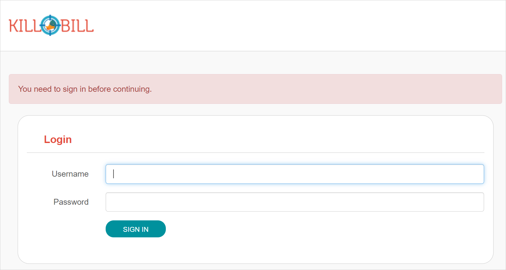
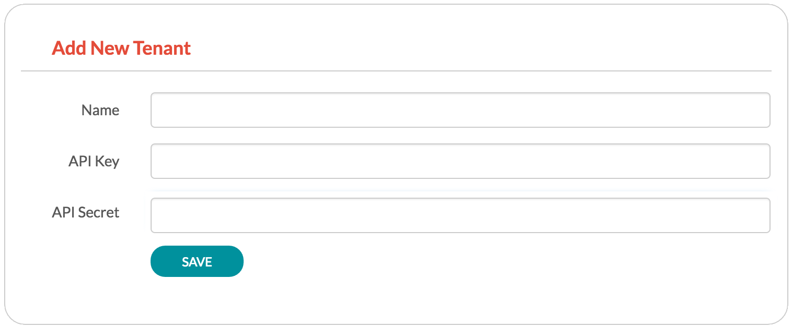
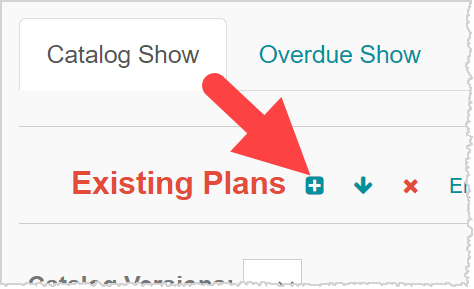
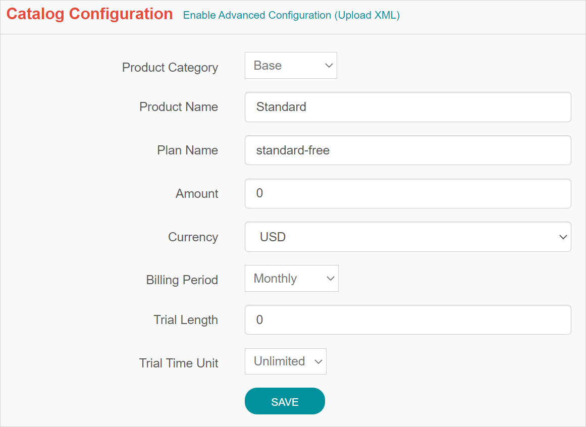
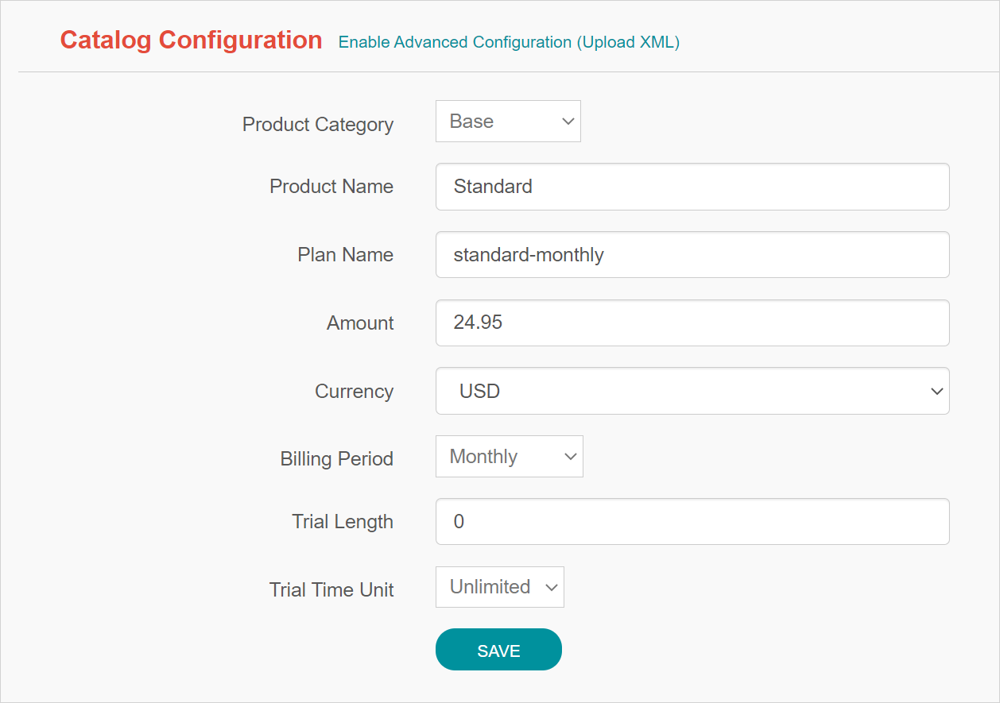
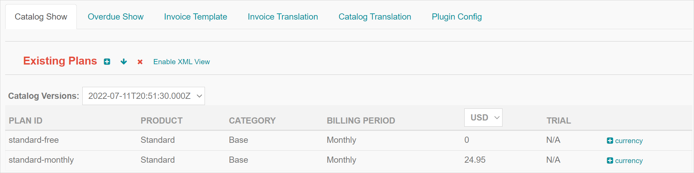

= Set Up Kill Bill Using Kaui

//This document uses images from the assets/img/kaui directory. If you change those images, consider how it will impact the Kaui Guide. 

//IMPORTANT: DELETE tutorial.adoc and remove its reference from install_kb_and_kaui.adoc. 

This section explains how to configure Kill Bill using Kaui, the back-office user interface.

As part of getting familiar with Kaui, we'll walk you through the steps of creating a tenant, setting up a simple catalog, followed by creating an account in Kaui. Next, you'll learn how to assign a payment method to the account and subscribe the account to a plan. Finally, you'll be able to view the generated invoice and payment.

Before you begin this tutorial, make sure you have https://docs.killbill.io/latest/install-kb-and-kaui.html[installed Kill Bill and Kaui]. 

[NOTE]
*Note:* You can also achieve these same results of this tutorial with the API. For more information, see https://docs.killbill.io/latest/set-up-kb-with-the-api.html[Set Up Kill Bill with the API].

=== Additional Resources

* https://www.youtube.com/c/KillbillIoOSS[Kaui tutorials on YouTube]

* https://docs.killbill.io/latest/userguide_kaui.html[_Kaui Guide_]. 

=== Step 1. Start Kaui and Sign In

Go to http://127.0.0.1:9090[http://127.0.0.1:9090]. 

You will be prompted for a username and password. 

The default set of credentials is `admin`/`password`, which grants full access.

[NOTE]
*Note:* Kill Bill handles authentication. The method your organization uses to manage users is highly configurable. For information on managing users and permissions, see the <<users_roles_and_permissions, Users>> chapter.

== Step 2. Create a Tenant

Kill Bill supports multi-tenancy,  where each tenant has its own data, configuration, and so forth. After you log in to Kill Bill for the first time, Kaui displays the Add New Tenant screen, which requires you to create your own tenant:  

We will assume the api key is `bob` and api secret `lazar` in the rest of this guide.

== Step 3. Create a "Simple" Catalog

The Kill Bill *catalog* contains products and plans definitions. This XML configuration file is really powerful and offers various options for handling trials, add-ons, upgrades/downgrades, etc. For more details on its features, read the http://docs.killbill.io/latest/userguide_subscription.html[Subscription Billing manual].

For learning purposes, instead of starting with the XML catalog, you'll learn how to create a simple catalog in Kaui and configure it with two plans. Note that this is _a subset_ of what is supported through XML configuration and isn't necessarily intended to serve as a catalog in production. For more details on the simple catalog, see the https://killbill.github.io/slate/#catalog-simple-plan["Simple Plan"] section in the _API Reference_.

To create the simple catalog, click the tenant name in the upper right corner: 

Kaui opens the Tenant Configuration page. Scroll to the bottom:  

image::../assets/img/getting-started/tenant-config-labeled.png[width=650,align="center"]

Click the plus sign next to Existing Plans.

Kaui opens the Catalog Configuration screen. Fill in the fields as shown below: 

Click the *Save* button. Kaui returns to the Tenant Configuration screen. 

Click the plus sign again. On the Catalog Configuration screen, fill in the fields as shown below:

Click the *Save* button. Kaui returns to the Tenant Configuration screen. 

You will now see the two simple plans you have created for the catalog (which Kaui has automatically created):

=== Option #2 – Create the XML Catalog

For this tutorial, create 2 plans: 

*standard-free* (a free plan) and 

*standard-monthly* (a premium plan), 

associated with a single `Standard` product (the product category is `BASE`). 

We could have just defined standard-monthly, but that way you could make free users subscribe to the free plan. This is useful for reporting for example (to track how long it took to upsell them, etc.)

Note that we haven't defined any trial period.

image:https://github.com/killbill/killbill-docs/raw/v3/userguide/assets/img/tutorials/multi_gateways_standard-free_kaui.png[align=center]
image:https://github.com/killbill/killbill-docs/raw/v3/userguide/assets/img/tutorials/multi_gateways_standard-monthly_kaui.png[align=center]
image:https://github.com/killbill/killbill-docs/raw/v3/userguide/assets/img/tutorials/multi_gateways_catalog_kaui.png[align=center]

== Step 4. Create Your First Account

We will assume that users going to your site have to create an account in your system. When they do, you will need to create a mirrored *account* in Kill Bill.

To do so in Kaui, click the CREATE NEW ACCOUNT link at the top of the page.

Notes:

* The Kill Bill *External key* field should map to the unique id of the account in your system (should be unique and immutable). Kill Bill will auto-generate an id if you don't populate this field
* There are many more fields you can store (phone number, address, etc.) -- all of them are optional. Keep local regulations in mind though when populating these (PII laws, GDPR, etc.).

== Step 5. Add a Payment Method

To trigger payments, Kill Bill will need to integrate with a payment provider (such as Stripe or PayPal). Each means of payment (e.g. a credit card) will have a *payment method* associated with it.

For simplicity in this tutorial, we will assume your customers send you checks. To create the payment method in Kaui, click the + next to Payment Methods on the main account page. The plugin name should be set to $$__EXTERNAL_PAYMENT__$$, leave all other fields blank and make sure the checkbox Default Payment Method is checked.

Once you are ready to integrate with a real payment processor, all you'll have to do is to create a new payment method for that account. The rest of this tutorial will still apply.

== Step 6. Create Your First Subscription

Let's now try to subscribe a user to the Standard plan. This is the call that would need to be triggered from your website, when the user chooses the premium plan on the subscription checkout page.

In Kaui, click the Subscriptions tab then the + by *Subscription Bundles* (a subscription bundle is a collection, a _bundle_, of subscriptions, containing one base subscription and zero or more add-ons). Select the `standard-monthly` plan in the dropdown. You can also specify an optional (but unique) key to identify this subscription.

Because there is no trial period and because billing is performed in advance by default, Kill Bill will have automatically billed the user for the first month.

You should see the invoice and the payment by clicking on the Invoices and Payments tabs.

Kill Bill will now automatically charge the user on a monthly basis. You can estimate the amount which will be billed at a future date by triggering a dry-run invoice. On the main account page, in the Billing Info section, click the *Trigger invoice generation* wand (specify a date at least a month in the future).
