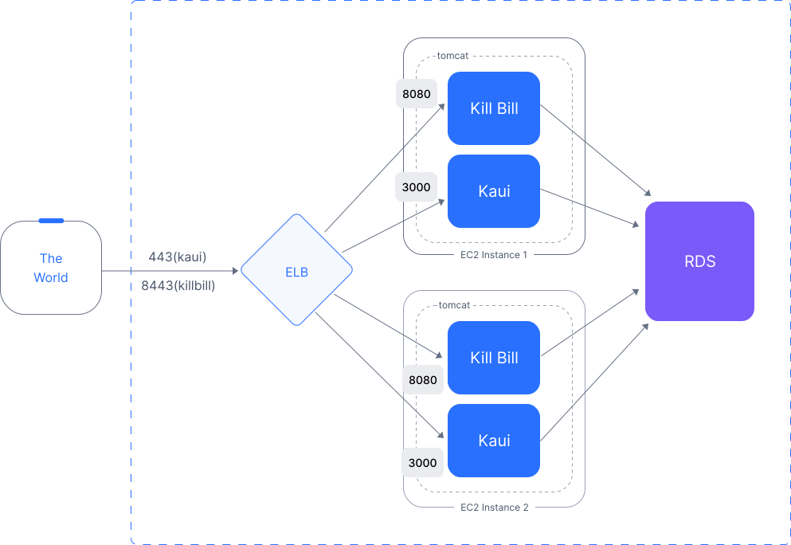

= Multi-Tier Option


There are three different ways to setup a working Kill Bill system on AWS, using software preconfigured by Kill Bill. Two options are based on a single *Amazon Machine Image (AMI)* containing the complete Kill Bill stack, that is both the Kill Bill server and the administrative UI (KAUI). These options are *single-tier* and *multi-tier*. The https://docs.killbill.io/latest//aws-singletier.html[*single-tier* option] is designed to deploy a limited version of Kill Bill quickly for trial and experimentation. For production deployments, we offer the multi-tier option. A third alternative available for deploying a production system is https://docs.killbill.io/latest//aws-cf.html[CloudFormation templates]. The multi-tier option requires more setup than CloudFormation, but provides more control over the deployment.

== Overview

This document describes the multi-tier option. This configuration uses two or more EC2 instances and a separate database provided by the AWS *Relational Database Service (RDS)*. It also includes an AWS *Elastic Load Balancer (ELB)* to correctly spread the traffic among the various nodes, and to route traffic to either the Kill Bill Server or KAUI based on the incoming port.

The diagram below shows the principal components of the multi-tier system: The ELB, the RDS, and two or more EC2 instances. Each EC2 is an instance of Ubuntu Linux, running both Kill Bill and KAUI within a `tomcat` server. Clients interact only with the ELB, which routes requests to the rest of the system.



== Installation

=== Login to AWS

To begin, log in to Amazon Web Services at https://aws.amazon.com. If you are new to AWS, you will be asked to create an account and provide billing information. You will need to sign in as a *Root User*. This should take you to the *AWS Management Console*, which provides links to all available services.

Check the upper right corner of your screen to be sure you are in the appropriate *region*. All resources you create will be placed in this region, and may not be accessible from other regions.

In addition, AWS places all resources within a *Virtual Private Cloud (VPC)*. A default VPC will be created and used automatically in the following steps. However, if you have access to other VPCs, you will need to ensure that all Kill Bill resources are deployed in the same one.

=== Setup the Database Manager

Once you are logged in, the first step is to setup the RDS instance. This process begins with the RDS dashboard, which should be available from the Services menu. When the dashboard appears, select *Databases* from the left menu, and click the red button at the top right that reads *Create Database*:

image::https://github.com/killbill/killbill-docs/raw/v3/userguide/assets/aws/multitier-create-database.png[align=center]

==== 1. Set the Configuration

You will be taken to the *Create Database* page. The first choice you will have is between *Standard Create*, which allows you to set a full range of configuration parameters, or *Easy Create*, which sets most of these parameters to defaults. We recommend *Easy Create* in most cases.

image::https://github.com/killbill/killbill-docs/raw/v3/userguide/assets/aws/multitier-standard-or-easy.png[align=center]

The next section offers you a choice of several database types. Kill Bill can work with any database type that is `mysql` or `postgres` compatible. For robust production use, Amazon Aurora is probably a good choice. Here we will illustrate the simpler steps setting up a MariaDB database.

image::https://github.com/killbill/killbill-docs/raw/v3/userguide/assets/aws/multitier-database-types.png[align=center]

The next choice determines the instance size. We suggest the *Production* option as this will provide the most robust configuration.

image::https://github.com/killbill/killbill-docs/raw/v3/userguide/assets/aws/multitier-instance-sizes.png[align=center]

The last section asks you to:

1. Specify a name for your database
2. Give a username for the administrative account (we suggest that you do *not* use the default name)
3. Provide a password for the administrative acount (we suggest you let AWS generate one for you)

image::https://github.com/killbill/killbill-docs/raw/v3/userguide/assets/aws/multitier-names-and-password.png[align=center]

==== 2. Create the DBM

When the password is setup and confirmed, click *Create Database* in the lower right corner. You will return to the main Databases screen, which should now look like this:

image::https://github.com/killbill/killbill-docs/raw/v3/userguide/assets/aws/multitier-database-starting.png[align=center]

This display shows that your database is starting. After a few minutes, the status will change to *Available* (You may need to reload the page to see this). At this time you can click on the database name to get more information, including the full name of the instance.

On the page that appears you should see a panel named *Connectivity and Security*. The left side of this panel shows the full name of the endpoint, which you will need shortly, and the port number, which is normally 3306.

image::https://github.com/killbill/killbill-docs/raw/v3/userguide/assets/aws/multitier-connectivity-and-security.png[align=center]

==== 3. Setup the Security Rules

Lastly, on the *Connectivity and Security* panel, locate and click on the link for the default VPC security group. You will need to add an inbound security rule, because the database by default does not allow external access. In the panel for this group, click on *Inbound Rules* and select *Edit Inbound Rules*. Next click on *Add rule*. In the *Type* column select `MYSQL/Aurora`. The port will be set to 3306 automatically. In the *Source* column, click on the search icon and select `0.0.0.0/0`. Finally, click on *Save Rules* in the bottom right. Your database is ready to go.

=== Edit the Configuration Script

To set up the EC2 instances you will need to provide them with information needed to connect to the databases. We provide a brief configuration script to simplify this process. The template for this script is as follows:


```
#!/bin/bash

DB_PROPS="/var/tmp/db.props.$$"
KB_PROPS="/var/tmp/kb.props.$$"

cat <<_EOF > $DB_PROPS
#
# EDIT THE FOLLOWING DB PROPERTIES AS NEEDED:
#
DB_SERVER=DB-INSTANCE-NAME:3306
DB_USER=ADMIN-NAME
DB_PASSWORD=PASSWORD
KILLBILL_DB_NAME=killbill
KAUI_DB_NAME=kaui
_EOF

cat <<_EOF > $KB_PROPS
#
# EDIT THE FOLLOWING KB PROPERTIES AS NEEDED:
#
org.killbill.dontexist=foo
_EOF

su -l -c "cd /var/lib/tomcat/bin && /var/lib/tomcat/bin/updateProperties.sh $DB_PROPS $KB_PROPS" tomcat
```
First, you need to edit the database properties. DB_SERVER should be set to the full name of the DB instance, as given in the *Connectivity and Security* panel (see above). The port number 3306 is required. DB_USER and DB_PASSWORD should be set to the administrator credentials you have chosen for the RDS instance.

Second, you may optionally edit any Kill Bill properties that you need to change from the standard defaults. For more information see the https://docs.killbill.io/latest/userguide_configuration.html[Kill Bill Configuration Guide].

Save this script in a text file. You will need it in the next step.

=== Launch EC2 Instances

The next step is to launch the number of EC2 instances you want, all based on the Kill Bill single AMI.


==== 1. Subscribe to the AMI

To start the installation process, point your browser to the Kill Bill AMI at
+++
<a href="https://aws.amazon.com/marketplace/pp/B083LYVG9H?ref=_ptnr_doc_"
onclick="getOutboundLink('https://aws.amazon.com/marketplace/pp/B083LYVG9H?ref=_ptnr_doc_');
return false;">
AWS Marketplace
</a>
+++.

You should see the following image at the top of your screen:

image::https://github.com/killbill/killbill-docs/raw/v3/userguide/assets/aws/multitier-subscribe.png[align=center]

Click *Continue to Subscribe*. The next page will give the AWS Terms and Conditions:

Accept the terms if asked. You will then see a new message confirming that you have subscribed. Next, click *Continue to Configuration*.

==== 2. Configure the Instances

The next page will give several configuration options:

image::https://github.com/killbill/killbill-docs/raw/v3/userguide/assets/aws/multitier-configure.png[align=center]

Be sure to select the region you plan to operate in. In most cases you should accept the other defaults. Then click *Continue to Launch*.

The next page will give you several options for the launch method. We recommend that you choose *Launch through EC2*.

image::https://github.com/killbill/killbill-docs/raw/v3/userguide/assets/aws/multitier-launch.png[align=center]

All other options will disappear. Click *Launch*.

The next page is headed *Launch an Instance*. There ar several things you will need to do here.

First, at the top right, select the number of instances you will use. We recommend 2. You can add more later.

Next, scroll down to the middle of this page, to the box titled *Key Pair (login)* Here you are asked to choose or create a *key pair*.

image::https://github.com/killbill/killbill-docs/raw/v3/userguide/assets/aws/single-tier-keypair.png[align=center]

The key pair provides the credentials you will need to login to your EC2 instance. For details about key pairs, see the https://docs.aws.amazon.com/AWSEC2/latest/UserGuide/ec2-key-pairs.html[AWS documentation]. We recommend that you create a new key pair. Click *Create Key Pair* to display a pane to be used for the creation. Give the key pair a simple, easy to remember name such as `My-Key-Pair`. Do not change the other options on this pane. Then click *Download Key Pair*. Important: You *must* save the private key that will be generated in this step. If you lose this key, you will *not* be able to login to your instance.

Finally, scroll to the bottom and open the section labeled *Advanced Details*. You will see a long list of settings. At to the very bottom of this list is a box headed *User Settings*. Copy your configuration file into this box.

==== 3. Launch your Instances

When the key pair is generated, click *Launch Instances*. You should see the screen below:

image::https://github.com/killbill/killbill-docs/raw/v3/userguide/assets/aws/multitier-launching.png[align=center]

Your instances are finally launching! To follow what is happening on the EC2 Dashboard, scroll all the way down to the bottom, and click *View Instance* at the bottom right. This will take you to the *Instances* screen which is part of the EC2 Dashboard.

image::https://github.com/killbill/killbill-docs/raw/v3/userguide/assets/aws/multitier-instances.png[align=center]


In a short time, the *Instance State* for each instance should indicate *Running*. You will need to scroll to the right to see all of the information available about your instances. In particular, make a note of the *Availability Zone* (such as `us-east-1a`) assigned to each instance. You will need this information later.

==== 4. Setup Security Rules

The next step is to scroll down in the menu on the left side to select *Security Groups*. You should see a list of two or more groups. Select the group whose name begins with `Kill Bill on AWS`, then scroll to the bottom and select the tab for *Inbound Rules*. You should see:

image::https://github.com/killbill/killbill-docs/raw/v3/userguide/assets/aws/multitier-inbound-original.png[align=center]

These rules enable the ports that must be open to access KAUI and Kill Bill from a browser. However, for access through the ELB these ports will be different. In addition, to enable direct login to your instance using SSH, you need to add one more port.

Click on *Edit Inbound Rules*. then do the following:

1. For the rule that specifies Type: HTTPS, Port Range: 443, change the type to CUSTOM TCP and the Port Range to 3000.
2. For the rule that specifies Type: CUStOM TCP, Port Range: 8443, change the Port Range to 8080.
3. Finally, add a rule with the following elements: Type: SSH, Protocol: TCP, Port Range: 22, Source: 0.0.0.0/0.


Your Inbound Rules should now look like this:

image::https://github.com/killbill/killbill-docs/raw/v3/userguide/assets/aws/multitier-inbound-new.png[align=center]


==== 5. Login to an Instance

Now that your instances are set up, you need to ensure that you can login to them for configuration and maintenance when needed. To login, use the secure shell command:

`ssh -i PRIVATE_KEY.pem ubuntu@INSTANCE_IP`

Here PRIVATE_KEY is the pathname where you have stored the private key that was downloaded when you generated your key pair, and INSTANCE_IP is the IPV4 address for any one of your instances as described earlier. The private key will not work unless its access controls are set to readable by the owner only.

On Windows versions before Windows 10, you may need to download a program called PuTTY to enable `ssh`. On Windows 10 `ssh` is available but may need to be activated through the Settings screen.

The first time you login, you will see a warning message asking if you want to add this host to your list of hosts. You should answer `yes`.

You will now be able to explore your instance and perform various configuration and maintenance tasks. To exit from your login, type `exit`.


=== Create the Databases

Kill Bill requires two databases, with the names `killbill` and `kaui`. We provide predefined schemas for these databases.

To create the databases, you will need to login to one of your instances as described above. Once you are logged in, you can use the `mysql` command to create the two databases `killbill` and `kaui`. The credentials for this command are the same ones you set up for the database and copied to the configuration file. Note that the DB-INSTANCE-NAME should *not* include the port number.

The password will not be echoed when it is typed.

```
> mysql -h DB-INSTANCE-NAME -u ADMIN-NAME -p
Enter Password:
mysql> create database killbill;
mysql> create database kaui;
mysql> exit
```
The next step is to install the schemas. These can be found at:

* killbill schema: `https://docs.killbill.io/latest/ddl.sql`
* kaui schema: `https://github.com/killbill/killbill-admin-ui/blob/master/db/ddl.sql`

One easy way to do this is to return to your local computer (type `exit`) and download the schemas (give them distinct names), then use the `sftp` command to upload them to your EC2 instance home directory with the commands:

```
sftp -i PRIVATE_KEY.pem ubuntu@INSTANCE_IP
put killbill.ddl
put kaui.ddl
exit
```

Once the files are successfully uploaded, login again to your instance using the `ssh` command. You can now install the schemas:

```
> mysql -h DB-INSTANCE-NAME -u ADMIN-NAME -p killbill < killbill.ddl
Enter Password:
> mysql -h DB-INSTANCE-NAME -u ADMIN-NAME -p kaui < kaui.ddl
Enter Password:
```
To ensure that the databases are setup correctly, login to `mysql` again, then try the SHOW TABLES command:

```
> mysql -h DB-INSTANCE-NAME -u ADMIN-NAME -p
Enter Password:
use killbill
show tables;
use kaui
show tables;
exit
```

Each `show tables` command should display a list of table names for the database.

=== Initial Testing

You can now login to KAUI from your browser using the URL http://INSTANCE_IP:3000, where INSTANCE_IP is the IPV4 address for your instance, given on your dashboard as *Public IPV4 Address*. This should display the KAUI login screen. For an introduction to KAUI, see our https://docs.killbill.io/latest/getting_started.html#_using_kill_bill_with_kaui[Getting Started] guide. The default credentials are: `admin` / `password`. The first few requests might be a bit slow as Kill Bill initializes itself.

In addition, you can login to the Kill Bill server using the URL http://INSTANCE_IP:8080. This provides access to certain detailed reports that may be needed for maintenance, including metrics, event logs, and the Swagger API pages.

If these logins succeed, your EC2 instances and your RDS databases are setup properly.


=== Add the ELB

The last major task is to setup the Elastic Load Balancer in front of the EC2 instances.

==== 1. Select the ELB type

To begin, from the EC2 dashboard scroll down the left-hand menu and select *Load Balancing / Load Balancers*. Then click the  *Create Load Balancer* button at the upper left.

You will be given a choice of several load balancer types. The type we will use is *Application Load Balancer*. Click on the *Create* button in the Application Load Balancer box. This will bring up the page titled *Create Application Load Balancer*. This is your master page for the load balancer creation.

==== 2. Basic Configuration

In the section headed *Basic Configuration*, give your load balancer a name. Do not change the other settings.

In the *Network Mappings* section, select *at least two* availability zones. These *must* include the avail ability zones assigned to each of your EC2 instances (which you took note of earlier).

==== 3. Setup a Security Group

The next section is headed *Security Groups*. Click on *create new security group*. This will open a page headed *Create security group*.

Art this time you should decide whether you want to use the secure protocol `HTTPS` (based on TLS) or the unsecure protocol `HTTP` for users to access your system. The secure protocol is strongly recommended. However, this will require you to provide or create a certificate in a later step.

Enter a name and a brief description for your security group. The description cannot be empty. Then setup the Inboud Rules as follows:

image::https://github.com/killbill/killbill-docs/raw/v3/userguide/assets/aws/multitier-inbound-original.png[align=center]

These rules assume you are using HTTPS. If you are using HTTP, the port for the second rule should be 80 instead of 443.

When your security group is set, return to the master page and select this group from the dropdown list. You may need to use the refresh icon to make your mew group appear in the list. Delete any other group that remains selected.

==== 4. Create Listeners

The next section is titled *Listeners and Routing*. This is the last section you will have to deal with, but it is very important. This is where you will setup the Listeners that will receive requests for Kaui or Kill Bill and pass them on to the appropriate modules in your EC2 instances.

Initially you will see one listener, set with protocol HTTP and Port 80. If you are using HTTP this is correct. If you are using HTTPS, change the protocol to HTTPS and the port to 443. If you choose HTTPS, a new section will open up, headed *Secure listener settings*:

image::https://github.com/killbill/killbill-docs/raw/v3/userguide/assets/aws/ELB-secure-listener.png[align=center]

Here you will be required to create or provide an X.509 SSL Certificate. If you already have a certificate you can identify it or upload it here. Otherwise we recommend you click on *Request a New Certificate from ACM.* This will enable you to create a certificate using the *Amazon Certificate Manager*. Follow the steps described for the ACM in https://docs.killbill.io/latest/using-https.html[Using HTTPS], then return to this page and proceed to the next step. In any case the Security Policy should not be changed.

Next you will need to click on *Add Listener* to create a second Listener. No matter whether you are using HTTP or HTTPS, this listener witt use port 8443. 


==== 5. Setup Target Groups

The next step is to identify the *target* instances for your load balancer, which are collected into a *target group*. Each listener will have a separate target group. Note that the display for each listener contain a link labeled *Create target group*. Click on this link for the first listener.  This will setup the routing for messages directed to Kaui.

Your group will consist of all of the instances you have launched. First, create the group, give it a simple name, and set the port to 3000:

image::https://github.com/killbill/killbill-docs/raw/v3/userguide/assets/aws/ELB-configure-routing.png[align=center]

Now click on *Next*, to open a page titled *Register Targets*. The purpose of this step is to identify the target instances that will be part of your target group. Initially, all your instances will be listed at the top. To register them, select them all and click *Include as pending below*. The instances will now be listed in the bottom section Then proceed to *Next: Review*. If all looks well, click on *Create Target Group*. This will bring you to the *Target groups* page, and your new group should appear.

Now return to the master page where you created the listeners. Click on the refresh icon for the first listener, then select your new target group from the dropdown list.

image::https://github.com/killbill/killbill-docs/raw/v3/userguide/assets/aws/ELB-listener-with-TG.png[align=center]


Next, you need to perform the same steps for the second listener. This listener will handle messages directed to the Kill Bill server. Click the link on the second listener labeled *Create target group*. Follow the same steps, setting the port this time to 8080.

When both target groups are setup, you will have a chance to review your settings, then proceed to the next section.


==== 6. Create the Load Balancer

Check all settings, then click *Create*. Your load balancer will be created. Close the final page to see the Load Balancer list. The initial status for your new ELB will be *provisioning*. After a few minutes this will change to *active*.

== Final Testing

When your ELB is complete you can proceed to testing. If you are using HTTPS you should be able to login to KAUI from your browser using the URL https://kaui.DOMAIN, where DOMAIN is *your* domain that you have used for your certificate. If you are using HTTP you will need to use the URL http://DNS_NAME where DNS_NAME is the *DNS name* for the KAUI load balancer as given on the Load Balancer dashboard.

The KAUI login screen should appear. For an introduction to KAUI, see our https://docs.killbill.io/latest/userguide_kaui.html[Kaui Guide]. The default credentials are: `admin` / `password`. The first few requests might be a bit slow as Kill Bill initializes itself.


Similarly, you should be able to login directly to the Kill Bill server using the URL https://kaui.domain:8443 or the URL http://DNS_NAME:8443.

Congratulations! Your multi-tier installation is ready to go!

== Configuration

Kill Bill defines a number of global properties and per-tenant properties that can be varied. These properties are explained in the https://docs.killbill.io/latest/userguide_configuration.html[configuration guide]. Default values for these properties are built into the Kill Bill code; these values can be overridden by values defined in the file `/var/lib/killbill/config/killbill.properties`. For example, this is where you can change the database URL and credentials.

This file also defines the location of the `shiro.ini` file, which by default is in the same directory. This file defines the Kill Bill admin credentials, along with any other users and their roles. See the https://docs.killbill.io/latest/user_management.html[RBAC guide] for details about this file.

If you make changes to these configuration files, remember to make the same changes to *all* your EC2 instances!

== Upgrading

From time to time new versions of Kill Bill and KAUI may be released. This section explains how to upgrade to these new versions. You will need to follow these procedures for *each* of your instances.

First, login to your instance using `ssh`, then switch to the `tomcat` user:

`sudo su - tomcat`

The configuration file `/var/lib/killbill/kpm.yml` specifies the Kill Bill version (and its plugins) to be run on the instance. Once you edit this file to specify the new version number, it will be used automatically. Perform the following steps:

1. Edit the configuration file to update the version number
2. Run the command `$KPM_INSTALL_KB_CMD`
3. Delete the cached directory `/var/lib/tomcat/webapps/ROOT`
4. Restart the instance.

A similar process can be used for KAUI: update `/var/lib/kaui/kpm.yml`, run `$KPM_INSTALL_KAUI_CMD`, delete the cached directory `/var/lib/tomcat/webapps2/ROOT` and restart the instance.

== Troubleshooting

If your installation does not seem to work correctly, the first step is to review your installation process carefully, to be sure that everything has been done and checked as described in this document. If problems persist, we will be glad to work with you to identify the problem. To help us to do this, there are several information reports that you may need to gather. These reports are somewhat technical but can be analyzed by Kill Bill personnel. This section explains how to obtain the reports that may be needed.

The procedures described here focus on obtaining detailed reports for a single EC2 instance. They should be used independently for each instance you have deployed.

=== System Health Check

The healthcheck report checks the health of various software components, and determines if any queues are growing improperly over time. To create this report, login to your EC2 instance and issue the following command:

`curl http://127.0.0.1:8080/1.0/healthcheck`

This will return a series of messages giving the health status of each component.

=== System Information

For a detailed system information report, use the following command:

`curl -u ADMIN:PASSWORD http://127.0.0.1:8080/1.0/kb/nodesInfo`

Here ADMIN and PASSWORD are your KAUI administrator access credentials.

=== Service Statuses

This procedure does not produce a report, but does provide important information about the status of each service.

The Kill Bill multi-tier option runs two services on each instance. The status of each service can be checked by the following commands:

* Kill Bill service: `sudo service killbill status`
* KAUI service: `sudo service kaui status`

For each report there should be a line near the top with the following form:

`Active: active (running) since Sat 2020-10-24 20:13:43 UTC; 1 day 1h ago`


Similarly you can `start` or `stop` the services using similar commands, such as `sudo service kaui stop` to stop KAUI.


=== Log Files

The system maintains a series of logfiles that should be helpful when troubleshooting is needed.

Tomcat logs are under `/var/lib/tomcat/logs/`:

* KAUI logs: `/var/lib/tomcat/logs/kaui.out`
* Kill Bill server logs: `/var/lib/tomcat/logs/catalina.out`

It is not necessary to download these logs separately, though, as they will be included in the output from the diagnostic command to be discussed next.

=== Diagnostic Command

The `diagnostic` option of the `kpm` command creates an extensive report for a given tenant that may be useful for troubleshooting. To run this command:

```
# Login as 'tomcat'
> sudo su - tomcat
#
# Run the command with your access credentials:
#
> kpm  diagnostic \
  --killbill-credentials=ADMIN PASSWORD \
  --bundles-dir=/var/lib/killbill/bundles \
  --database-name=killbill \
  --database-credentials=DBUSER DBPASS \
  --killbill-api-credentials=KEY SECRET \
  --kaui-web-path=/var/lib/tomcat/webapps2 \
  --killbill-url=http://127.0.0.1:8080 \  
  --database-host=DBURL:3306
```

You will need to edit this command to include:

1. Your KAUI username and password (ADMIN PASSWORD)
2. Your database credentials (DBUSER DBPASS)
3. The key and secret key for your tenant (KEY SECRET)
4. Your database URL (DBURL)

The last line of the response should look like:

`Diagnostic data is exported under /tmp/killbill-diagnostics-20200213-23204-u93ah5/killbill-diagnostics-02-13-20.zip`

The specified zip file contains several reports of various sizes. This report can be downloaded to your computer using `sftp` and forwarded to Kill Bill for analysis.
