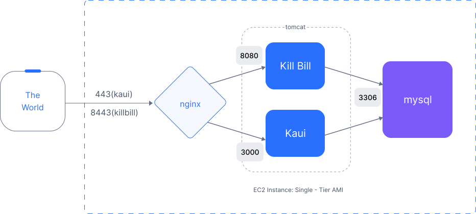

= Single-Tier Option


There are at least three different ways to setup a working Kill Bill system on AWS. Two options are based on a single *Amazon Machine Image (AMI)* containing the complete Kill Bill stack, that is both the Kill Bill server and the administrative UI (KAUI). These options are *single-tier* and *multi-tier*. The single-tier option is designed to deploy a limited version of Kill Bill quickly for trial and experimentation. For production deployments, we recommend the https://docs.killbill.io/latest//aws-multitier.html[multi-tier option.] A third alternative we offer for deploying a production system is https://docs.killbill.io/latest//aws-cf.html[CloudFormation templates]. The multi-tier option requires more setup than CloudFormation, but provides more control over the deployment.

== Overview

This document describes the single-tier option. Everything you need for this option is bundled in the AMI and can be launched on a single EC2 instance. The components of this system include Kill Bill, KAUI, a database manager (DBM), and a load balancer. The EC2 instance runs Ubuntu Linux. The DBM is an instance of https://mariadb.org[MariaDB], an open source version of MySQL. The load balancer is the open source package https://www.nginx.com[Nginx]. This package serves as a front end or reverse proxy, distributing the incoming traffic to either Kill Bill or KAUI based on the incoming port.

The organization of the single-tier system looks like this:



In this configuration, Kill Bill and KAUI are deployed within the `tomcat` application server. Requests are handled by `nginx`. Requests received on port 443 are delivered to KAUI, and those received on port 8443 are delivered to Kill Bill. Both Kill Bill and KAUI communicate as needed with the `mysql` databases.

== Installation

=== Login to AWS

To begin, log in to Amazon Web Services at https://aws.amazon.com. If you are new to AWS, you will be asked to create an account and provide billing information. You will need to sign in as a *Root User*. This should take you to the *AWS Management Console*, which provides links to all available services.

Check the upper right corner of your screen to be sure you are in the appropriate *region*. Your EC2 instance will be placed in this region, and may not be accessible from other regions.

=== Setup your EC2 Instance

==== 1. Subscription

To start the installation process, point your browser to the Kill Bill AMI at
+++
<a href="https://aws.amazon.com/marketplace/pp/B083LYVG9H?ref=_ptnr_doc_"
onclick="getOutboundLink('https://aws.amazon.com/marketplace/pp/B083LYVG9H?ref=_ptnr_doc_');
return false;">
AWS Marketplace
</a>
+++.

You should see the following image at the top of your screen:

image::https://github.com/killbill/killbill-docs/raw/v3/userguide/assets/aws/single-ami-subscribe.png[align=center]

Click *Continue to Subscribe*. The next page will give the AWS Terms and Conditions. Accept the terms if asked. You will then see a new message confirming that you have subscribed. Next, click *Continue to Configuration*.

==== 2. EC2 Configuration

The next page will give several configuration options.

image::https://github.com/killbill/killbill-docs/raw/v3/userguide/assets/aws/single-ami-configure.png[align=center]

Be sure to select the region you plan to operate in. In most cases you should accept the other defaults. Then click *Continue to Launch*.

The next page will give you several options for the launch method. We recommend that you choose *Launch through EC2*.

image::https://github.com/killbill/killbill-docs/raw/v3/userguide/assets/aws/single-ami-launch.png[align=center]

All other options will disappear. Click *Launch*.

The next page is headed *Launch an Instance*. Scroll down to the middle of this page, to the box titled *Key Pair (login)* Here you are asked to choose or create a *key pair*.

image::https://github.com/killbill/killbill-docs/raw/v3/userguide/assets/aws/single-tier-keypair.png[align=center]

The key pair provides the credentials you will need to login to your EC2 instance. For details about key pairs, see the https://docs.aws.amazon.com/AWSEC2/latest/UserGuide/ec2-key-pairs.html[AWS documentation]. We recommend that you create a new key pair. Click *Create Key Pair* to display a pane to be used for the creation. Give the key pair a simple, easy to remember name such as `My-Key-Pair`. Do not change the other options on this pane. Then click *Download Key Pair*. Important: You *must* save the private key that will be generated in this step. If you lose this key, you will *not* be able to login to your instance.

==== 3. Launch

When the key pair is generated, click *Launch Instances*. You should see the screen below:

image::https://github.com/killbill/killbill-docs/raw/v3/userguide/assets/aws/single-tier-launching.png[align=center]

Your instance is finally launching! To follow what is happening on the EC2 Dashboard, scroll all the way down to the bottom, and click *View Instance* at the bottom right. This will take you to the *Instances* screen which is part of the EC2 Dashboard.

image::https://github.com/killbill/killbill-docs/raw/v3/userguide/assets/aws/single-ami-instances.png[align=center]


In a short time, the *Instance State* for your instance should indicate *Running*. You will need to scroll to the right to see all of the information available about your instance.

==== 4. Security Group Setup

You are almost set, but there is one more thing you should do, and that is to scroll down in the menu on the left side to select *Security Groups*. You should see a list of two or more groups. Select the group whose name begins with `Kill Bill on AWS`, then scroll to the bottom and select the tab for *Inbound Rules*. You should see:

image::https://github.com/killbill/killbill-docs/raw/v3/userguide/assets/aws/single-ami-inbound.png[align=center]

These rules enable the ports that must be open to access KAUI and Kill Bill from a browser. To enable direct login to your instance using SSH, you need to add one more port. Click on *Edit Inbound Rules*. Then add a rule with the following elements: Type: SSH, Protocol: TCP, Port Range: 22, Source: 0.0.0.0/0. Your Inbound Rules should now look like this:

image::https://github.com/killbill/killbill-docs/raw/v3/userguide/assets/aws/single-ami-inbound-new.png[align=center]

Your Kill Bill installation is ready to go!

== Login

You have setup access to port 22 in your security group. This will allow you to login directly to your instance from a terminal or command window. You may need to do this to perform some configuration and maintenance tasks that will be described below.

To login, use the secure shell command:

`ssh -i PRIVATE_KEY.pem ubuntu@INSTANCE_IP`

Here PRIVATE_KEY is the pathname where you have stored the private key that was downloaded when you generated your key pair, and INSTANCE_IP is the IPV4 address described earlier. The private key will not work unless its access controls are set to readable by the owner only.

On Windows versions before Windows 10, you may need to download a program called PuTTY to enable `ssh`. On Windows 10 `ssh` is available but may need to be activated through the Settings screen.

The first time you login, you will see a warning message asking if you want to add this host to your list of hosts. You should answer `yes`.

You will now be able to explore your instance and perform various configuration and maintenance tasks. To exit from your login, type `exit`.

== Testing

You can now try to login to KAUI from your browser using the URL https://INSTANCE_IP:443, where INSTANCE_IP is the IPV4 address for your instance, given on your dashboard as *Public IPV4 Address*. If all goes well, this should display the KAUI login screen. The browser may complain that your connection is not secure, but it should offer you a way to bypass the problem.

For an introduction to KAUI, see our https://docs.killbill.io/latest/userguide_kaui.html[Kaui Guide]. The default credentials are: `admin` / `{EC2 instance ID}`. The first few requests might be a bit slow as Kill Bill initializes itself.

In addition, you can login to the Kill Bill server using the URL https://INSTANCE_IP:8443. This provides access to certain detailed reports that may be needed for maintenance, including metrics, event logs, and the Swagger API pages.

Even though access may work as described here, it is not secure. You will probably notice a lock symbol that is crossed out in your URL address bar, and yourr access may be subject to eavesdropping. To fix this, proceed to the next section.


== Adding a Certificate

In order to make your site secure, you will need to add a valid X.509 SSL/TLS certificate. The easiest way to add this certificate is to make use of the tool `certbot`, which relies on the free Certificate Authority (CA) `Let’s Encrypt`. This method provides a simple way to obtain and install free certificates. For instructions on creating a certificate using `certbot`, see https://docs.killbill.io/latest/using-https.html[Using HTTPS]. Once your certificate is setup, you can login securely to KAUI using your CNAME as the URL (e.g., https://kaui.mydomain.com).


== Configuration

Kill Bill defines a number of global properties and per-tenant properties that can be varied. These properties are explained in the https://docs.killbill.io/latest/userguide_configuration.html[configuration guide]. Default values for these properties are built into the Kill Bill code; these values can be overridden by values defined in the file `/var/lib/killbill/config/killbill.properties`. For example, this is where you can change the database URL and credentials.

This file also defines the location of the `shiro.ini` file, which by default is in the same directory. This file defines the Kill Bill admin credentials, along with any other users and their roles. See the https://docs.killbill.io/latest/user_management.html[RBAC guide] for details about this file.

== Upgrades

From time to time new versions of Kill Bill and KAUI may be released. This section explains how to upgrade to these new versions.

First, login to your instance using `ssh`, then switch to the `tomcat` user:

`sudo su - tomcat`

The configuration file `/var/lib/killbill/kpm.yml` specifies the Kill Bill version (and its plugins) to be run on the instance. Once you edit this file to specify the new version number, it will be used automatically. Perform the following steps:

1. Edit the configuration file to update the version number
2. Run the command `$KPM_INSTALL_KB_CMD`
3. Delete the cached directory `/var/lib/tomcat/webapps/ROOT`
4. Restart the instance.

A similar process can be used for KAUI: update `/var/lib/kaui/kpm.yml`, run `$KPM_INSTALL_KAUI_CMD`, delete the cached directory `/var/lib/tomcat/webapps2/ROOT` and restart the instance.


== Troubleshooting


After launching the EC2 instance, the full stack should come up, with all services enabled and running, including:

* An `nginx` instance receiving traffic on port `443` and `8443`
* A instance of Kill Bill server listening on `127.0.0.1:8080` (and receiving external traffic through nginx on port `8443`)
* A instance of Kaui listening on `127.0.0.1:3000` (and receiving external traffic through nginx on port `443`)
* A local `mysql` server running on port `3306`


In this section, we will provide some tips to verify the operation of the system, and what to do when things are not working.

If your installation does not seem to work correctly, the first step is to review your installation process carefully, to be sure that everything has been done and checked as described in this document. If problems persist, we will be glad to work with you to identify the problem. To help us to do this, there are several information reports that you may need to gather. These reports are somewhat technical but can be analyzed by Kill Bill personnel. This section explains how to obtain the reports that may be needed.

=== System Health Check

The healthcheck report checks the health of various software components, and determines if any queues are growing improperly over time. To create this report, login to your EC2 instance and issue the following command:

`curl http://127.0.0.1:8080/1.0/healthcheck`

This will return a series of messages giving the health status of each component.

=== System Information

For a detailed system information report, use the following command:

`curl -u ADMIN:{EC2 instance ID} http://127.0.0.1:8080/1.0/kb/nodesInfo`

Here ADMIN and {EC2 instance ID} are your KAUI administrator access credentials.

=== Service Statuses

This procedure does not produce a report, but does provide important information about the status of each service.


The Kill Bill single-tier option is composed of four services. The status of each service can be checked by the following commands:

* Kill Bill service: `sudo service killbill status`
* KAUI service: `sudo service kaui status`
* Nginx service: `sudo service nginx status`
* Mysql service: `sudo service mysql status`

For each report there should be a line near the top with the following form:

`Active: active (running) since Sat 2020-10-24 20:13:43 UTC; 1 day 1h ago`


Similarly you can `start` or `stop` the services using similar commands, such as `sudo service kaui stop` to stop KAUI.


=== Log Files

The system maintains a series of logfiles that should be helpful when troubleshooting is needed.

Tomcat logs are under `/var/lib/tomcat/logs/`:

* KAUI logs: `/var/lib/tomcat/logs/kaui.out`
* Kill Bill server logs: `/var/lib/tomcat/logs/catalina.out`

Nginx logs can be found under `/var/log/nginx/`

* Access logs: `/var/log/nginx/access.log`
* Error logs: `/var/log/nginx/error.log`

=== Diagnostic Command

The `diagnostic` option of the `kpm` command creates an extensive report for a given tenant that may be useful for troubleshooting. To run this command:

```
# Login as 'tomcat'
> sudo su - tomcat
#
# Run the command with your access credentials:
#
> kpm  diagnostic \
  --killbill-credentials=ADMIN {EC2 instance ID} \
  --bundles-dir=/var/lib/killbill/bundles \
  --database-name=killbill \
  --database-credentials=DBUSER DBPASS \
  --killbill-api-credentials=KEY SECRET \
  --kaui-web-path=/var/lib/tomcat/webapps2 \
  --killbill-url=http://127.0.0.1:8080 \  
  --database-host=127.0.0.1:3306
```

You will need to edit this command to include:

1. Your KAUI username and password (ADMIN {EC2 instance ID})
2. Your database credentials (DBUSER DBPASS)
3. The key and secret key for your tenant (KEY SECRET)

The last line of the response should look like:

`Diagnostic data is exported under /tmp/killbill-diagnostics-20200213-23204-u93ah5/killbill-diagnostics-02-13-20.zip`

The specified zip file contains several reports of various sizes. This report can be downloaded to your computer using `sftp` and forwarded to Kill Bill for analysis.

=== Databases

To access the mysql (MariaDB) databases, you can use the following command:

`mysql -u root -proot`

This enables interactive access to the database manager. There is one `killbill` and one `kaui` database created and used by the respective applications. To verify the tables in each database, you can type:

```
use killbill
show tables;
```
or

```
use kaui
show tables;
```

Standard SQL commands can be used to explore or manipulate the tables. Be sure you know what you are doing, or the databases may become corrupted!

To exit the mysql interactive mode, type `exit`.


=== Load Balancer

The load balancer `nginx` should normally require little attention. The configuration files are located under `/etc/nginx/`. The configuration file for `nginx` itself is `/etc/nginx/nginx.conf`. Additional configuration files are located under `/etc/nginx/sites-enabled/`. The only file normally present in this directory is `/etc/nginx/sites-enabled/killbill.conf`. This file may need to be edited to enable SSL, as explained above.
