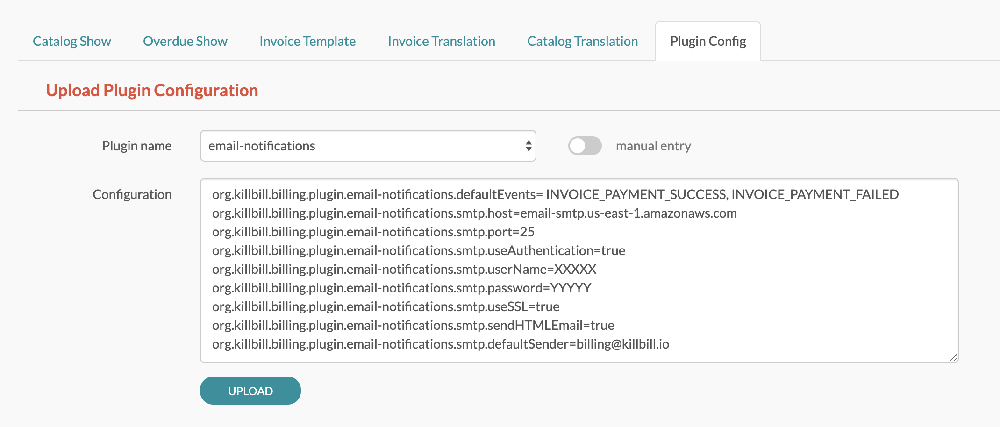
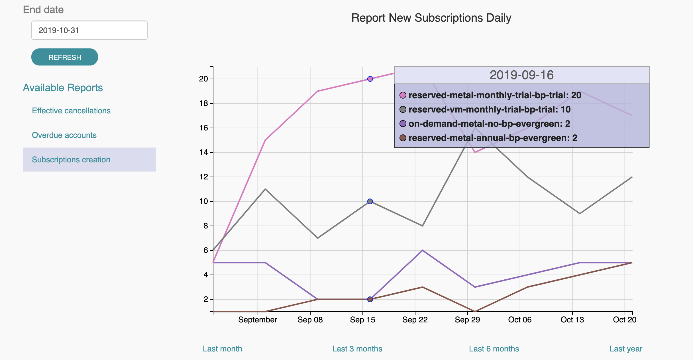

= Kill Bill on AWS

++++
<div class="col-sm-8" style="max-width: 100%">
  <div id="cards" class="card text-center">
    <div class="card-group">
      <div class="card">
        <div class="card-body">
          <h5 class="card-title">Single-Tier single AMI with MariaDB</h5>
          <p class="card-text">Perfect for prototyping and test environments</p>
          <a href="https://aws.amazon.com/marketplace/pp/B083LYVG9H?ref=_ptnr_doclanding_" onclick="getOutboundLink('https://aws.amazon.com/marketplace/pp/B083LYVG9H?ref=_ptnr_doclanding_'); return false;" class="btn btn-primary">Launch</a>
          <p class="card-text"><a href="https://docs.killbill.io/latest/how-to-set-up-a-single-tier-system.html">Docs</a></p>
        </div>
      </div>
      <div class="card">
        <div class="card-body">
          <h5 class="card-title">Multi-Tier CloudFormation with Amazon Aurora</h5>
          <p class="card-text">Production ready setup in minutes <strong>(most popular)</strong></p>
          <a href="https://aws.amazon.com/marketplace/pp/prodview-aicuarzg3e4t6?ref=_ptnr_doc_" onclick="getOutboundLink('https://aws.amazon.com/marketplace/pp/prodview-aicuarzg3e4t6?ref=_ptnr_doclanding_'); return false;" class="btn btn-primary">Launch</a>
          <p class="card-text"><a href="https://docs.killbill.io/latest/how-to-set-up-a-cloud-formation-system.html">Docs</a></p>
        </div>
      </div>
      <div class="card">
        <div class="card-body">
          <h5 class="card-title">Multi-Tier single AMI with external database</h5>
          <p class="card-text">Fully customizable production environment (advanced users)</p>
          <a href="https://aws.amazon.com/marketplace/pp/prodview-rtgjip6tx3oea" onclick="getOutboundLink('https://aws.amazon.com/marketplace/pp/prodview-rtgjip6tx3oea'); return false;" class="btn btn-primary">Launch</a>
          <p class="card-text"><a href="https://docs.killbill.io/latest/how-to-set-up-a-multi-tier-system.html">Docs</a></p>
        </div>
      </div>
    </div>
  </div>
</div>
++++

== Overview

The core development team publishes official Amazon Machine Images (AMIs) on the AWS Marketplace, which allow you to quickly get started with Kill Bill in the cloud. There are several strategies and AMIs to target different use cases:

1. Single AMI Deployments: Both Kill Bill server and KAUI, the administrative UI, run in the same EC2 instance (or node) or a very small number of instances.
2. Cloud Formation Deployments: The Cloud Formation Template will deploy auto-scaling groups of instances for Kill Bill server and KAUI, and create an RDS database instance.

So, which one should you choose? Here is a little more information to help you decide:


**Single AMI Deployments** come in 2 flavors:

* `Single-Tier`: To help you to quickly get started, the single-tier deployment offers an AMI that provides everything you need and can be launched very easily . In this option the Kill Bill server, KAUI and a MariaDB (MySQL) database run on one single node. This is very convenient and inexpensive to get started, but is not recommended for production deployments.
* `Multi-Tier`: In this mode, there is also a single AMI for both Kill Bill server and KAUI, but the deployment will use more than one node (typically two). This option requires a bit more setup and depends on an external database. The use of multiple nodes is intended to provide redundancy and to eliminate downtime during upgrades.

The Single AMI Deployments are a great way to easily get started, but they are often not the best choices for production deployments. Please refer to https://docs.killbill.io/latest/how-to-set-up-a-single-tier-system.html[How to Setup a Single-Tier System] or https://docs.killbill.io/latest/how-to-set-up-a-multi-tier-system.html[How to Setup a Multi-Tier System] for further information.

**Cloud Formation Deployments** use AWS CloudFormation to provide a better integration with the rest of the AWS ecosystem. These deployments include separate AMIs for the Kill Bill Server and for Kaui, and rely on auto-scaling groups to scale both Kill Bill and KAUI instances independently. They make use of the Amazon Aurora RDS database, a version of MySQL that is also PostgreSQL compatible. They also make use of CloudWatch for metrics.
Cloud Formation Deployments also offer a **one-click** button deployment for the whole stack, including the required database. They are a good option to set up a production-ready deployment with minimum efforts. Please refer to https://docs.killbill.io/latest/how-to-set-up-a-cloud-formation-system.html[How to Setup a CloudFormation System] for further information.

The rest of this document describes configurations that apply to both types of deployments.

== Default configuration

Either installation method comes with a default configuration to get you started.

A few plugins are also pre-configured, but not installed. These include `email-notifications` and `analytics`, to be discussed below. To install them, just head to the Kaui KPM page and select the plugin(s) of your choice.

=== Invoice templates

Kill Bill allows you to generate an HTML template corresponding to an invoice. Invoice templates can be customized. You can read the https://docs.killbill.io/latest/invoice_templates.html[Invoice Templates] document to learn more.

=== Email notifications plugin

This section explains how to configure your system to send email notifications to your customers using the https://github.com/killbill/killbill-email-notifications-plugin[email-notifications] plugin. This plugin is provided preconfigured and may be installed as described above.

==== SMTP configuration

The `email-notifications` plugin needs to be configured with an SMTP server to be able to send emails. The easiest way to set this up on AWS is with  Amazon's Simple Email Service (SES). Instructions for setting this up may be found at https://docs.killbill.io/latest/using-ses-with-aws.html[Using SES with AWS].

Follow the instructions on the link above. Once you have obtained your credentials, update the plugin configuration:



==== Templates

The email plugin comes with a preconfigured set of https://docs.killbill.io/latest/email-notification-plugin.html#_default_templates[email templates]. More details on how to update these strings and the HTML templates are available in the https://docs.killbill.io/latest/email-notification-plugin.html[email notification plugin tutorial].

=== Analytics plugin

This section explains how to configure your system to perform analytics using the `analytics` plugin. This plugin is provided preconfigured and may be installed as described above.


The plugin comes with a few pre-configured reports:

* `Subscriptions creation`: counts the number of subscriptions being created per day (effective on that day, i.e. pending subscriptions are ignored). Refreshed every hour. The name of the report is `report_new_subscriptions_daily`.
* `Effective cancellations`: counts the number of subscriptions being canceled per day (only effective cancellations are taken into account: end of term cancellations are ignored). Refreshed every hour. The name of the report is `report_cancellations_daily`.
* `Overdue accounts`: counts the number of overdue accounts per day (defined as having a negative balance, i.e. owing money). Refreshed once a day at 6am UTC. The name of the report is `report_overdue_accounts_daily`.

In order to make these reports active, they must be enabled on a per tenant level. Assuming a `bob/lazar` tenant, we can activate the reports using the following command -- e.g. report=`report_cancellations_daily`:

```
#
# Activate report report_cancellations_daily for tenant bob/lazar:
#
curl -v \
-X PUT \
-u admin:password \
-H "X-Killbill-ApiKey:bob" \
-H "X-Killbill-ApiSecret:lazar" \
-H 'Content-Type: application/json' \
-d '{}' \
'http://127.0.0.1:8080/plugins/killbill-analytics/reports/report_cancellations_daily?shouldRefresh=true'
```

Custom reports can be added by following our https://docs.killbill.io/latest/userguide_analytics.html[Analytics guide].


