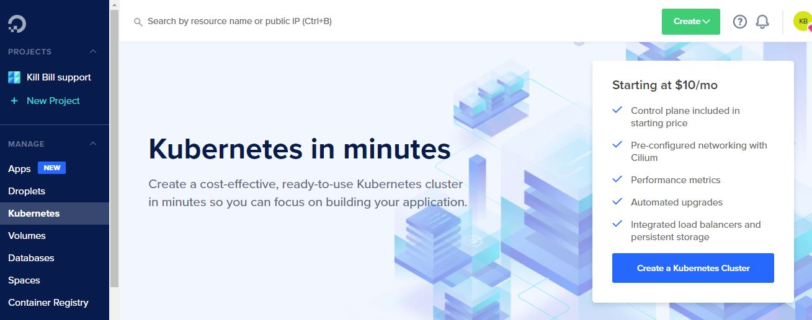
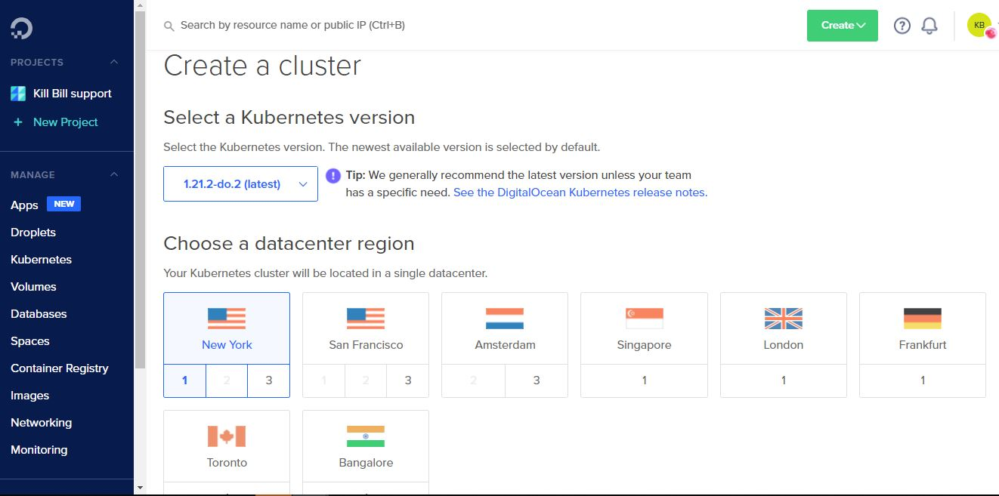
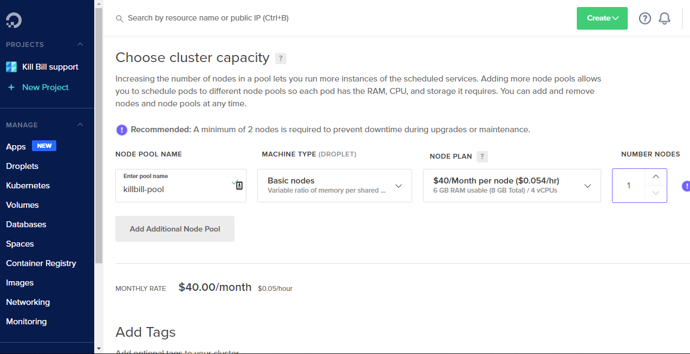
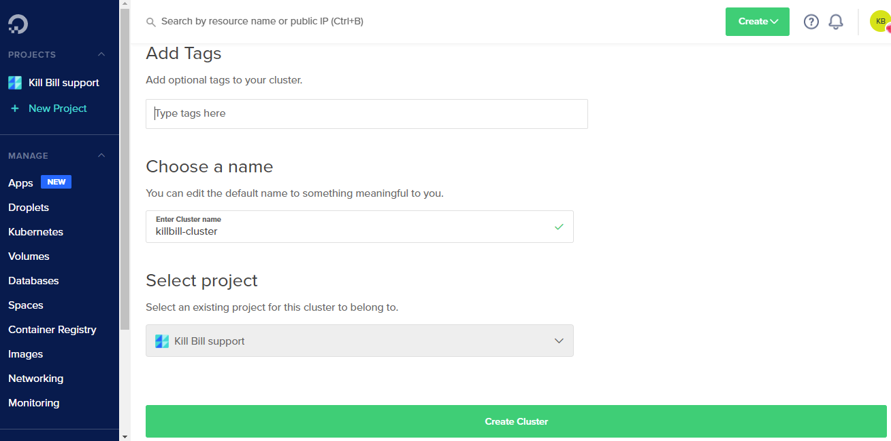
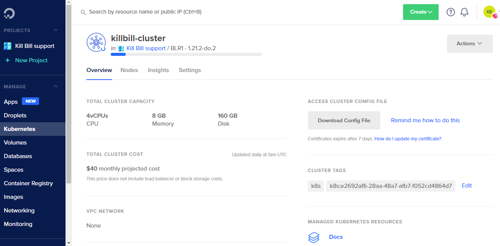

= Deploy to Kubernetes

This guide explains how to get started with Kill Bill deployment in Kubernetes.

Kubernetes is an open-source system for managing containerized applications across multiple hosts.
It provides basic mechanisms for deployment, maintenance, and scaling of applications.

*This guide has the following sections:*

* <<deploy_to_local_kubernetes, Deploy to Local Kubernates>>
* <<deploy_to_kubernetes_on_digitalocean, Deploy to Kubernates on DigitalOcean>>
* <<debug_running_pods, Debug Running Pods>>


== Before You Begin
This guide uses *kubectl*, a command-line tool for running commands against a Kubernetes cluster.

For more information about the *kubectl* tool, check the following links:

* https://kubernetes.io/docs/reference/kubectl/overview/[Overview of kubectl]

* https://kubernetes.io/docs/tasks/tools/#kubectl[Install kubectl]

To check the version, enter ```kubectl version```.

[[resource_config_file]]
== Resource Configuration File 
You can deploy Kill Bill on the Kubernetes cluster running locally or in the cloud using the resource configuration file shared below.

[source,yaml]
----
apiVersion: v1
items:
  - apiVersion: v1
    kind: Service
    metadata:
      labels:
        service: db
      name: db
    spec:
      ports:
        - name: "3306"
          port: 3306
          targetPort: 3306
      selector:
        service: db
  - apiVersion: v1
    kind: Service
    metadata:
      labels:
        service: kaui
      name: kaui
    spec:
      ports:
        - name: "9090"
          port: 9090
          targetPort: 8080
      selector:
        service: kaui
      type: LoadBalancer
  - apiVersion: v1
    kind: Service
    metadata:
      labels:
        service: killbill
      name: killbill
    spec:
      ports:
        - name: "8080"
          port: 8080
          targetPort: 8080
      selector:
        service: killbill
      type: LoadBalancer
  - apiVersion: apps/v1
    kind: Deployment
    metadata:
      labels:
        service: db
      name: db
    spec:
      replicas: 1
      selector:
        matchLabels:
          service: db
      template:
        metadata:
          labels:
            service: db
        spec:
          containers:
            - env:
                - name: MYSQL_ROOT_PASSWORD
                  value: killbill
              image: killbill/mariadb:0.22
              name: db
              ports:
                - containerPort: 3306
          restartPolicy: Always
  - apiVersion: apps/v1
    kind: Deployment
    metadata:
      labels:
        service: kaui
      name: kaui
    spec:
      replicas: 1
      selector:
        matchLabels:
          service: kaui
      template:
        metadata:
          creationTimestamp: null
          labels:
            service: kaui
        spec:
          containers:
            - env:
                - name: KAUI_CONFIG_DAO_PASSWORD
                  value: killbill
                - name: KAUI_CONFIG_DAO_URL
                  value: jdbc:mysql://db:3306/kaui
                - name: KAUI_CONFIG_DAO_USER
                  value: root
                - name: KAUI_KILLBILL_URL
                  value: http://killbill:8080
              image: killbill/kaui:2.0.9
              name: kaui
              ports:
                - containerPort: 8080
          restartPolicy: Always
  - apiVersion: apps/v1
    kind: Deployment
    metadata:
      labels:
        service: killbill
      name: killbill
    spec:
      replicas: 1
      selector:
        matchLabels:
          service: killbill
      template:
        metadata:
          labels:
            service: killbill
        spec:
          containers:
            - env:
                - name: KILLBILL_DAO_PASSWORD
                  value: killbill
                - name: KILLBILL_DAO_URL
                  value: jdbc:mysql://db:3306/killbill
                - name: KILLBILL_DAO_USER
                  value: root
              image: killbill/killbill:0.22.26
              name: killbill
              ports:
                - containerPort: 8080
          restartPolicy: Always
kind: List
----

[[deploy_to_local_kubernetes]]
== Deploy to Local Kubernetes 
There are multiple platforms that allows you to run Kubernetes locally.
This guide uses https://minikube.sigs.k8s.io/docs/start/[Minikube] to set up a local Kubernetes cluster and deploy Kill Bill to it.

*Step 1 - Start Your Cluster*

By default, Minikube starts with 2GB of memory. For Kill Bill to run smoothly, it is recommended to start Minikube with at least 4GB of memory.

To start Minikube with increased memory, run the following commands:

[source,bash]
minikube config set memory 4096
minikube start

*Step 2 - Create Resources*

Refer to the Kill Bill <<resource_config_file, resource configuration file>>. Save the configuration to a file (_Example:_ app.yaml).

The following command will create resources in the local cluster:
[source,bash]
kubectl apply -f app.yaml

*Step 3 - Expose Services*

In the resource configuration file, Kill Bill and Kaui services are of type *LoadBalancer*.

A LoadBalancer service is the standard way to expose a service to the internet. With this method, each service gets its own IP address.

Use *minikube tunnel* to expose these services in the local environment.

Minikube tunnel runs as a process to creates a network route on the host to the service CIDR of the cluster using the cluster's IP address as a gateway.
The tunnel command exposes the external IP directly to any program running on the host operating system.

*Run tunnel in a separate terminal*

[source,bash]
minikube tunnel --alsologtostderr

_Tunnel Output Example:_
[source,bash]
I0907 16:03:15.327778   30968 loadbalancer_patcher.go:122] Patched kaui with IP 127.0.0.1
I0907 16:03:15.354775   30968 out.go:177] * Starting tunnel for service kaui.
* Starting tunnel for service kaui.
I0907 16:03:15.468048   30968 out.go:177] * Starting tunnel for service killbill.
* Starting tunnel for service killbill.
I0907 16:03:15.550837   30968 loadbalancer_patcher.go:122] Patched killbill with IP 127.0.0.1

*Step 4 - Check Pods' Statuses*

At this stage, statuses of pods' would be either *ContainerCreating* or *Pending* as downloading container images over the network and setting up containers could take a few minutes.

Wait until all containers get created successfully and all pods' bound to nodes.
When this gets done, pods' statuses will change to *Running*.

To check the current statuses of all pods', run the following command:

[source,bash]
kubectl get pods

*Step 5 - Access Services*

To access Kaui and Kill Bill, you need to know the external IP assigned to these services.

Run the following command and make a note of *EXTERNAL-IP* assigned to Kaui and Kill Bill services.
As per the resource configuration, Kaui is exposed on port 9090, and Kill Bill is exposed on port 8080.

[source,bash]
kubectl get services

_Output Example:_
[source,bash]
NAME         TYPE           CLUSTER-IP       EXTERNAL-IP   PORT(S)          AGE
db           ClusterIP      10.99.84.181     <none>        3306/TCP         13m
kaui         LoadBalancer   10.101.231.183   127.0.0.1     9090:30843/TCP   13m
killbill     LoadBalancer   10.101.146.51    127.0.0.1     8080:31203/TCP   13m
kubernetes   ClusterIP      10.96.0.1        <none>        443/TCP          24m

To access Kaui and Kill Bill, link would be \http://<EXTERNAL-IP>:<PORT>

As per the above example, Kaui is accessible at \http://127.0.0.1:9090 and Kill Bill is at \http://127.0.0.1:8080/api.html.

=== How To Delete a Local Cluster

To delete the local Kubernetes cluster, run the following command:

[source,bash]
minikube delete

=== Troubleshoot ERR_EMPTY_RESPONSE

If for any of the reasons, you try to access Kill Bill or Kaui and get ERR_EMPTY_RESPONSE (this page isn’t working message), try *NodePort* service.

Run the following commands to expose a service and start a tunnel for that service:

[source,bash]
kubectl expose deployment killbill --type=NodePort --name=killbill-np
minikube service killbill-np

_Output Example:_
[source,bash]
|-----------|-------------|-------------|---------------------------|
| NAMESPACE |    NAME     | TARGET PORT |            URL            |
|-----------|-------------|-------------|---------------------------|
| default   | killbill-np |        8080 | http://192.168.49.2:30685 |
|-----------|-------------|-------------|---------------------------|
* Starting tunnel for service killbill-np.
|-----------|-------------|-------------|------------------------|
| NAMESPACE |    NAME     | TARGET PORT |          URL           |
|-----------|-------------|-------------|------------------------|
| default   | killbill-np |             | http://127.0.0.1:19757 |
|-----------|-------------|-------------|------------------------|
* Opening service default/killbill-np in default browser...

The Kill Bill API documentation link - \http://<External-IP>:<Port>/api.html.

[[deploy_to_kubernetes_on_digitalocean]]
== Deploy to Kubernetes on DigitalOcean 

DigitalOcean Kubernetes is a managed Kubernetes service that lets you deploy Kubernetes clusters without the complexities of handling the control plane and containerized infrastructure.

The instructions in this section assume you already have an account with DigitalOcean.

Following are the steps to deploy Kill Bill to Kubernetes on DigitalOcean:

*Step 1 - Create a Kubernetes Cluster*

* To create a Kubernetes cluster on DigitalOcean, click on MANAGE > Kubernetes > Create a Kubernetes Cluster.
+

+
* On the next screen, choose a data center region that is near to your location.
+

+
* In the *Choose cluster capacity* section, choose the appropriate NODE PLAN. Kill Bill needs at least 4GB of memory to run smoothly.
+

+
* Scroll down to *Choose a name* and enter a meaningful name for your cluster, then click on *Create Cluster*.
+


*Step 2 - Access Cluster Config File*

* On the cluster Overview page, click on the *Download Config File* button.
+


*Step 3 - Create Resources*

Refer to the Kill Bill <<resource_config_file, resource configuration file>>. Save the configuration to a file (_Example:_ app.yaml).

The following command will create resources in the cluster (replace the value of ```--kubeconfig``` with the cluster config file name downloaded in Step 2):

[source,bash]
kubectl --kubeconfig=killbill-cluster-kubeconfig.yaml apply -f app.yaml

*Step 4 - Access Services*
To access Kaui and Kill Bill, you need to know the external IP assigned to these services.

Run the following command and make a note of *EXTERNAL-IP* assigned to Kaui and Kill Bill services.
As per the resource configuration, Kaui is exposed on port 9090, and Kill Bill is exposed on port 8080.

[source,bash]
kubectl --kubeconfig=killbill-cluster-kubeconfig.yaml get services

_Output Example:_
[source,bash]
$ kubectl --kubeconfig=killbill-cluster-kubeconfig.yaml get services
NAME         TYPE           CLUSTER-IP      EXTERNAL-IP       PORT(S)          AGE
db           ClusterIP      10.245.34.99    <none>            3306/TCP         8m21s
kaui         LoadBalancer   10.245.204.79   144.126.254.141   9090:32438/TCP   8m21s
killbill     LoadBalancer   10.245.95.189   139.59.48.25      8080:31554/TCP   8m21s
kubernetes   ClusterIP      10.245.0.1      <none>            443/TCP          9m35s

To access Kaui and Kill Bill, use the following link: \http://<EXTERNAL-IP>:<PORT>

As per the above example, Kaui is accessible at \http://144.126.254.141:9090 and Kill Bill is at \http://139.59.48.25:8080/api.html.

[[debug_running_pods]]
== Debug Running Pods' 

*How to access Kill Bill/Kaui logs?*

The following are the steps to view the logs of Kill Bill or Kaui deployed on a cluster:

*Step 1 - Find a Pod Name*

For Kubernetes cluster running locally:

[source,bash]
kubectl get pods

For Kubernetes cluster running on DigitalOcean:

[source,bash]
kubectl --kubeconfig=killbill-cluster-kubeconfig.yaml  get pods

*Step 2 - Execute Commands in a Container*

Run the following command to connect and run commands in a container:

[source,bash]
kubectl --kubeconfig=<Kube Config File> exec -ti <Pod Name> -- bash

_Note:_ For a cluster running locally, do not use ```--kubeconfig```.

_Example:_

[source,bash]
kubectl --kubeconfig=killbill-cluster-kubeconfig.yaml exec -ti -748fbdbf5-g9t47 -- bash

Once you are connected to a container, logs can be found under the *logs* directory.