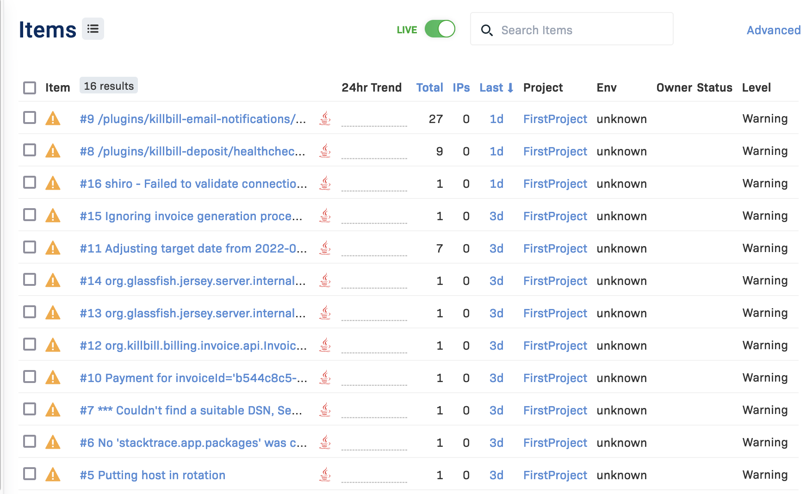

= Error Tracking with Rollbar

include::{sourcedir}/aws/includes/aws-card.adoc[]

== Overview

Rollbar is an error tracking tool that can be integrated with several types of Kill Bill installations. In this guide we discuss the use of Rollbar to track errors produced
by two types of implementations on Amazon Web Services (AWS):
single-tier and multi-tier. With the latest Amazon Machine Image (AMI)
for Kill Bill, it is very easy to process the Kill Bill logs using
Rollbar and work with them in the way that best suits your needs.

This discussion applies to installations using Kill Bill 2021.9 or later.

== Set Up Rollbar

You may already be familiar with Rollbar. If not, this section will
explain how to get started.

First, go to the https://rollbar.com/[Rollbar website]. Rollbar
offers a 30-day free trial, then continues free as long as your usage does not exceed certain limits. Provide a name and email address to sign up.
Once you create an account, you should see the Rollbar main page.

Kill Bill is preconfigured to send its error logs to Rollbar. No additional agent is needed. All that has to be done is to enable the transfer by providing an access token. The access token is installed by editing a simple configuration file.  

== Get the Access Token

To get the access token you will need, follow these steps:

1. From the Rollbar main page, click *Settings* at the bottom of the left menu.
2. In the submenu that appears, select *Account Access Tokens*.
3. Choose the token marked *Write* and click *Copy*.

The token is copied to your clipboard.


== Edit the Configuration File

To authorize the sending of the Kill Bill metrics, it is necessary to
edit two lines in this file:

```
/var/lib/tomcat/bin/setenv2.sh
```

This file contains configuration information for `tomcat`, which manages the
KillBill web applications.

This is a small file. The two lines to be edited are:

```
-Dcom.killbill.rollbar.enable=false
-Dcom.killbill.rollbar.accessToken=
```

These should be changed to:

```
-Dcom.killbill.rollbar.enable=true
-Dcom.killbill.rollbar.accessToken=YourAccessToken
```
where `YourAccessToken` is copied from your clipboard.

After editing the file, go to your AWS EC2 dashboard and *reboot the
instance* so the new configuration file will be read. If you have more
than one instance, follow the same procedure for each one.

Now return to the Rollbar main page and choose *Items*. After a short delay you should see a list of items like the following, representing significant log entries:




Congratulations. Your Rollbar integration is complete!

== Using Rollbar

Rollbar automatically groups similar items and provides detailed analysis to help in correcting errors in your code. Full documentation can be found on the https://docs.rollbar.com[Rollbar Website].


