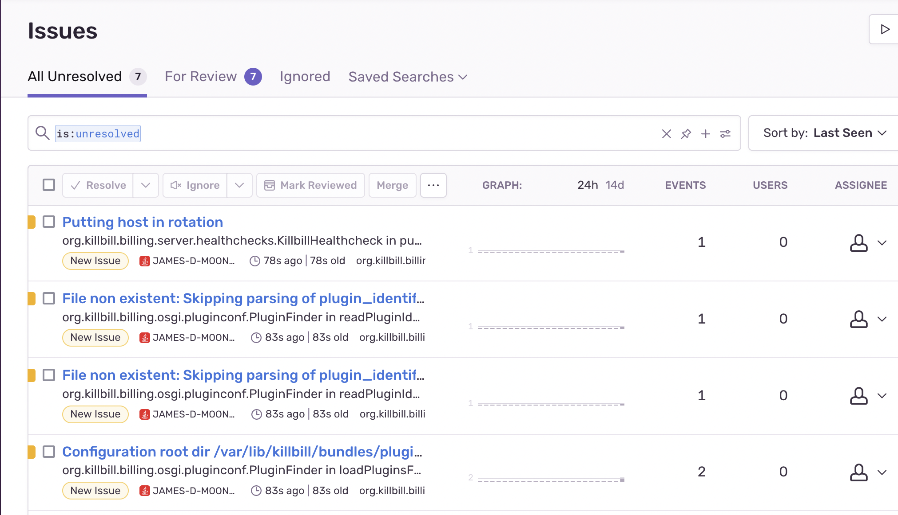

= Error Tracking with Sentry

include::{sourcedir}/aws/includes/aws-card.adoc[]

== Overview

Sentry is an error tracking and optional performance monitoring tool that can be integrated with several types of Kill Bill installations. In this guide we discuss the use of Sentry to track errors produced
by two types of implementations on Amazon Web Services (AWS):
single-tier and multi-tier. The latest Amazon Machine Image (AMI)
for Kill Bill is preconfigured to deliver the required data to Sentry if an authorization code is provided.

This discussion applies to installations using Kill Bill 2021.9 or later.

To set up Sentry to work with Kill Bill, there
are just two steps:

. Setup a Sentry account
. Edit a configuration file to authorize the transfer of the Kill Bill data


== Set Up Sentry

You may already be familiar with Sentry. If not, this section will
explain how to get started.

First, go to the https://sentry.io/welcome/[Sentry website]. Sentry
offers a 14-day free trial. Provide an email address to sign up.
Once you create an account, you should see the Sentry main page.

Choose *Create a Project*. Select Java as your platform, and give your project a name.

== Get the DSN

The authorization key that Sentry requires to work with Kill Bill is called the Data Source Name (DSN). To find your DSN, follow these steps:

. Go to the Sentry main page.
. Select your project name
. Choose *Settings* from the left menu
. Choose *Client Keys* from the Settings menu. A list of keys should appear, including the DSN.
. Click the copy icon next to the DSN to copy it to the clipboard.
The token is copied to your clipboard.


== Edit the Configuration File

To authorize the sending of the Kill Bill metrics, it is necessary to
edit two lines in this file:

```
/var/lib/tomcat/bin/setenv2.sh
```

This file contains configuration information for `tomcat`, which manages the
KillBill web applications.

This is a small file. The two lines to be edited are:

```
-Dcom.killbill.sentry.enable=false
-Dcom.killbill.sentry.dsn=
```

These should be changed to:

```
-Dcom.killbill.sentry.enable=true
-Dcom.killbill.sentry.dsn=YourDSN
```
where `YourDSN` is copied from your clipboard.

After editing the file, go to your AWS EC2 dashboard and *reboot the
instance* so the new configuration file will be read. If you have more
than one instance, follow the same procedure for each one.

Now return to the Sentry main page and choose *Issues*. After a short delay you should see a list like the following, representing significant log entries:




Congratulations. Your Sentry integration is complete!

== Using Sentry

Sentry gives you the ability to analyze and, if possible, resolve any issues that it receives from your Kill Bill application. Click on an issue to see full information about it and explore your options. Full documentation is available on the https://docs.sentry.io[Sentry Website].


