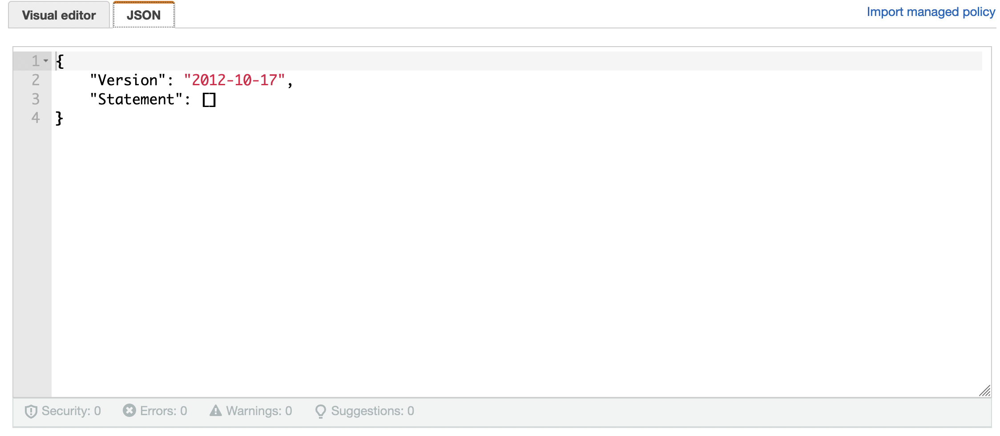
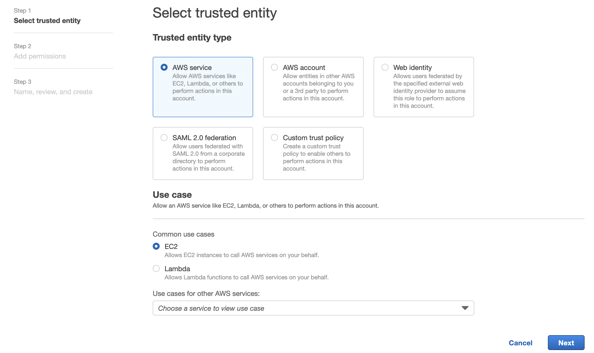
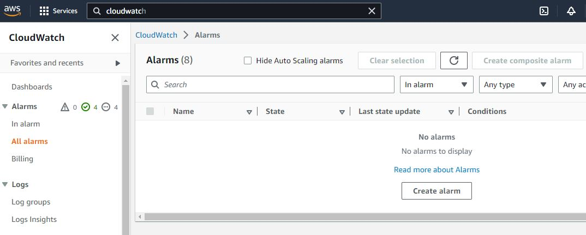

= Managing Metrics with Cloudwatch

include::{sourcedir}/aws/includes/aws-card.adoc[]

== Overview

Several third-party tools are available to manage and display the metrics produced by Kill Bill. However, one popular tool available directly from AWS is https://docs.aws.amazon.com/cloudwatch/index.html[CloudWatch]. This
package enables you to monitor and display whatever metrics
you may find useful from the Kill Bill collection, including metrics
that show the performance and resource use of Kill Bill and Kaui
themselves, and metrics describing the infrastructure on which these
systems run. CloudWatch is included automatically in the Kill Bill CloudFormation option, but it can be used with the other AWS options as well.

In this guide we discuss the use of CloudWatch to manage metrics produced
by single-tier and multi-tier implementations on Amazon Web Services (AWS). The latest Amazon Machine Image (AMI)
for Kill Bill is preconfigured to direct the Kill Bill metrics to
CloudWatch and work with them in the way that best suits your needs. These instructions apply to the Kill Bill AMI version 2021.9 or later.

To set up CloudWatch to manage the metrics available from Kill Bill, there
are five steps:

1. Edit a configuration file to enable the use of CloudWatch.
2. Install the AWS X-Ray daemon
3. Create an IAM policy
4. Create an IAM role
5. Attach the role to your EC2 instance(s)

== Edit the Configuration File

To authorize the sending of the Kill Bill metrics to CloudWatch, it is necessary to
edit just one line in this file:

```
/var/lib/tomcat/bin/setenv2.sh
```

This file contains configuration information for `tomcat`, which manages the
KillBill web applications.

This is a small file. The line to be edited is:

```
-Dcom.killbill.cloudwatch.enable=false

```

This should be changed to:

```
-Dcom.killbill.cloudwatch.enable=true
```

After editing the file, go to your AWS EC2 dashboard and *reboot the
instance* so the new configuration file will be read. If you have more
than one instance, follow the same procedure for each one.


== Create an IAM Policy

This step creates a policy, or a set of permissions, that is required to access the Kill Bill metrics.

. From the EC2 Dashboard, Type "IAM" in the search field at the upper left. Select the IAM Dashboard.
. From the left menu, choose Policies, then select *Create Policy*.
. On the page that appears, select the JSON tab. You should see:
+



. Next, copy the following lines between the square brackets:
+
```
        {
            "Effect": "Allow",
            "Action": [
                "ec2:DescribeTags",
                "cloudwatch:PutMetricData",
                "xray:GetSamplingRules",
                "xray:GetSamplingTargets",
                "xray:GetSamplingStatisticSummaries",
                "xray:PutTraceSegments",
                "xray:PutTelemetryRecords",
                "logs:CreateLogGroup",
                "logs:CreateLogStream",
                "logs:DescribeLogGroups",
                "logs:DescribeLogStreams",
                "logs:PutLogEvents"
            ],
            "Resource": "*"
        }
```

. Choose *Next:Tags*.  Then on the next page, click *Next:Review*.

. Now give your policy a name, such as "CloudWatch_Policy". Then click *Create Policy*.

Your policy will be created.

== Create an IAM Role

A role is an identity that has specific permissions defined by a policy. A role can be used to define the permissions for an EC2 instance.

. Return to the IAM Dashboard.
. From the left menu, choose Roles, then select *Create Role*. You should see:
+


. Under *Common Use Cases*, select *EC2*. Then click *Next*.
. On the next page, select the policy you created. Then click *Next*.
. Give your role a name, such as "CloudWatch_Role". Then click *Create Role*.

Your role will be created.


== Attach Role to EC2 Instance

The last step is to associate your role with your instance(s).

. Go to your EC2 Dashboard and select *Instances*.

. Select your instance. If you have more than one select only one.

. Select *Actions/Security/Modify IAM Role*.

. From the dropdown list choose the role you just created.

. Click *Save*.

If you have multiple instances, repeat these steps for each one. You may use the same role for all your instances.

== Test the Installation

To test your installation, Go to the Cloudwatch console. After a short delay, you
should see a set of available metrics. There should be well over 1,000 in your list.

Congratulations. Your CloudWatch integration is complete!

== Using CloudWatch

CloudWatch is managed from the CloudWatch console. AWS provides full https://docs.aws.amazon.com/AmazonCloudWatch/latest/monitoring/WhatIsCloudWatch.html[documentation]. If you select `All metrics` from the left-hand menu, you will see all your available metrics in groups. You can create various types of graphs, collect them into dashboards, set alarms, and perform various other useful actions.

== Creating Alarms in CloudWatch

One of the key features of CloudWatch is the ability to create alarms based on metrics, which can help you identify and respond to issues in real-time. We'll walk through the steps to create an alarm in CloudWatch based on a metric and conditions.

To create an alarm in CloudWatch, start by opening the CloudWatch console and clicking on "Alarms" in the left-hand navigation menu. Then click "Create alarm" to begin the alarm creation process.



=== Step 1: Specify Metric and Conditions

The first step is to specify the metric and conditions that will trigger the alarm. Click on "Select metric" and choose the appropriate namespace, region, and metric from the available options. In this example, we'll use the "killbill" namespace, select "Instance, Region, Type" and then choose the "threads.deadlock.count" metric.

Next, specify the conditions that will trigger the alarm. This can include thresholds for minimum and maximum values, as well as time periods during which the metric must meet certain criteria. For example, you might create an alarm that triggers if the deadlock count exceeds a certain threshold for more than five minutes.

=== Step 2: Configure Actions

Once you've specified the metric and conditions, you'll need to configure the actions that will be taken when the alarm is triggered. Click on "Next" to proceed to the actions configuration screen.

Here, you can choose what actions to take when the alarm enters various states, such as "In alarm" or "OK". For example, you might configure the alarm to send a notification to an SNS topic when it enters the "In alarm" state. To do this, select "In alarm" from the drop-down menu, then choose an existing SNS topic or create a new one.

=== Step 3: Add Name and Description

After configuring the actions, give your alarm a name and description to help identify it later on.

=== Step 4: Preview and Create

Finally, review the settings you've specified and click "Create alarm" to create the new alarm. 

Once the alarm is created, it will start monitoring the specified metric and trigger actions when the specified conditions are met.

By following the steps outlined above, you can create an alarm in CloudWatch to monitor your metrics and respond to issues in real-time.
