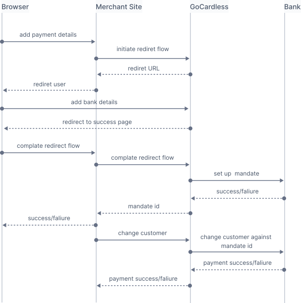
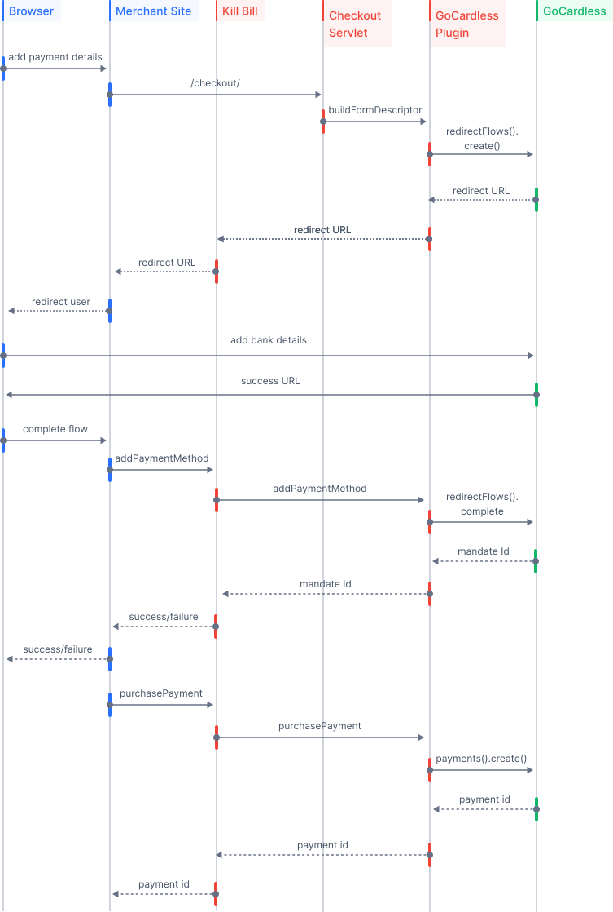

= Payment Plugin Overview

Payment plugins integrate Kill Bill with a specific https://docs.killbill.io/latest/Kill-Bill-Glossary.html#payment_gateway[gateway] (i.e., payment processor), such as Stripe or Braintree. We already have many open-source payment plugins available on GitHub as listed in our https://docs.killbill.io/latest/plugin_introduction.html#payment_gateways[_Plugin Introduction_] guide.

You can use this tutorial to develop a custom payment plugin.

== Prerequisites

* Make sure to familiarize yourself with the https://docs.killbill.io/latest/userguide_subscription.html#components-payment[Payment] section of the _Subscription Guide_ and the https://docs.killbill.io/latest/userguide_payment.html[_Payment Guide_].

* Make sure to familiarize yourself with the https://docs.killbill.io/latest/plugin_introduction.html[_Plugin Introduction Guide_].

* Make sure to familiarize yourself with the plugin development process documented in the  https://docs.killbill.io/latest/plugin_development.html[_Plugin Development Guide_].

== Developing a Payment Plugin

Kill Bill provides a https://github.com/killbill/killbill-plugin-api/[Plugin API] for plugin development. This includes the https://github.com/killbill/killbill-plugin-api/blob/master/payment/src/main/java/org/killbill/billing/payment/plugin/api/PaymentPluginApi.java[`PaymentPluginApi`] interface. You need to implement this interface in order to develop a custom payment plugin.

Kill Bill also provides a https://github.com/killbill/killbill-plugin-framework-java[plugin framework], which has many classes that you can use out-of the-box for plugin development. We strongly encourage you to use this framework. 

== Getting Started

At a high level, you must perform the following steps to develop a payment plugin:

. Clone one of our existing sample plugins and set it up as explained in the https://docs.killbill.io/latest/plugin_development.html#_getting_started[__Plugin Development Guide__]. You can use one of the following:
.. https://github.com/killbill/killbill-hello-world-java-plugin[Hello World Plugin] - This is a sample plugin that you can use as a template for developing other plugins. 
..  https://github.com/killbill/killbill-gocardless-example-plugin[GoCardless Example Plugin] - This is a sample payment plugin for https://gocardless.com/[GoCardless] and is used in this tutorial.
. Create a class that implements the `PaymentPluginApi` interface (Similar to https://github.com/killbill/killbill-hello-world-java-plugin/blob/master/src/main/java/org/killbill/billing/plugin/helloworld/HelloWorldPaymentPluginApi.java[`HelloWorldPaymentPluginApi`] or https://github.com/killbill/killbill-gocardless-example-plugin/blob/main/src/main/java/org/killbill/billing/plugin/gocardless/GoCardlessPaymentPluginApi.java[`GoCardlessPaymentPluginApi.java`]).
. Implement the desired methods from the `PaymentPluginApi` interface within your class. These methods are explained in the <<paymentpluginapi_methods, PaymentPluginApi Methods>> table below.
. Create an activator class that is responsible for starting the plugin (Similar to https://github.com/killbill/killbill-hello-world-java-plugin/blob/master/src/main/java/org/killbill/billing/plugin/helloworld/HelloWorldActivator.java[`HelloWorldActivator`] or https://github.com/killbill/killbill-gocardless-example-plugin/blob/main/src/main/java/org/killbill/billing/plugin/gocardless/GoCardlessActivator.java[`GoCardlessActivator`]).

[[paymentpluginapi_methods]]
== PaymentPluginApi Methods

The following table lists the methods in the https://github.com/killbill/killbill-plugin-api/blob/master/payment/src/main/java/org/killbill/billing/payment/plugin/api/PaymentPluginApi.java[`PaymentPluginApi`] interface. You can implement the desired methods in your plugin class.

[cols="1,3"]
|===
|Method Name | Method Description

|authorizePayment/capturePayment
|Should trigger an https://en.wikipedia.org/wiki/Authorization_hold[authorization] and capture respectfully (applies to credit cards only)
|purchasePayment
|Should trigger a generic payment (authorization with auto-capture for credit cards, ACH/SEPA, etc.)
|voidPayment
|Should void an authorization (credit cards only)
|creditPayment
|Should fund the payment method from your merchant account (similar to a refund, but no prior payment is required: this can be used to initiate an ACH for disbursement for instance)
|refundPayment
|Should reverse an existing (settled) charge
|getPaymentInfo
|Should return payment information.
|searchPayments
|Should return payment transactions matching the specified searchKey (the implementation is up to the plugin)
|addPaymentMethod
|Should create the payment method in the gateway (e.g. store a token)
|deletePaymentMethod
|Should delete the payment method in the gateway (e.g. revoke a token)
|getPaymentMethodDetail
|Should return detailed information about the payment method (e.g. billing address)
|setDefaultPaymentMethod
|Should mark the payment method as the default one in the gateway (if the associated account in the gateway has several payment methods)
|getPaymentMethods
|Should list the payment methods in the gateway for that account (used by the refresh endpoint, when payment methods are added directly in the gateway, bypassing addPaymentMethod)
|searchPaymentMethods
|Should return payment methods matching the specified searchKey (the implementation is up to the plugin)
|resetPaymentMethods
|Called at the end of a refresh call, should associate to that account the payment methods specified (this is useful if Kill Bill knows payment methods that are not yet in the gateway)
|buildFormDescriptor
|Should return enough metadata for the front-end to build a form or a redirect to a hosted payment page
|processNotification
|Should process payloads from the gateway to transition payments states
|===

A few pointers for implementing these methods:

* Almost all the methods accept parameters like `kbAccountId`, `kbPaymentId`, `kbTransactionId`, etc., which are self-explanatory. These may or may not be used by your plugin code. But you may need some of these values to populate the `PaymentTransactionInfoPlugin` object that is returned by most of the methods (refer to the <<PaymentTransactionInfoPlugin, PaymentTransactionInfoPlugin>> section).

* All the methods accept `Iterable<PluginProperty> properties` as a parameter. These can be used to pass arbitrary data to the plugin method as explained in the <<plugin_property_notes, Plugin Property Notes>> section. 

* All the methods listed in the `PaymentPluginApi` also accept as parameter either a `TenantContext` or a `CallContext`. Read only operations (operations which retrieve some data from Kill Bill) like the `getPaymentInfo` accept a `TenantContext`. Read/write operations like `authorizePayment` accept a `CallContext`. Both these values can be used for auditing purposes. 

* It is quite possible that your plugin might not support some of the operations listed above. In such a case, the plugin can do one of the following:

** Return an *empty list* when the return type is a `List`.
** Return a transaction with status *CANCELED* if the return type is a `PaymentTransactionInfoPlugin`.
** Return empty objects otherwise.

[[PaymentTransactionInfoPlugin]]
== PaymentTransactionInfoPlugin 

Most of the methods in the https://github.com/killbill/killbill-plugin-api/blob/master/payment/src/main/java/org/killbill/billing/payment/plugin/api/PaymentPluginApi.java[`PaymentPluginApi`] interface return a https://github.com/killbill/killbill-api/blob/4ae1c343a593de937415e21feecb9f5405037fa3/src/main/java/org/killbill/billing/payment/plugin/api/PaymentTransactionInfoPlugin.java[`PaymentTransactionInfoPlugin`] object. Again, the https://github.com/killbill/killbill-plugin-framework-java[Kill Bill Plugin framework] includes a class called https://github.com/killbill/killbill-plugin-framework-java/blob/46d94fbeb1cf089aa04e62cfecf751ca47032023/src/main/java/org/killbill/billing/plugin/api/payment/PluginPaymentTransactionInfoPlugin.java[ `PluginPaymentTransactionInfoPlugin`], which implements the `PaymentTransactionInfoPlugin` interface. Thus, if you use the framework, you can simply create a class that extends `PluginPaymentTransactionInfoPlugin` and have the plugin methods return an object of this class.

The `PaymentTransactionInfoPlugin` interface has the following methods. Thus, your plugin code needs to populate this information in the `PaymentTransactionInfoPlugin` object:

[cols="1,3"]
|===
|*Method Name* | *Method Description*
|getKbPaymentId
|Returns Payment Id in Kill Bill
|getKbTransactionPaymentId
|Returns Transaction Id in Kill Bill
|getTransactionType
|Returns the transaction type (https://github.com/killbill/killbill-api/blob/4ae1c343a593de937415e21feecb9f5405037fa3/src/main/java/org/killbill/billing/payment/api/TransactionType.java[`TransactionType`] object)
|getAmount
|Returns the processed amount
|getCurrency
|Returns the processed currency
|getCreatedDate
|Returns the date when the payment was created
|getEffectiveDate
|Returns the date when the payment is effective
|getStatus
| Returns the payment status (https://github.com/killbill/killbill-api/blob/4ae1c343a593de937415e21feecb9f5405037fa3/src/main/java/org/killbill/billing/payment/plugin/api/PaymentPluginStatus.java[`PaymentPluginStatus`] object)
|getGatewayError
|Returns the gateway error if any
|getGatewayErrorCode
|Returns the gateway error code if any
|getFirstPaymentReferenceId
|Returns gateway specific first payment ID if any
|getSecondPaymentReferenceId
|Returns gateway specific second payment ID if any
|getProperties
|Returns a https://github.com/killbill/killbill-api/blob/4ae1c343a593de937415e21feecb9f5405037fa3/src/main/java/org/killbill/billing/payment/api/PluginProperty.java[`PluginProperty`] list. This can be used to return arbitrary plugin specific properties. See <<plugin_property_notes, Plugin Property Notes>> section for more information.
|===

[[payment_plugin_status]]
== Payment Plugin Status

https://github.com/killbill/killbill-api/blob/4ae1c343a593de937415e21feecb9f5405037fa3/src/main/java/org/killbill/billing/payment/plugin/api/PaymentPluginStatus.java[`PaymentPluginStatus`] indicates the status of executing a plugin method. It can be returned via the `PaymentTransactionInfoPlugin#getStatus` method. It is used by Kill Bill to compute the https://github.com/killbill/killbill-api/blob/master/src/main/java/org/killbill/billing/payment/api/TransactionStatus.java[`TransactionStatus`]. The following table elaborates how the status should be populated and the `TransactionStatus` that the `PaymentPluginStatus` translates to:

[cols="1,2,1"]
|===
|*Plugin Status* | *Status Description* | *Transaction Status*

|PROCESSED
|Indicates that the payment is successful
|SUCCESS
|ERROR
|Indicates that the payment is rejected by the gateway (insufficient funds, fails AVS check, fraud detected, etc.)
|PAYMENT_FAILURE
|PENDING
|Indicates that the payment requires a completion step (3D-S verification, HPP, etc.)
|PENDING
|CANCELED
|Indicates that the gateway wasn't contacted (DNS error, SSL handshake error, socket connect timeout, etc.)
|PLUGIN_FAILURE
|UNDEFINED
|Should be used for all other cases (socket read timeout, 500 returned, etc.)
|UNKNOWN
|===

[NOTE]
*Note*: `PROCESSED`, `ERROR` and `PENDING` are normal cases and it is okay to return these status values from plugin methods. However, `CANCELED` and `UNDEFINED` should be reserved for serious issues like plugin failure, timeout, etc. 

[[plugin_property_notes]]
== Plugin Property Notes 

Sometimes, it may be necessary to pass extra plugin/gateway specific data to/from a plugin. Plugin properties can be used in such situations. A https://github.com/killbill/killbill-api/blob/4ae1c343a593de937415e21feecb9f5405037fa3/src/main/java/org/killbill/billing/payment/api/PluginProperty.java[`PluginProperty`] consists of a *key-value* pair. For example, *city=San Francisco*. It is important to note that plugin properties passed to a plugin or returned by a plugin are opaque to Kill Bill. So, Kill Bill just passes these values through. 

* Properties can be passed to a plugin method via the `properties` parameter (If you recall, all the <<paymentpluginapi_methods, plugin methods>> accept `Iterable<PluginProperty> properties` as a parameter).

* Properties can be returned from a plugin via the `PaymentTransactionInfoPlugin` object (So the `PaymentTransactionInfoPlugin#getProperties` must be implemented to return the desired plugin properties).

[NOTE]
*Note*: 
The plugin properties returned by the <<getPaymentInfo,`getPaymentInfo`>> method are displayed in Kaui on the Payments screen under the *Status* column.

See the https://docs.killbill.io/latest/userguide_payment.html#_plugin_properties[__Payment Guide__] for more information on plugin properties.

== GoCardless Plugin Tutorial

In order to demonstrate creating a payment plugin, we will be creating a Kill Bill payment plugin for https://gocardless.com/[GoCardless]. GoCardless allows direct debit from customers' bank accounts. It requires a customer to set up a *mandate* the first time. A *mandate* is an *authorisation* from a customer to take payments from their bank account. Once a mandate is set up, it directly collects payments against the mandate. 

GoCardless provides a https://developer.gocardless.com/getting-started/api/making-your-first-request/#setting-up-your-client-library[client library]. We will be using this library to integrate GoCardless with Kill Bill. For the sake of simplicity, we will be creating a very basic plugin that can only process payments. Refunds, credits and other plugin functionality will currently not be implemented.

The complete code for this tutorial is available on https://github.com/killbill/killbill-gocardless-example-plugin[Github].

=== How GoCardless Works

The first step in GoCardless would be adding a customer and setting up a payment mandate. We will be using the https://developer.gocardless.com/api-reference#core-endpoints-redirect-flows[Gocardless Redirect Flow].

The diagram below explains the steps involved. We consider the following actors:

*Browser*: user sitting behind a browser and initiating the payment flow

*Merchant Site*: customer facing web site which receives the order 

*GoCardless*: The GoCardless payment system

*Bank* - Customer's bank which processes the payments

. A user enters his/her payment details on a merchant site.

. The merchant site *initiates* the *GoCardless Redirect flow* with the *customer details* (optional) and a *success page URL*.

.  *GoCardless* returns a *redirect URL*. 

. The merchant site redirects the user to this URL. 

. The user *manually* enters bank details at this page.

. If successful, GoCardless redirects the user to the *success page URL* sent to it in step 1. 

. The merchant site *completes* the *GoCardless Redirect flow* .

. GoCardless then actually sets up the mandate with the customer's bank.

. If successful, it returns a *mandate Id* to the merchant site.

. The merchant site then charges the customer against the *mandate Id* as required.

[[using_gocardless_from_killbill]]
=== Using GoCardless from Kill Bill

In order to use GoCardless from Kill Bill, we will need to create a payment plugin corresponding to GoCardless. Since we are developing a very basic plugin that can only process payments, we only need to do the following:

. Set up the mandate. This is a two-step process as explained above where:

.. Step 1 involves redirecting the user to a page to manually confirm setting up the mandate. The https://github.com/killbill/killbill-plugin-api/blob/d9eca5af0e37541069b1c608f95e100dbe13b301/payment/src/main/java/org/killbill/billing/payment/plugin/api/PaymentPluginApi.java#L269[`PaymentPluginApi#buildFormDescriptor`] method can be used.

.. Step 2 involves completing the GoCardless flow and retrieving the mandate ID. The https://github.com/killbill/killbill-plugin-api/blob/d9eca5af0e37541069b1c608f95e100dbe13b301/payment/src/main/java/org/killbill/billing/payment/plugin/api/PaymentPluginApi.java#L175[`PaymentPluginApi#addPaymentMethod`] method can be used.

. Implement the https://github.com/killbill/killbill-plugin-api/blob/d9eca5af0e37541069b1c608f95e100dbe13b301/payment/src/main/java/org/killbill/billing/payment/plugin/api/PaymentPluginApi.java#L82[`PaymentPluginApi#purchasePayment`] method to charge the customer.

The diagram below explains the end-to-end flow. We consider the following actors:

*Browser*: user sitting behind a browser and initiating the payment flow

*Merchant Site*: customer facing web site which receives the order 

*Kill Bill* - The Kill Bill system

*Checkout Servlet* - Servlet that initiates setting up the payment method. This is explained in the <<gocardless_checkout_servlet, GocardlessCheckoutServlet>> section below.

*GoCardless Plugin*: Payment plugin corresponding to GoCardless that can process payments using the GoCardless system

*GoCardless*: The GoCardless payment system

. A user enters his/her payment details on a merchant site.

. The merchant site invokes the `Checkout Servlet`.

. The `Checkout Servlet` invokes the `GoCarldessPlugin#buildFormDescriptor`.

. The `GoCarldessPlugin#buildFormDescriptor` method invokes the `redirectFlows().create()`. This *initiates* the *GoCardless redirect flow* and returns the *redirect URL* .

. The merchant site redirects the user to this URL.

. The user manually enters bank details on this page.

. GoCardless redirects the user to the *success page*. 

. The merchant site invokes the `KillBill#addPaymentMethod` which in turn invokes `GoCardlessPlugin#addPaymentMethod`.

. The `GoCarldessPlugin#addPaymentMethod` invokes `redirectFlows().complete()`. This *completes* the *redirect flow* and returns the *mandate ID* which is saved in the Kill Bill database.

. The merchant site can then invoke `KillBill#purchasePayment` as required. This in turn invokes `GoCardlessPlugin#purchasePayment`.

. The `GoCardlessPlugin#purchasePayment` invokes the `payments().create()` to charge the customer against the saved *mandate ID* as explained in the https://developer.gocardless.com/direct-debit/taking-a-one-off-payment[GoCardless documentation].

=== Creating the GoCardless Plugin

Let us now understand how we can create a payment plugin for GoCardless.

==== Step 1 - Initial Setup

Initial setup steps include installing the necessary software, setting up the project in an IDE, and generating a GoCardless token as explained below. 

. Ensure that you have the necessary software for plugin development as listed in the https://docs.killbill.io/latest/plugin_development.html#_prerequisites[Prerequisites] section of the __Plugin Development Guide__. 
. Clone the https://github.com/killbill/killbill-gocardless-example-plugin[killbill-gocardless-example-plugin] repository and set it up in an IDE as explained https://docs.killbill.io/latest/plugin_development.html#_setting_up_the_code_in_an_ide[Setting up the Code in an IDE] section of the _Plugin Development Guide_.

. Generate a GoCardless access token as explained in the https://developer.gocardless.com/getting-started/making-your-first-api-request#creating_an_access_token[GoCardless documentation].

. Create an environment variable called *GC_ACCESS_TOKEN* with the GoCardless access token.

==== Step 2 - Creating GoCardlessPluginApi

The first step is to create a class that implements the `PaymentPluginApi` interface. Let us take a look at the https://github.com/killbill/killbill-gocardless-example-plugin/blob/9522498ecde5849c940574c598ceb5ce088d32a7/src/main/java/org/killbill/billing/plugin/gocardless/GoCardlessPaymentPluginApi.java[`GoCardlessPaymentPluginApi.java`] class.

[source,java,linenums]
----
public class GoCardlessPaymentPluginApi implements PaymentPluginApi {
	private static final Logger logger = LoggerFactory.getLogger(GoCardlessPaymentPluginApi.class);
	private OSGIKillbillAPI killbillAPI;
	private Clock clock;
	private static String GC_ACCESS_TOKEN_PROPERTY = "GC_ACCESS_TOKEN";
    private GoCardlessClient client;
    public GoCardlessPaymentPluginApi(final OSGIKillbillAPI killbillAPI,final Clock clock) { 
		this.killbillAPI = killbillAPI;
		this.clock = clock;
		client = GoCardlessClient.newBuilder(System.getenv(GC_ACCESS_TOKEN_PROPERTY)).withEnvironment(GoCardlessClient.Environment.SANDBOX).build();
	}
	//other methods
}
----

* The `GoCardlessPaymentPluginApi` implements the `PaymentPluginApi` interface.
* It declares the following fields:
** `killbillAPI` - This is of type https://github.com/killbill/killbill-platform/blob/617d4b626ddd7c081d2927355c6f8cfe2cbd4bd5/osgi-bundles/libs/killbill/src/main/java/org/killbill/billing/osgi/libs/killbill/OSGIKillbillAPI.java[`OSGIKillbillAPI`]. `OSGIKillBillAPI` is a Kill Bill class which exposes all of Kill Bill’s internal APIs. 
** `GC_ACCESS_TOKEN_PROPERTY` - This is a String field that is required for accessing the GoCardless access token
** `clock` - This is of type https://github.com/killbill/killbill-commons/blob/aa83708f56377aabff8391c3ddc197817ad19ec2/clock/src/main/java/org/killbill/clock/Clock.java[`Clock`]. This is part of Kill Bill's clock library.

** `client` This is of type http://gocardless.github.io/gocardless-pro-java/com/gocardless/GoCardlessClient.html[`GoCardlessClient`]. This is a GoCardless specific class that can be used to access the GoCardless API.

* The constructor initializes the fields with the values passed in and creates a GoCardless client.

Within this class, we need to implement the `buildFormDescriptor`, `addPaymentMethod`, and `purchasePayment` methods as explained in the <<using_gocardless_from_killbill, Using GoCardless from Kill Bill>> section above. These methods are implemented in the subsequent steps.

[[GoCardlessPaymentTransactionInfoPlugin]]
==== Step 3 - Creating GoCardlessPaymentTransactionInfoPlugin

As explained earlier, most of the `PaymentPluginApi` methods return a `PaymentTransactionInfoPlugin` object (Refer to the <<PaymentTransactionInfoPlugin, PaymentTransactionInfoPlugin>> section). Let us take a look at the https://github.com/killbill/killbill-gocardless-example-plugin/blob/9522498ecde5849c940574c598ceb5ce088d32a7/src/main/java/org/killbill/billing/plugin/gocardless/GoCardlessPaymentTransactionInfoPlugin.java[`GoCardlessPaymentTransactionInfoPlugin.java`] class. 

[source,java,linenums]
----
public class GoCardlessPaymentTransactionInfoPlugin extends PluginPaymentTransactionInfoPlugin{
	public GoCardlessPaymentTransactionInfoPlugin(UUID kbPaymentId, UUID kbTransactionPaymentPaymentId,
			TransactionType transactionType, BigDecimal amount, Currency currency, PaymentPluginStatus pluginStatus,
			String gatewayError, String gatewayErrorCode, String firstPaymentReferenceId,
			String secondPaymentReferenceId, DateTime createdDate, DateTime effectiveDate,
			List<PluginProperty> properties) {
		super(kbPaymentId, kbTransactionPaymentPaymentId, transactionType, amount, currency, pluginStatus, gatewayError,
				gatewayErrorCode, firstPaymentReferenceId, secondPaymentReferenceId, createdDate, effectiveDate, properties);
	}
}
----

* The `GoCardlessPaymentTransactionInfoPlugin` extends the https://github.com/killbill/killbill-plugin-framework-java/blob/46d94fbeb1cf089aa04e62cfecf751ca47032023/src/main/java/org/killbill/billing/plugin/api/payment/PluginPaymentTransactionInfoPlugin.java[`PluginPaymentTransactionInfoPlugin`] class from the https://github.com/killbill/killbill-plugin-framework-java[Kill Bill Plugin framework]. `PluginPaymentTransactionInfoPlugin` in turn implements the `PaymentTransactionInfoPlugin` interface.

* The `GoCardlessPaymentTransactionInfoPlugin` constructor accepts parameters corresponding to the data to be returned by `PaymentTransactionInfoPlugin`. It simply invokes the superclass constructor with these parameters.

==== Step 4 - Implementing GoCardlessPaymentPluginApi#buildFormDescriptor

The `buildFormDesciptor` method is typically used for https://docs.killbill.io/latest/userguide_payment.html#_hosted_payment_page_flow[__hosted payment flows__] to display a form where a user can enter his/her payment details. This tutorial uses it to *initiate* the *GoCardless redirect flow* and to obtain the *redirect URL*. Thus, it is implemented as follows (See https://github.com/killbill/killbill-gocardless-example-plugin/blob/9522498ecde5849c940574c598ceb5ce088d32a7/src/main/java/org/killbill/billing/plugin/gocardless/GoCardlessPaymentPluginApi.java#L293[`GoCardlessPaymentPluginApi.buildFormDescriptor`]):

[source,java,linenums]
----
public HostedPaymentPageFormDescriptor buildFormDescriptor(UUID kbAccountId, Iterable<PluginProperty> customFields,
	Iterable<PluginProperty> properties, CallContext context) throws PaymentPluginApiException {
	logger.info("buildFormDescriptor, kbAccountId=" + kbAccountId);
	// retrieve properties
	String successRedirectUrl = PluginProperties.findPluginPropertyValue("success_redirect_url", properties); // "https://developer.gocardless.com/example-redirect-uri/"; - this is the URL to which GoCardless will redirect after users set up the mandate
	String redirectFlowDescription = PluginProperties.findPluginPropertyValue("redirect_flow_description",properties); 
	String sessionToken = PluginProperties.findPluginPropertyValue("session_token", properties); PrefilledCustomer customer = buildCustomer(customFields);// build a PrefilledCuctomer object from custom fields if present
	RedirectFlow redirectFlow = client.redirectFlows().create().withDescription(redirectFlowDescription)
			.withSessionToken(sessionToken) 
			.withSuccessRedirectUrl(successRedirectUrl).withPrefilledCustomer(customer).execute();
	logger.info("RedirectFlow Id", redirectFlow.getId());
	logger.info("RedirectFlow URL", redirectFlow.getRedirectUrl());
	PluginHostedPaymentPageFormDescriptor pluginHostedPaymentPageFormDescriptor = new PluginHostedPaymentPageFormDescriptor(
			kbAccountId, redirectFlow.getRedirectUrl());
	return pluginHostedPaymentPageFormDescriptor;
}
----

* The code first retrieves the `successRedirectUrl`, `redirectFlowDescription` and `sessionToken` sent by the client application from the `properties` passed in. These are required by GoCardless and are as explained below:

** `successRedirectUrl` - Indicates the page to which the user should be redirected after setting up the mandate successfully. 

** `redirectFlowDescription` - Is a description that is displayed on the payment page (page where the user is redirected to set up the mandate).

** `sessionToken` - Is something that identifies the user’s session on the client application. GoCardless requires this to be supplied while *creating the redirect flow* (now, while invoking the `buildFormDescriptor` method), and while *completing the redirect flow* (when the `addPaymentMethod` is invoked) it at the end. Supplying this token twice makes sure that the person who completed the redirect flow is the person who initiated it.

* Next, the `client.redirectFlows().create()` is invoked with the `successRedirectUrl`, `redirectFlowDescription` and `sessionToken`. This returns a `RedirectFlow` object. The `RedirectFlow` object contains the *redirect URL*. 

* Finally, a `HostedPaymentPageFormDescriptor` object is created using the *redirect URL* and the *Kill Bill Account Id*. This is then returned to the client application.

==== Step 5 - Implementing GoCardlessPaymentPluginApi#addPaymentMethod

The `addPaymentMethod` method is typically used to add a https://docs.killbill.io/latest/Kill-Bill-Glossary.html#payment_method[payment method] in Kill Bill corresponding to a https://docs.killbill.io/latest/Kill-Bill-Glossary.html#account[customer/account]. Most plugins use this method to create the payment method in the gateway and store payment method specific data in the plugin tables). This tutorial uses it to *complete* the *redirect flow*. Thus, it is implemented as follows (See https://github.com/killbill/killbill-gocardless-example-plugin/blob/9522498ecde5849c940574c598ceb5ce088d32a7/src/main/java/org/killbill/billing/plugin/gocardless/GoCardlessPaymentPluginApi.java#L223[`GoCardlessPaymentPluginApi#addPaymentMethod`]):

[source,java,linenums]
----
public void addPaymentMethod(UUID kbAccountId, UUID kbPaymentMethodId, PaymentMethodPlugin paymentMethodProps,
		boolean setDefault, Iterable<PluginProperty> properties, CallContext context)
		throws PaymentPluginApiException {
	logger.info("addPaymentMethod, kbAccountId=" + kbAccountId);
	final Iterable<PluginProperty> allProperties = PluginProperties.merge(paymentMethodProps.getProperties(),
			properties);
	String redirectFlowId = PluginProperties.findPluginPropertyValue("redirect_flow_id", allProperties);  //retrieve the redirect flow ID
	String sessionToken = PluginProperties.findPluginPropertyValue("session_token", allProperties); 
	try {
		//Use the redirect flow ID to "complete" the GoCardless flow
		RedirectFlow redirectFlow = client.redirectFlows().complete(redirectFlowId).withSessionToken(sessionToken).execute();
		String mandateId = redirectFlow.getLinks().getMandate(); //obtain mandate ID from the redirect flow  
		logger.info("MandateId:", mandateId);
		try {
			//save Mandate ID in the Kill Bill database 
			killbillAPI.getCustomFieldUserApi().addCustomFields(List.of(new PluginCustomField(kbAccountId,
					ObjectType.ACCOUNT, "GOCARDLESS_MANDATE_ID", mandateId, clock.getUTCNow())), context);
		} catch (CustomFieldApiException e) {
			logger.warn("Error occured while saving mandate id", e);
			throw new PaymentPluginApiException("Error occured while saving mandate id", e);
		}
	} catch (GoCardlessApiException e) {
		logger.warn("Error occured while completing the GoCardless flow", e.getType(), e);
		throw new PaymentPluginApiException("Error occured while completing the GoCardless flow", e);
	}
}
----

* In addition to the `Iterable<PluginProperty> properties`, the `addPaymentMethod` accepts `PaymentMethodPlugin paymentMethodProps` as a parameter. 

* `PaymentMethodPlugin` is a generic object that represents a payment method (creditcard, bank account, etc.). It has a `getProperties` method that returns a `List<PluginProperty>`. 

* The `properties` parameter is typically used to pass properties which are related to the specific method call (`addPaymentMethod` in this case) while the `PaymentMethodPlugin#getProperties` typically refers to non-standard generic information about the payment method itself. 

* A client application can use either of these to pass in the GoCardless properties. The code above (like other plugins) is lenient and accepts both ways. So, it first invokes `PluginProperties.merge` to merge both properties and stores them into a merged `allProperties` list.

* It then retrieves the `redirectFlowId` and `sessionToken` from `allProperties`. These are required by GoCardless and are as explained below:

** `redirectFlowId` - If you recall, the `redirectFlowId` is sent to a client application after the `buildFormDescriptor` method call. A client application needs to send this back. 

** `sessionToken` - As explained earlier, a client application needs to send the same `sessionToken` that was sent at the time of *creating the redirect flow* (when the `buildFormDescriptor` method was invoked) to ensure that the person who *completes the redirect flow* is the person who initiated it.

* Next, the `client.redirectFlows().complete` is invoked with the `redirectFlowId` and the `sessionToken`. This returns a `RedirectFlow` object which contains the *mandate Id*. 

* Finally, the *mandateId* is stored in the Kill Bill database. Normally, each plugin has its own plugin specific tables. However, since we are not creating a full-fledged GoCardless plugin, we are storing the *mandateId* in the *custom_fields* table. The *custom_fields* table can be used to store arbitrary key/value pairs in the Kill Bill database.

* In case an error occurs in any of the steps, the code throws a https://github.com/killbill/killbill-plugin-api/blob/d9eca5af0e37541069b1c608f95e100dbe13b301/payment/src/main/java/org/killbill/billing/payment/plugin/api/PaymentPluginApiException.java[`PaymentPluginApiException`].

[[purchase_payment]]
==== Step 6 - Implementing GoCardlessPaymentPluginApi#purchasePayment

The `purchasePayment` method is used to charge a customer against a payment method. It is invoked when:

* Kill Bill triggers an automatic payment against an https://docs.killbill.io/latest/Kill-Bill-Glossary.html#invoice[invoice].
* A https://killbill.github.io/slate/#account-trigger-a-payment-authorization-purchase-or-credit[direct payment API] is invoked.

In the case of GoCardless, it is used to trigger payments against a *mandateId*. Thus, it is implemented as follows (see https://github.com/killbill/killbill-gocardless-example-plugin/blob/9522498ecde5849c940574c598ceb5ce088d32a7/src/main/java/org/killbill/billing/plugin/gocardless/GoCardlessPaymentPluginApi.java#L94[`GoCardlessPaymentPluginApi#purchasePayment`]):

[source,java,linenums]
----
public PaymentTransactionInfoPlugin purchasePayment(UUID kbAccountId, UUID kbPaymentId, UUID kbTransactionId,
		UUID kbPaymentMethodId, BigDecimal amount, Currency currency, Iterable<PluginProperty> properties,
		CallContext context) throws PaymentPluginApiException {
	logger.info("purchasePayment, kbAccountId=" + kbAccountId);
	PaymentTransactionInfoPlugin paymentTransactionInfoPlugin;
	String mandate = getMandateId(kbAccountId, context); // retrieve mandateId from Kill Bill tables
	logger.info("MandateId="+mandate);
	if (mandate != null) {
		logger.info("Processing payment");
		try {
			String idempotencyKey = PluginProperties.findPluginPropertyValue("idempotencykey", properties);
			com.gocardless.services.PaymentService.PaymentCreateRequest.Currency goCardlessCurrency = convertKillBillCurrencyToGoCardlessCurrency(
					currency);
			Payment payment = client.payments().create()
					.withAmount(Math.toIntExact(KillBillMoney.toMinorUnits(currency.toString(), amount)))
					.withCurrency(goCardlessCurrency).withLinksMandate(mandate).withIdempotencyKey(idempotencyKey)
					.withMetadata("kbPaymentId", kbPaymentId.toString()).withMetadata("kbTransactionId", kbTransactionId.toString()) //added for getPaymentInfo
					.execute();
			List<PluginProperty> outputProperties = new ArrayList<PluginProperty>();
			outputProperties.add(new PluginProperty("paymentId", payment.getId(), false));
			paymentTransactionInfoPlugin = new GoCardlessPaymentTransactionInfoPlugin(kbPaymentId, kbTransactionId,
					TransactionType.PURCHASE, amount, currency, PaymentPluginStatus.PROCESSED, null, null,
					String.valueOf(payment.getId()), null, new DateTime(), new DateTime(payment.getCreatedAt()),
					outputProperties);
			logger.info("Payment processed, PaymentId="+payment.getId());
		} catch (GoCardlessApiException e) {
			paymentTransactionInfoPlugin = new GoCardlessPaymentTransactionInfoPlugin(kbPaymentId, kbTransactionId,
					TransactionType.PURCHASE, amount, currency, PaymentPluginStatus.ERROR, e.getErrorMessage(),
					String.valueOf(e.getCode()), null, null, new DateTime(), null, null);
			logger.warn("Error occured in purchasePayment", e.getType(), e);
		}
	} else {
		logger.warn("Unable to fetch mandate, so cannot process payment");
		paymentTransactionInfoPlugin = new GoCardlessPaymentTransactionInfoPlugin(kbPaymentId, kbTransactionId,
				TransactionType.PURCHASE, amount, currency, PaymentPluginStatus.CANCELED, null, 
				null, null, null, new DateTime(), null, null);
	}
	return paymentTransactionInfoPlugin;
}
----

* If you recall, `addPaymentMethod` stores the *mandate ID* in the Kill Bill database. This is first retrieved and assigned to `mandate`.

* Next, the `idempotencyKey` is retrieved from the `properties` passed in. The `idempotencyKey` is a GoCardless specific value. As per the GoCardless documentation, their API will ensure this payment is only ever created once per `idempotencyKey`. So a client application could specify `kbPaymentId` as the `idempotencyKey` to ensure at most a single payment is created per `kbPaymentId`.

*  The `currency` object passed in is of type `org.killbill.billing.catalog.api.Currency`. This is then converted to a *GoCardless Currency object* (of type `com.gocardless.services.PaymentService.PaymentCreateRequest.Currency`). Most payment plugins have code similar to this to convert Kill Bill objects to compatible objects in the plugin's client library.

* Finally, the `client.payments().create()` is invoked with the `idempotencyKey`, `amount`, and `currency` values. This returns a `Payment` object which contains a `paymentId`. Additionally, the `kbPaymentId` and `kbTransactionId` are sent as *metadata* to GoCardless in this call. GoCardless *metadata* allows an application to send custom key value pairs to GoCardless. These can then be retrieved later on as required. In our case, `kbPaymentId` and `kbTransactionId` are required to retrieve the payment information as explained in the <<getPaymentInfo, `getPaymentInfo`>> section. 

* The `purchasePayment` method returns a `PaymentTransactionInfoPlugin` object. We have already created a <<GoCardlessPaymentTransactionInfoPlugin, `GoCardlessPaymentTransactionInfoPlugin`>> class above.

* If the payment is successful, the `GoCardlessPaymentTransactionInfoPlugin` object is created with the following values:

** *kbPaymentId* - Set to `kbPaymentId`. It corresponds to the Kill Bill payment ID. 

** *kbTransactionId* - Set to `kbTransactionId`. It corresponds to the Kill Bill transaction ID. 

** *TransactionType* - Set to `TransactionType.PURCHASE` since this is a purchase transaction.

** *amount* - Set to `amount`. It corresponds to the amount with which the customer is charged.

** *currency* - Set to `currency`. It corresponds to the currency in which the customer is charged.

** *PaymentPluginStatus* - Set to `PaymentPluginStatus.PROCESSED` since the payment is processed successfully.

** *gatewayError* - Set to `null` since there is no error.

** *gatewayErrorCode* - Set to `null` since there is no error.

** *firstPaymentReferenceId* - Set to the *payment Id* returned by GoCardless.

** *secondPaymentReferenceId* - Set to `null` since GoCardless does not have a secondPaymentReferenceId. Other payment plugins might use this parameter if required.

** *createdDate* - Set to the current date.

** *effectiveDate* - Set to the date when the payment was created. This is retrieved from the `payment` object returned by GoCardless.

** *properties* - Set to a `List<PluginProperty>` called `outputProperties` which contains the GoCardless *payment ID*. See <<plugin_property_notes, Plugin Property Notes>> for more information.

* If there is an exception while processing the payment, the `GoCardlessPaymentTransactionInfoPlugin` object is created with the following values:

** *PaymentPluginStatus* - Set to `PaymentPluginStatus.ERROR` since there is an error in the payment.

** *gatewayError* - Set to the *error message* from the exception.

** *gatewayErrorCode* - Set to the *error code* from the exception.

** *firstPaymentReferenceId* - Set to `null` since the payment failed.

** *effectiveDate* - Set to `null` since the payment failed.

** *properties* - Set to `null` since the payment failed.

* If the code is unable to retrieve the `mandateId` from the Kill Bill database, the `GoCardlessPaymentTransactionInfoPlugin` object is created with the following values:

** *PaymentPluginStatus* - Set to `PaymentPluginStatus.CANCELED` since the gateway was not contacted as the plugin was unable to retrieve the `mandateId`.

** *gatewayError* - Set to `null` since there is no error.

** *gatewayErrorCode* - Set to `null` since there is no error.

** *firstPaymentReferenceId* - Set to `null` since the payment was not processed.

** *effectiveDate* - Set to `null` since the payment was not processed.

** *properties* - Set to `null` since the payment was not processed.

[[getPaymentInfo]]
==== Step 7 - Implementing GoCardlessPaymentPluginApi#getPaymentInfo

The `getPaymentInfo` method is used to retrieve payment information. It is very important to implement this method properly since it is used by the https://docs.killbill.io/latest/userguide_payment.html#_janitor[Kill Bill Janitor]. The Janitor attempts to fix *PENDING* and *UNKNOWN* transaction states. It queries the plugin via the `getPaymentInfo` method. It then updates the Kill Bill database based on the data in the `PaymentTransactionInfoPlugin` object returned by the `getPaymentInfo` method. So, if the plugin subsequently returns a *PROCESSED* status, the Janitor updates the internal payment state accordingly. In addition, the Janitor also updates other fields in the `PaymentTransactionInfoPlugin` object, like processed amount (via `PaymentTransactionInfoPlugin#getAmount`), error information (via `PaymentTransactionInfoPlugin#getGatewayError`/`PaymentTransactionInfoPlugin#getGatewayErrorCode`), etc. in the Kill Bill database. 

The Janitor matches the internal transactions against plugin transactions via the *transaction ID*, so make sure `PaymentTransactionInfoPlugin#getKbTransactionPaymentId` is correctly implemented.

In addition to the Janitor, the `getPaymentInfo` is also invoked whenever a https://killbill.github.io/slate/#payment-retrieve-a-payment-using-paymentid[payment is retrieved] with `withPluginInfo=true`, which in turn results in triggering the https://docs.killbill.io/latest/userguide_payment.html#_on_the_fly_janitor[on-the-fly janitor] to fix the payment state before returning the payment information.

In the case of GoCardless, this method retrieves the payment information from GoCardless and populates the `PaymentTransactionInfoPlugin` based on this information. Thus, this method is implemented as follows (see https://github.com/killbill/killbill-gocardless-example-plugin/blob/9522498ecde5849c940574c598ceb5ce088d32a7/src/main/java/org/killbill/billing/plugin/gocardless/GoCardlessPaymentPluginApi.java#L211[`GoCardlessPaymentPluginApi#getPaymentInfo`]):
[source,java,linenums]
----
	public List<PaymentTransactionInfoPlugin> getPaymentInfo(UUID kbAccountId, UUID kbPaymentId,
			Iterable<PluginProperty> properties, TenantContext context) throws PaymentPluginApiException {
		
		List<PaymentTransactionInfoPlugin> paymentTransactionInfoPluginList = new ArrayList<>();
		String mandateId = getMandateId(kbAccountId, context) ;
		Mandate mandate = client.mandates().get(mandateId).execute(); //get GoCardless Mandate object
		String customerId = mandate.getLinks().getCustomer(); //retrieve customer ID from mandate
		
		Iterable<Payment> payments = client.payments().all().withCustomer(customerId).execute(); //get all payments related to customer
		
		for (Payment payment : payments) {
			String kbPaymentIdFromPayment = payment.getMetadata().get("kbPaymentId"); //get kbPaymentId from metadata in payment
			if(kbPaymentIdFromPayment != null && kbPaymentId.toString().equals(kbPaymentIdFromPayment)) {
				Currency killBillCurrency = convertGoCardlessCurrencyToKillBillCurrency(payment.getCurrency());
				PaymentPluginStatus status = convertGoCardlessToKillBillStatus(payment.getStatus());
				String kbTransactionPaymentIdStr = payment.getMetadata().get("kbTransactionId"); 
				UUID kbTransactionPaymentId = kbTransactionPaymentIdStr !=null?UUID.fromString(kbTransactionPaymentIdStr):null;
				List<PluginProperty> outputProperties = new ArrayList<PluginProperty>();
				outputProperties.add(new PluginProperty("mandateId",mandateId,false)); //arbitrary data to be returned to the caller
				outputProperties.add(new PluginProperty("customerId",customerId,false));  //arbitrary data to be returned to the caller
				outputProperties.add(new PluginProperty("gocardlessstatus",payment.getStatus(),false)); //arbitrary data to be returned to the caller
				GoCardlessPaymentTransactionInfoPlugin paymentTransactionInfoPlugin = new GoCardlessPaymentTransactionInfoPlugin(
						kbPaymentId, kbTransactionPaymentId, TransactionType.PURCHASE, new BigDecimal(payment.getAmount()), killBillCurrency,
						status, null, null, String.valueOf(payment.getId()), null, new DateTime(),
						new DateTime(payment.getCreatedAt()), outputProperties); 
				logger.info("Created paymentTransactionInfoPlugin {}",paymentTransactionInfoPlugin);
				paymentTransactionInfoPluginList.add(paymentTransactionInfoPlugin);
			}
		}
		
		return paymentTransactionInfoPluginList;
	}

----

* If you recall, the `addPaymentMethod` stores the *mandate ID* in the Kill Bill database in the *custom_fields* table. This is first retrieved and assigned to `mandateId`.

* Next, the GoCardless Mandate object is retrieved via `client.mandates().get(mandateId)` as explained in the https://developer.gocardless.com/api-reference/#mandates-get-a-single-mandate[GoCardless documentation].

* Next, the `customerId` associated with the mandate is retrieved and all the `payments` associated with the customer are retrieved via `client.payments().all().withCustomer(customerId)` as explained in the https://developer.gocardless.com/api-reference/#payments-list-payments[GoCardless documentation].

* The code then iterates through the `payment` objects and obtains the `Payment` object corresponding to the `kbPaymentId` passed in. If you recall, the `purchasePayment` method sends `kbPaymentId` and `kbTransactionId` to GoCardless as metadata fields. Thus, the `kbPaymentId` is retrieved from the metadata of each `Payment` object and compared with the `kbPaymentId` passed in. 

* The code then creates a `GoCardlessPaymentTransactionInfoPlugin` corresponding to a matching `Payment` using the following:

**  *payment amount* - The *amount* is retrieved from the `payment` object.

**  *killBillCurrency* - The *GoCardless currency* (`com.gocardless.resources.Payment.Currency`) is retrieved from the `payment` object and converted to *Kill Bill currency* (`org.killbill.billing.catalog.api.Currency`).

** *status* - The *GoCardless status* (`com.gocardless.resources.Payment.Status`) is retrieved from the `payment` object and converted to *Kill Bill status* (`org.killbill.billing.payment.plugin.api.PaymentPluginStatus`).

** *kbTransactionId* - This is retrieved from the payment metadata. This step is very important because, the Janitor uses the *transaction ID* to match the internal transactions with the plugin transactions as explained earlier. 

** *outputProperties* - This is a `List` of `PluginProperty` objects and contains properties corresponding to the `mandateId` and `customerId`. See <<plugin_property_notes, Plugin Property Notes>> for more information.

* The List of `GoCardlessPaymentTransactionInfoPlugin` object is returned back.

[[gocardless_checkout_servlet]]
==== Step 8 - Creating GoCardlessCheckoutServlet

In the case of GoCardless, we need to create an additional servlet that invokes the `GoCardlessPluginApi#buildFormDescriptor` method. Normally, a client API invokes `buildFormDescriptor` via the 
https://github.com/killbill/killbill-api/blob/4ae1c343a593de937415e21feecb9f5405037fa3/src/main/java/org/killbill/billing/payment/api/PaymentGatewayApi.java[`PaymentGatewayApi`] interface. If you take a look at the https://github.com/killbill/killbill-api/blob/4ae1c343a593de937415e21feecb9f5405037fa3/src/main/java/org/killbill/billing/payment/api/PaymentGatewayApi.java#L43[`PaymentGatewayApi#buildFormDescriptor`] method, you will notice that it accepts a `UUID paymentMethodId` as a parameter. Thus, this method assumes that a https://docs.killbill.io/latest/userguide_payment.html#_payment_methods[payment method] already exists. 

However, in the case of GoCardless, we are using the `GoCardlessPluginApi#buildFormDescriptor` to create a form where a user sets up a mandate. Thus, the *payment method* will not exist in Kill Bill at the time of invoking the `PaymentGatewayApi#buildFormDescriptor` method. So, this method cannot directly invoke the `GoCardlessPlugin#buildFormDescriptor` method. 

To work around this, we need to create a servlet and invoke the `GoCardlessPlugin#buildFormDescriptor` method from this servlet. The client application needs to invoke this servlet and not the `PaymentGatewayApi#buildFormDescriptor` method.

This servlet is implemented as follows (see https://github.com/killbill/killbill-gocardless-example-plugin/blob/9522498ecde5849c940574c598ceb5ce088d32a7/src/main/java/org/killbill/billing/plugin/gocardless/GoCardlessCheckoutServlet.java[`GoCardlessCheckoutServlet`]):

[source,java,linenums]
----
@Singleton
// Handle /plugins/killbill-gocardless/checkout
@Path("/checkout")
public class GoCardlessCheckoutServlet {
    private final OSGIKillbillClock clock;
    private final GoCardlessPaymentPluginApi goCardlessPaymentPluginApi;
    private static final Logger logger = LoggerFactory.getLogger(GoCardlessCheckoutServlet.class);
    @Inject
    public GoCardlessCheckoutServlet(final OSGIKillbillClock clock,
                                     final GoCardlessPaymentPluginApi goCardlessPaymentPluginApi) {
        this.clock = clock;
        this.goCardlessPaymentPluginApi = goCardlessPaymentPluginApi;
    }
    // Setting up Direct Debit mandates using Hosted Payment Pages, before a payment method has been added to the account
    @POST
    public Result createSession(@Named("kbAccountId") final UUID kbAccountId,
                                @Named("success_redirect_url") final Optional<String> successUrl,
                                @Named("redirect_flow_description") final Optional<String> description,
                                @Named("lineItemName") final Optional<String> token,
                                @Local @Named("killbill_tenant") final Tenant tenant) throws PaymentPluginApiException {
    	logger.info("Inside createSession");
        final CallContext context = new PluginCallContext(GoCardlessActivator.PLUGIN_NAME, clock.getClock().getUTCNow(), kbAccountId, tenant.getId());
        final List<PluginProperty> properties = List.of(
                new PluginProperty("success_redirect_url", successUrl.orElse("https://developer.gocardless.com/example-redirect-uri/"), false),
                new PluginProperty("redirect_flow_description", description.orElse("Kill Bill payment"), false),
                new PluginProperty("session_token", token.orElse("killbill_token"), false));
        final HostedPaymentPageFormDescriptor hostedPaymentPageFormDescriptor = goCardlessPaymentPluginApi.buildFormDescriptor(kbAccountId,
                List.of(),
                properties,
                context);
        return Results.with(hostedPaymentPageFormDescriptor, Status.CREATED)
                .type(MediaType.json);
    }
}
----

* The servlet is mapped to the `/checkout` path. Thus, a client application needs to make a request to this path to invoke the servlet.

* The `createSession` accepts properties corresponding to `clock` and `goCardlessPaymentPluginApi`. These are injected via the `GoCardlessActivator` class (explained in the <<gocardless_activator, GoCardlessActivator>> section below).    

* It then creates `PluginProperty` objects corresponding to the values passed in as parameters.

* Finally, it invokes the `GoCardlessPlugin#buildFormDescriptor` method.

[[gocardless_activator]]
==== Step 9 - Creating GoCardlessActivator

All plugins require an activator class that starts the plugin. Let us take a look at the https://github.com/killbill/killbill-gocardless-example-plugin/blob/9522498ecde5849c940574c598ceb5ce088d32a7/src/main/java/org/killbill/billing/plugin/gocardless/GoCardlessActivator.java[`GoCardlessActivator`] class:

[source,java,linenums]
----
public class GoCardlessActivator extends KillbillActivatorBase{
//This is the plugin name and is used by Kill Bill to route payment to the appropriate payment plugin
	public static final String PLUGIN_NAME = "killbill-gocardless";
	@Override
    public void start(final BundleContext context) throws Exception {
        super.start(context);
        final GoCardlessPaymentPluginApi pluginApi = new GoCardlessPaymentPluginApi(killbillAPI,clock.getClock());
        registerPaymentPluginApi(context, pluginApi);
        // Register the servlet, which is used as the entry point to generate the Hosted Payment Pages redirect url
        final PluginApp pluginApp = new PluginAppBuilder(PLUGIN_NAME, killbillAPI, dataSource, super.clock, configProperties)
                .withRouteClass(GoCardlessCheckoutServlet.class)
                .withService(pluginApi)
                .withService(clock)
                .build();
        final HttpServlet goCardlessServlet = PluginApp.createServlet(pluginApp);
        registerServlet(context, goCardlessServlet);
    }
    private void registerPaymentPluginApi(final BundleContext context, final PaymentPluginApi api) {
        final Hashtable<String, String> props = new Hashtable<String, String>();
        props.put(OSGIPluginProperties.PLUGIN_NAME_PROP, PLUGIN_NAME);
        registrar.registerService(context, PaymentPluginApi.class, api, props);
    }
    private void registerServlet(final BundleContext context, final HttpServlet servlet) {
        final Hashtable<String, String> props = new Hashtable<String, String>();
        props.put(OSGIPluginProperties.PLUGIN_NAME_PROP, PLUGIN_NAME);
        registrar.registerService(context, Servlet.class, servlet, props);
    }
}
----

* The `GoCardlessActivator` class defines a static field called `PLUGIN_NAME` with the value `killbill-gocardless`. This is the name of the plugin and will be used by Kill Bill to route payment to the appropriate plugin as explained in the https://docs.killbill.io/latest/userguide_payment.html#_payment_methods_and_plugin_names[__Payment Guide__].

* The `start` method creates a new `GoCardlessPaymentPluginApi` object.

* It then invokes the `registerPaymentPluginApi` method, which registers the plugin with the `PLUGIN_NAME`. This code is virtually standard across all plugins and can be used as it is.

* In the case of GoCardless, we need to create a checkout servlet as explained above. The `start` method creates this servlet via `PluginAppBuilder` as follows:

** `withRouteClass` specifies the name of the servlet, in this case `GoCardlessCheckoutServlet`.

** `withService` specifies `pluginApi`. Since the `GoCardlessCheckoutServlet` accepts a parameter corresponding to `GoCardlessPaymentPluginApi`, this is injected via `withService`.

** Similarly, since `GoCardlessPaymentPluginApi` accepts a parameter corresponding to `OSGIKillbillClock`, a `clock` object is injected via `withService`.

** Any other values that need to be passed to the servlet can be injected similarly.

** The `build` method is invoked, which creates `pluginApp`.

** Finally, the servlet is created via `PluginApp.createServlet`.

* The `registerServlet` method is then invoked, which registers the servlet. 

==== Step 10 - Build and Deployment

The GoCardless plugin can be built and deployed as per the build and deployment instructions specified in the https://docs.killbill.io/latest/plugin_development.html#build[__Plugin Development Guide__]. 

==== Step 11 - Testing

Once the plugin is deployed successfully, you can test it using https://curl.haxx.se/[curl] commands as specified in the https://github.com/killbill/killbill-gocardless-example-plugin/#testing[plugin readme]. (If you are on Windows, we recommend that you use https://git-scm.com/download/win[Git Bash] to run the `cURL` commands).

== Frequently Asked Questions

=== What if my payment gateway processes a smaller amount?

Some payment gateways may sometimes charge a smaller amount than what is passed to it by a plugin method like `purchasePayment`. In such cases, the plugin should let Kill Bill know so that Kill Bill can update the invoice/account balance accordingly. 
For this, the plugin needs to set the actual amount processed by the payment gateway in the `PaymentTransactionInfoPlugin` object returned by the plugin method. In other words, the `PaymentTransactionInfoPlugin#getAmount` method should be implemented to return the actual processed amount. Kill Bill then takes care of the rest by updating its database accordingly. 

=== What should I do if my payment gateway processes payments offline or processes payments after a delay?

If the payment gateway does not process a payment synchronously, the corresponding plugin method (`purchasePayment`, `capturePayment`, etc.) should return a *PENDING* status (Refer to the <<payment_plugin_status, Payment Plugin Status>> section). This sets the `transactionstatus` to *PENDING* in the Kill Bill database. This can subsequently be converted to the *PAYMENT_SUCCESS*/*PAYMENT_FAILURE* status in one of the following ways:

* *Explicitly by the plugin* - Once the plugin receives a notification from the payment gateway about the payment being processed, it can explicitly invoke the https://github.com/killbill/killbill-api/blob/4ae1c343a593de937415e21feecb9f5405037fa3/src/main/java/org/killbill/billing/payment/api/PaymentApi.java#L402[`PaymentApi#notifyPendingTransactionOfStateChanged`] method. You can take a look at how this is done in the https://github.com/killbill/killbill-adyen-plugin/blob/5bb6ad36a868bab15a4123af32a8c453f383e3b7/src/main/java/org/killbill/billing/plugin/adyen/core/KillbillAdyenNotificationHandler.java#L350[Adyen plugin]. 
+
Some Important Pointers:
+
** In order to ensure that the invoice balance is adjusted after updating the payment status, you need to make sure the payment goes through the internal payment control state machine. If you are using the https://github.com/killbill/killbill-plugin-framework-java[Kill Bill Plugin framework], you can use the https://github.com/killbill/killbill-plugin-framework-java/blob/870ae40ab476a3cc2d85b89eb2d920e4504e2784/src/main/java/org/killbill/billing/plugin/api/core/PaymentApiWrapper.java#L74-L94[`PaymentApiWrapper#transitionPendingTransaction`] method, which does this for you.
+
** Kill Bill also provides a https://killbill.github.io/slate/#payment-transaction-mark-a-pending-payment-transaction-as-succeeded-or-failed[Mark a pending payment transaction as succeeded or failed] endpoint. This internally invokes the https://github.com/killbill/killbill-api/blob/4ae1c343a593de937415e21feecb9f5405037fa3/src/main/java/org/killbill/billing/payment/api/PaymentApi.java#L402[`PaymentApi#notifyPendingTransactionOfStateChanged`] method and can also be used.

* *Via the Janitor* - As explained earlier, the https://docs.killbill.io/latest/userguide_payment.html#_janitor[Kill Bill Janitor] attempts to fix *PENDING* and *UNKNOWN* payment states by querying the <<getPaymentInfo, `getPaymentInfo`>> method. Thus, once the plugin receives a notification from the payment gateway about the payment being processed, the `getPaymentInfo` should return the correct payment status.

[NOTE] 
*Note*: The https://docs.killbill.io/latest/userguide_payment.html#_janitor_notification_queue[Notification Queue Janitor] runs automatically per a configured schedule. If you would like to run the Janitor immediately, you can trigger the https://docs.killbill.io/latest/userguide_payment.html#_on_the_fly_janitor[on-the-fly janitor] by invoking the https://github.com/killbill/killbill-api/blob/4ae1c343a593de937415e21feecb9f5405037fa3/src/main/java/org/killbill/billing/payment/api/PaymentApi.java#L439[`PaymentApi#getPayment`] method. 

*Other Notes*

Sometimes, in addition to processing the payment after a delay, the payment gateway may also charge a smaller amount than the amount that was passed to it by a plugin method. The plugin should let Kill Bill know the actual processed amount so that Kill Bill can update the invoice/account balance accordingly. In such cases, you cannot use the https://github.com/killbill/killbill-api/blob/4ae1c343a593de937415e21feecb9f5405037fa3/src/main/java/org/killbill/billing/payment/api/PaymentApi.java#L402[`PaymentApi#notifyPendingTransactionOfStateChanged`] method as it can be used only to update the payment status. So, in such cases you need to rely on the Janitor and let the `getPaymentInfo` return the processed amount via the `PaymentTransactionInfoPlugin#getAmount` method.

=== How can I pass arbitrary values to the plugin or return arbitrary values from the plugin to Kill Bill/my front-end application?

Sometimes a front-end application may need to pass some arbitrary values to the plugin code or payment gateway. Similarly, the payment gateway or plugin code may need to return some arbitrary values to Kill Bill or the front-end application. Kill Bill provides *plugin properties*, which can be used to achieve this. Refer to the <<plugin_property_notes, Plugin Property Notes>> section for further information.

Some examples of passing plugin properties to/from a plugin:

* The `redirect_flow_id` is passed to the https://github.com/killbill/killbill-gocardless-example-plugin/blob/85e6a2034d377925537ed58295547c92945f8896/src/main/java/org/killbill/billing/plugin/gocardless/GoCardlessPaymentPluginApi.java#L338[`GocardlessPaymentPluginApi#addPaymentMethod`] as a plugin property.

* The https://github.com/killbill/killbill-gocardless-example-plugin/blob/85e6a2034d377925537ed58295547c92945f8896/src/main/java/org/killbill/billing/plugin/gocardless/GoCardlessPaymentPluginApi.java#L120[`GocardlessPaymentPluginApi#purchasePayment`] method returns the GoCardless `paymentId` as a plugin property. 

=== How can I update error information in Kill Bill?

Sometimes, the payment might not be processed by the payment gateway due to some error. In order to update the error information in Kill Bill, the `PaymentTransactionInfoPlugin` object returned by the plugin method should be populated with the error information. In other words, the `PaymentTransactionInfoPlugin#getGatewayError` and the `PaymentTransactionInfoPlugin#getGatewayErrorCode` need to be implemented correctly. Kill Bill then automatically updates this information in the Kill Bill database. For example, in case an exception occurs while processing the payment, the https://github.com/killbill/killbill-gocardless-example-plugin/blob/85e6a2034d377925537ed58295547c92945f8896/src/main/java/org/killbill/billing/plugin/gocardless/GoCardlessPaymentPluginApi.java#L127[`GocardlessPaymentPluginApi#purchasePayment`] method returns the error information.

== Further Reading

* https://docs.killbill.io/latest/plugin_installation.html[_Plugin Installation_]

* https://docs.killbill.io/latest/Kill-Bill-Glossary.html[_Kill Bill Glossary_]

 