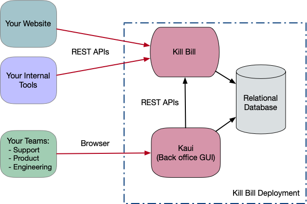
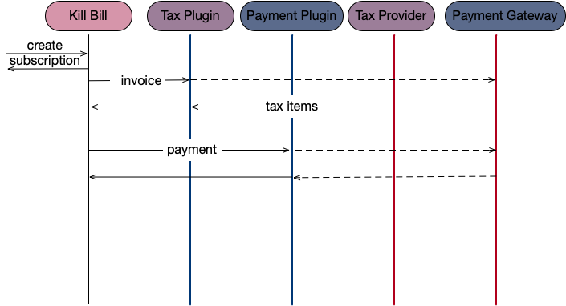

= What Is Kill Bill?

== Introduction

Kill Bill is a mature open-source platform which powers the billing and payment infrastructure of some of the largest e-commerce websites.

The *subscription billing* features let you create recurring or usage based subscriptions (e.g. "gold plan subscription at $9.99/month") and manage upgrades and downgrades. The system will take care of generating invoices, managing credits and triggering payments. Netflix, Dropbox and The New York Times are examples of websites which sell such subscriptions.

The *payment* features let you connect with virtually any payment gateway and processor (Stripe, Braintree, PayPal, Adyen, CyberSource, etc.) to charge your customers (using credit or debit cards, ACH, wire transfers, Bitcoin, etc.) for their subscriptions or one-off payments (e.g. shopping cart-type websites like Amazon or Zappos).

== Overview

Check this video for a quick tour:

https://www.youtube.com/watch?v=f2IHcz3OLYo[image:http://img.youtube.com/vi/f2IHcz3OLYo/0.jpg[align=center]]

=== Big Picture

At a high level we provide 2 pieces of software that **you will have to deploy and manage** in your own data center or in any public cloud.
//TODO For convenience we also offer a managed version running in AWS that you can use for free to get started very quickly.

* Kill Bill, or Kill Bill server is a standalone Java server that runs in your back-end. Your customers will never interact with it directly, but instead your website (it could be a custom e-commerce website, a Drupal or WordPress deployment, etc.) will trigger REST API calls (over HTTP) to process subscriptions or orders.
* KAUI, our Back-office UI, which provides an interface to interact with Kill Bill for your support and finance teams (to manage refunds, invoice adjustments, etc.).
{empty} +
{empty} +

[caption=""] 
//.Kill Bill: Big Picture

So, in the diagram above, we can see that:

* Customers interact with your website, which then issues REST API calls to Kill Bill. **You are responsible for designing and building that piece**.
* Kill Bill, with its database, **manages all the state associated with the subscriptions, invoices, payments, etc.**
* KAUI is the **Back-office UI for your teams**, and it includes role based access control to provide different priviledges for different teams/users:
  ** Your customer support team will use to access/modify consumer accounts data
  ** Your product team  will use to configure catalog information, billing rules, ...
  ** You finance/accounting team will access it for different types of reports
  ** Your engineering team will access it for running quick dev scenarios

=== Deployment

Kill Bill is packaged as a WAR and is therefore executed within a web container (typically Tomcat). While you can deploy Kill Bill directly as a WAR inside a container, we also provide easier deployment options:

* Docker containers 
* 1-click button AWS instances
* Hosted cloud deployment

=== Kill Bill Platform

We refer to Kill Bill as a *platform* because of its extensibility: You can write plugins to **modify the behavior of the system** or to **integrate with third-party vendors**, such as fraud detection solutions (Accertify, Feedzai, etc.) or Tax providers (Avalara AvaTax, etc.). We offer some open-source plugins on our http://github.com/killbill/killbill[GitHub organization], but in order to match you exact business requirements you may need to to write your own.

As an example, let's imagine a Kill Bill deployment with two plugins, the first one a tax plugin that will interact with a 3rd party tax provider, and the second one, a payment plugin that will interact with a payment gateway.

{empty} +

[caption=""] 
//.Kill Bill: Big Picture
image::../assets/what_is_killbill/KillBill_Plugins.png[format=png,align=center,title-align=center]

=== Kill Bill Model

Most billing systems out there have been designed to be batch oriented, i.e invoice generation and payments are made in batches at specific points in time. We have taken a different approach, and have built a system that is **event driven**, and where operations will happen in sequence.

A typical scenario is one where a _subscription_ gets created, eventually leading to the creation of an _invoice_ and a _payment_. Reusing our example from above, i.e a deployment with the 2 plugins, the following would occur:

{empty} +

[caption=""] 
//.Kill Bill: Big Picture

The flow diagram above highlights a couple of important aspects of the system:

1. The creation of the subscription will generate a series of internal events that will lead to the generation of the _invoice_ and its associated _payment_. If needed such behavior can also be configured.
2. Because of its plugin architecture, it is easy to extend the system by writing plugins. The diagrams above assumes the plugins interact with 3rd party systems, but of course all the tax logic could for instance be implemented in the plugin itself.
3. Kill Bill offers well defined extension points for these plugins to be highly effective and modify the behavior of the system as needed.

== Features

* Core Foundations
** High level of integrity and *robustness*
** Authentication and role-based access control (*RBAC*) support integrating with your LDAP, Okta, etc.
** A *plugin framework* where open-source and proprietary plugins can be added to modify the behavior of the system, and/or to interact with third party systems
** A robust persistent *event bus*, that is used both internally and externally (events are visible to plugins and to other services via HTTP push notifications)
** An *auditing* framework that keeps track of all the changes that occurred (who?, when?, what?)
* Core services, each of which exposing its own APIs and publishing bus events, which are consumed by other core services or 
plugins:
** Account
** Catalog
** Subscription and entitlement
** Usage: units recording from metering system
** Invoice: invoice generation and management (e.g. ability to adjust invoice items) for subscriptions and one-off charges
** Payment: payment gateways integration for recurring and one-off payments
** Overdue: dunning management (in case of unpaid invoices for instance)
* Multi-tenancy: Kill Bill has been designed as a multi-tenant system, meaning **you can run multiple logical instances of Kill Bill with a single server and database** (see this http://killbill.io/blog/subscription-service-using-kill-bill[blog post] which illustrates some of the use cases).
* Plugins
** Ability to easily connect to third party services
** Ability to modify behavior of the system to match custom business logic

== Where to Start?

=== Layman's Next Steps

If you are interested to know more about what Kill Bill is about, the following links will be of interest:

* http://docs.killbill.io/latest/features.html[List of features]
* http://docs.killbill.io/latest/faq.html[FAQ]
* http://killbill.io/blog/[Our official blog]
* +++<a href="https://www.capterra.com/p/159213/Kill-Bill/#reviews" onclick="getOutboundLink('https://www.capterra.com/p/159213/Kill-Bill/#reviews'); return false;">User reviews on Capterra, a Gartner company</a>+++

=== Technical Guides

To quickly get started, create a +++<a href="https://cloud.killbill.io/" onclick="getOutboundLink('https://cloud.killbill.io/'); return false;">sandbox account</a>+++.

When you are ready to start integrating Kill Bill in your environment:

1. Follow the http://docs.killbill.io/latest/getting_started.html[Getting Started guide]
2. Integrate your application through our https://killbill.github.io/slate/[REST APIs]
3. Configure Kill Bill to match your own set of requirements:
 * https://docs.killbill.io/latest/userguide_subscription.html[Billing System manual]
 * https://docs.killbill.io/latest/userguide_payment.html[Payment System manual]

*All of our documentation is hosted in a https://github.com/killbill/killbill-docs[GitHub repository], so please either submit a PR when obvious things are missing or wrong, or let us know so we can improve it!*
